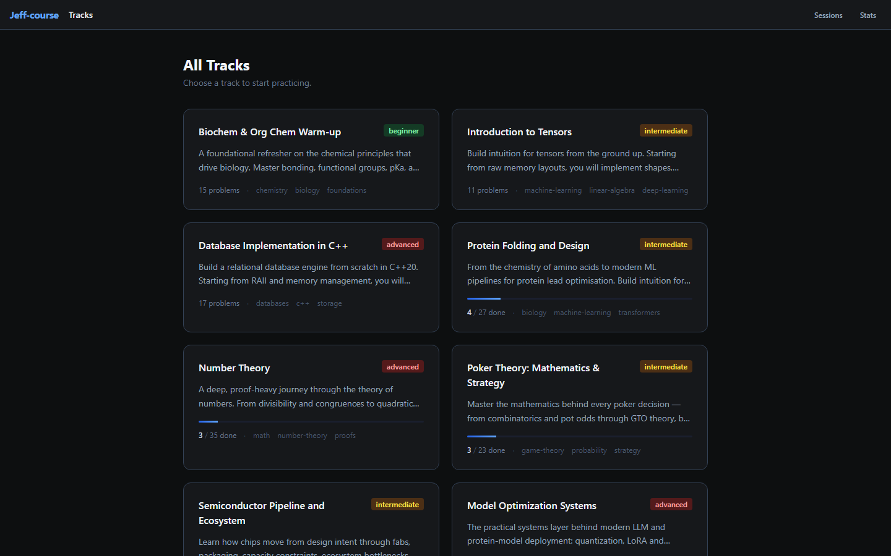
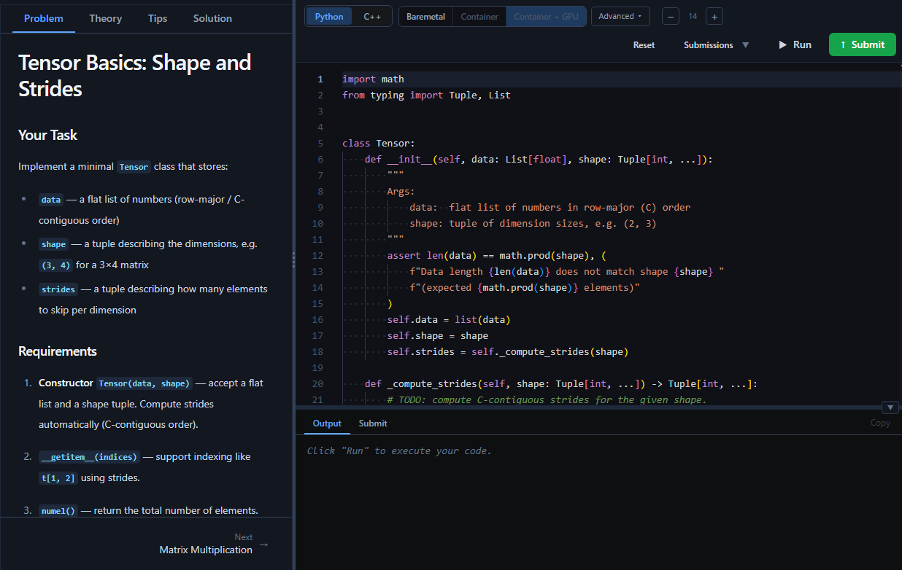
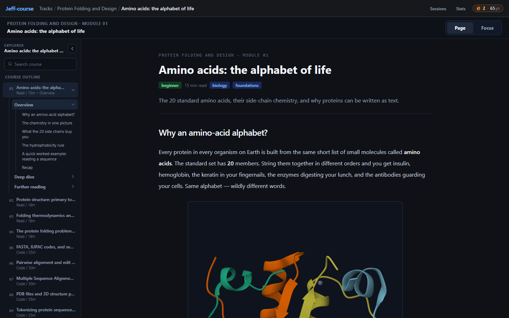
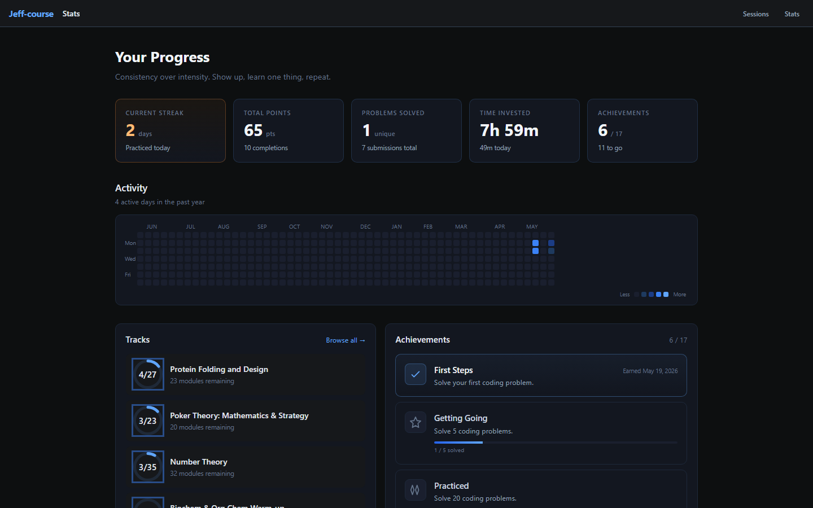
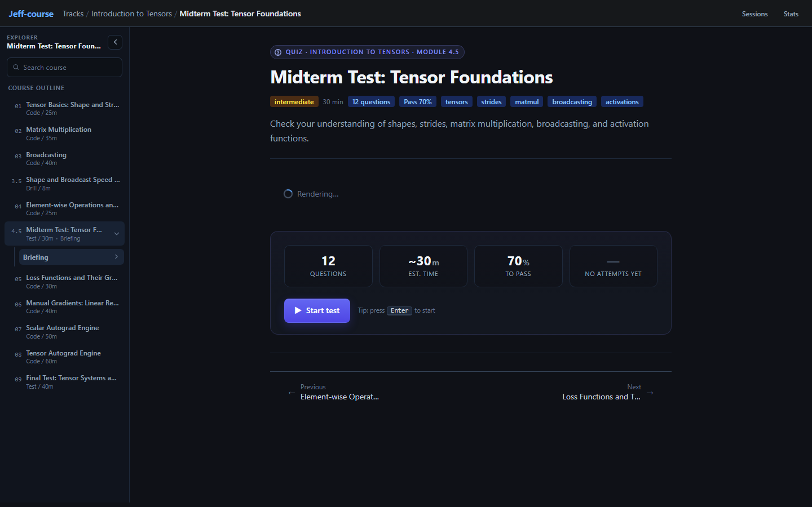

# Jeff Course

A local-first learning platform where courses are files, not products.

Jeff Course turns a folder of YAML, Markdown, quizzes, drills, and starter code
into a LeetCode-style course site. The goal is simple: if an agent can generate
good course material for a subject, you should be able to study it, improve it,
and share it with someone else.


## What It Is

Jeff Course is a local web app for self-directed courses. It can host reading
modules, coding exercises, quizzes, tests, timed drills, progress tracking, and
study history. Course content lives in `courses/`. User progress lives in
`data/jeff-course.duckdb`.

It ships with tracks in machine learning, biology, systems, math, databases,
semiconductors, and poker theory, but the important part is the format: courses
are meant to be generated, edited, copied, and shared.

## Quick Start

```bash
git clone git@github-personal:Jjx003/jeff-course.git
cd jeff-course
npm install
npm run dev
```

Open [http://localhost:5173](http://localhost:5173).

For coding exercises, install the language tools you want to run:

- Python: install [`uv`](https://docs.astral.sh/uv/) so the app can run `uv run`.
- C++: install `g++` if you want to run C++ modules.
- Docker: optional, useful for isolated or heavier sandbox runs.

For Windows, macOS, Linux, tablets, phones, Chromebooks, and LAN access, see
[Setup Guide](docs/setup.md).

## Product Tour

| Browse courses | Work through coding exercises |
|---|---|
|  |  |

| Read, review, and assess | Track steady progress |
|---|---|
|  |  |

| Tests and quizzes |
|---|
|  |

## Why This Exists

Most learning platforms make the course the scarce thing. Jeff Course treats the
course as a portable artifact. An agent can draft a track on any topic, a human
can clean it up, and the result can be shared as ordinary files.

The platform is intentionally calm: no accounts, no feed, no marketplace lock-in.
It keeps progress, streaks, achievements, and practice history locally so you can
build momentum without turning study into noise.

## What You Can Build

Each course can mix several module types:

| Type | Use it for |
|---|---|
| Reading | Textbook-style lessons with Markdown, LaTeX, Mermaid diagrams, and focus mode |
| Coding | Python or C++ exercises with starter code, run/submit, and expected-output grading |
| Quiz | Self-checks with immediate feedback |
| Test | Exam-style assessments that reveal answers at the end |
| Drill | Timed generated practice for speed and fluency |

See [Course Authoring](docs/course-authoring.md) for the file format and sharing
workflow.

## Course Packs

Shared courses can also be installed as git-backed course packs. A pack repo may
contain either a `courses/` directory with one or more tracks, or a single track
with `course.yaml` at the repository root.

```bash
npm run course:add -- https://github.com/someone/ml-foundations-course-pack.git
npm run course:list
npm run course:update
npm run course:validate
```

The pack manifest lives at `data/course-packs.yaml` by default, and cloned repos
live under `data/course-packs/repos/`. Both are local user state. See
`course-packs.example.yaml` for the manifest shape.

## Project Layout

```text
jeff-course/
  courses/                 Course tracks, modules, Markdown, quizzes, drills
  data/                    Local DuckDB progress and generated/cache data
  docs/                    User-facing setup and authoring docs
  infra/docker/            Local sandbox Dockerfiles
  src/
    lib/content/           Server-side course loader and parser
    lib/server/            DuckDB, execution, grading, stats, sandbox sessions
    lib/services/          Client-facing service interfaces and implementations
    lib/components/        Svelte UI components
    routes/                SvelteKit pages and API routes
```

## Included Tracks

| Track | Modules |
|---|---:|
| Biochem & Org Chem Warm-up | 15 |
| Database Implementation in C++ | 17 |
| Model Optimization Systems | 18 |
| Number Theory | 35 |
| Poker Theory: Mathematics & Strategy | 23 |
| Protein Folding and Design | 27 |
| Semiconductor Pipeline and Ecosystem | 19 |
| Introduction to Tensors | 11 |

## Scripts

```bash
npm run dev          # Start the dev server
npm run build        # Build with adapter-node
npm run preview      # Preview the production build
npm run check        # Svelte + TypeScript checks
npm run course:add -- <git-url>   # Install a git-backed course pack
npm run course:update             # Pull enabled course packs
npm run course:validate           # Validate built-in courses and enabled packs
```

## Environment Variables

| Variable | Purpose |
|---|---|
| `COURSES_DIR` | Override the course content directory. Defaults to `<repo>/courses`. |
| `COURSE_PACKS_MANIFEST` | Override the course-pack manifest path. Defaults to `<repo>/data/course-packs.yaml`. |
| `COURSE_PACKS_DIR` | Override the course-pack checkout directory. Defaults to `<repo>/data/course-packs/repos`. |
| `DB_PATH` | Override the DuckDB file path. Defaults to `<repo>/data/jeff-course.duckdb`. |
| `TORCH_INDEX_URL` | Override the PyTorch wheel index used by Python exercises with `torch`. |
| `SANDBOX_SKIP_GPU_PROBE=1` | Skip Docker GPU probing on startup. |

## Tech Stack

SvelteKit 2, Svelte 5 runes, TypeScript, Tailwind CSS, Monaco Editor, unified
Markdown rendering, KaTeX, Mermaid, DuckDB, Vite 6, and adapter-node.

Important: `@sveltejs/vite-plugin-svelte` must stay on v5 or newer for Vite 6.

## Sharing Courses

A course is just a folder under `courses/<track-slug>/`. To share one, share that
folder. To install one, copy it into `courses/` or point `COURSES_DIR` at a
folder that contains one or more track directories.

For repeatable sharing, put that folder in a git repository and install it with
`npm run course:add -- <repo-url>`. Course-pack repos can be forked, pinned,
updated, and validated without changing app code.

The long-term spirit of the project is a commons of agent-generated courses:
small enough to fork, clear enough to review, and personal enough to study from.
