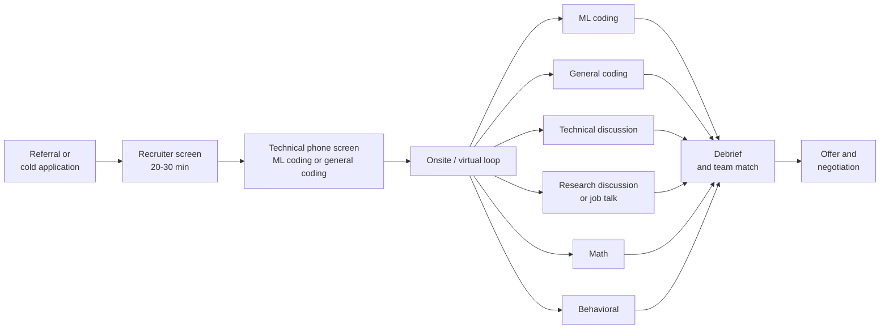

# The Loop: What AI Labs Actually Test

You do not need a PhD to get into a frontier lab. You need to survive a loop
that was designed around people who have one — which means you need the thing a
PhD is a proxy for, demonstrated directly, in about six hours of live
conversation.

That is the good news and the bad news. The credential is a filter on the way
*in*. Once you are in the loop, the evidence is what you say and type in the
room. Candidates with strong publication records fail these loops constantly,
for a boring reason: **technical skills and knowledge are evaluated far more
than research experience.** Your CV gets you the first call. It does not answer
"what is 5D parallelism", and it does not implement multi-head attention.

This course is built around that fact.

## What the loop looks like

A typical Research Scientist / Research Engineer / MTS loop at a large lab runs
5–8 interviews after the recruiter screen, drawn from six recurring formats.

The mix depends on the role. Research Engineer loops lean toward ML coding,
systems, and general coding. Research Scientist loops add a research discussion
and sometimes a job talk. MTS at a smaller lab is often the most implementation-
heavy of the three. Ask the recruiter for the breakdown — they will usually tell
you, and that answer is the single highest-value piece of information you can
get before a loop.

## The six formats

| Format | Frequency | What it scores | Where it lives in this course |
|---|---|---|---|
| **ML coding** | Most common by far | Can you write correct PyTorch, fast, without help? | Modules 3, 7–10, 16, 18, 26, 30, 33 |
| **General coding** | Common | Data-structure fundamentals, often with an ML skin | Modules 39–40 |
| **Technical discussion** | Common | Breadth (rapid-fire) or research taste (experiment design) | Modules 13–28, 43 |
| **Research discussion** | Scientist roles | Can you explain and defend a body of work? | Module 41 |
| **Math** | Occasional, company-specific | Probability, linear algebra, calculus under pressure | Modules 35–38 |
| **Behavioral** | Always | Judgment, collaboration, and prepared honesty | Module 42 |

Two of these deserve immediate emphasis because they are where prepared
candidates separate from unprepared ones.

**ML coding is the load-bearing format.** Implementing or debugging a
transformer comes up so often that it should be muscle memory. Not "I understand
attention" — that is table stakes. You should be able to produce a correct
causal multi-head attention block, with the mask, the scaling, the head reshape,
and the KV cache, in fifteen minutes, from an empty file, with no autocomplete,
while talking. This course spends five modules getting you there and then makes
you debug a deliberately broken one.

**Technical discussion in rapid-fire mode is pure recall.** "What are the ways
of encoding positional information?" "What is the difference between PPO and
GRPO?" "Why does GQA exist?" There is no thinking your way to these under
pressure. Either the fact is loaded or it is not. That is exactly what spaced
repetition is for, which is why this course carries flashcard decks alongside
the readings rather than treating them as a novelty.

## What "prepared" actually means

Three specific standards, which the rest of this course is calibrated to:

1. **You can implement it with the assistant off.** Practice with AI assistance
   completely disabled. You will badly underestimate your reliance otherwise —
   the gap between "I know this" and "I can type this" is invisible until the
   moment it costs you an offer.
2. **You can defend the number.** Not "the KV cache is big" but "two bytes times
   two for K and V, times 32 layers, times 8 KV heads, times 128 head dim, times
   4096 tokens — about 0.5 GB per sequence, so at batch 64 the cache alone is 34
   GB, which is why we quantize it."
3. **You have an opinion.** Interviewers at labs are not looking for a lookup
   table. When you say "I would use GQA here," expect "why not MQA?" and have an
   answer that references quality degradation and the memory-bandwidth
   arithmetic, not vibes.

## An eight-week plan

This assumes ~12 hours a week around a job. Compress or stretch it, but keep the
ordering: the transformer work is load-bearing for everything after it.

| Week | Focus | Modules |
|---|---|---|
| 1 | Fundamentals + backprop by hand | 1–5 |
| 2 | The transformer, implemented | 6–9 |
| 3 | The transformer, debugged + accounting | 10–14 |
| 4 | Training dynamics and precision | 15–20 |
| 5 | Scaling, parallelism, inference | 21–28 |
| 6 | Post-training, tokenization, data | 29–34 |
| 7 | Math and general coding | 35–40 |
| 8 | Research pitch, behavioral, mocks | 41–45 |

Two habits that matter more than the schedule:

- **Review daily.** Ten minutes on the [Review](/review) page every morning.
  The decks in this course are built so that a fact you learn in week 2 is still
  loaded in week 8. Cramming does not survive an eight-week search.
- **Log every interview.** Immediately afterward, write down every question you
  were asked and every place you stumbled. That log is the best study guide you
  will ever have, because it is calibrated to the actual companies you are
  talking to.

## Sequencing your companies

The standard advice is to warm up on lower-priority companies and time the
finals so offers land together. That is roughly right, with three amendments
worth knowing before you build a schedule:

- **Stamina is finite.** A loop is genuinely draining. Burning six of them as
  "practice" and arriving exhausted at the one you care about is a real failure
  mode.
- **Headcount beats preparation.** Whether a team is actively hiring matters
  more than whether you studied an extra week. Friends and recruiters are the
  only source for this; ask.
- **Deadlines flex more than you think.** Recruiters know you have other
  processes running. Exploding offers exist but are the exception — find out
  which companies have that reputation before you sequence around them.

## How to use this course

- **Reading modules** are the spine. Read them properly; they are written at
  interview depth, not blog depth.
- **Coding modules** run real PyTorch on CPU and check their own correctness.
  Do them with autocomplete off and a timer running.
- **Flashcard decks** feed the [Review](/review) queue. Do a deck once when you
  reach it, then let the scheduler handle it.
- **Drills** build arithmetic speed. Estimating a KV cache in your head is a
  skill, and it is trainable.
- **Quizzes and the final test** are checkpoints, not grades. A missed question
  is a signal about what to reread.
