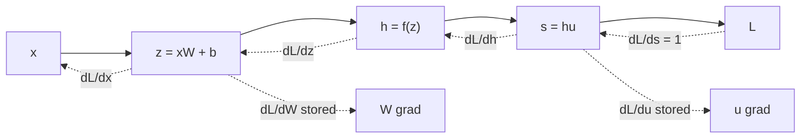

# Fundamentals You Cannot Fumble

There is a specific failure mode in AI lab interviews that has nothing to do with not knowing enough. It is knowing a great deal about transformers and then being unable to state the derivative of softmax composed with cross-entropy, or being unsure whether the gradient of a bias accumulates over the batch dimension.

Interviewers probe this deliberately. The reasoning is that someone who has only ever called `loss.backward()` will be helpless the first time a gradient is `NaN` at step 4,000, and gradients being `NaN` at step 4,000 is a substantial fraction of the actual job.

## What gets asked here

- Write the forward and backward pass of a linear layer. What shape is each gradient, and why?
- Why is the gradient of cross-entropy with respect to the logits so clean?
- Why do we use ReLU instead of sigmoid in hidden layers? What is a dying ReLU?
- What is SwiGLU and why did it replace ReLU in modern LMs?
- What does `.backward()` actually do? Why does it need a scalar?
- What is gradient checkpointing, what does it cost, and what is the optimal number of checkpoints?
- What is stored during a forward pass, and what does that mean for memory?

## The mental model to carry in

Every question in this module reduces to one picture: a neural network is a **computation graph**, the forward pass caches whatever the backward pass will need, and backprop is repeated application of the chain rule in reverse topological order.

Two rules make every shape question answerable without deriving anything:

**Rule 1 — the gradient of a tensor has the same shape as the tensor.** If `W` is `(d_in, d_out)`, then `dL/dW` is `(d_in, d_out)`. Always. This alone resolves most "which way does the transpose go" confusion: there is exactly one arrangement of the matmul that produces the right shape.

**Rule 2 — shared tensors sum over the batch, unshared tensors stack.** `W` and `b` are shared across every example in the batch, so their gradients are summed over it. Activations are per-example, so their gradients keep the batch dimension. This is why the bias gradient is `dL/dZ.sum(0)` and the weight gradient is a matmul that contracts the batch dimension away.

Everything in the deep dive follows from those two rules plus the chain rule.
