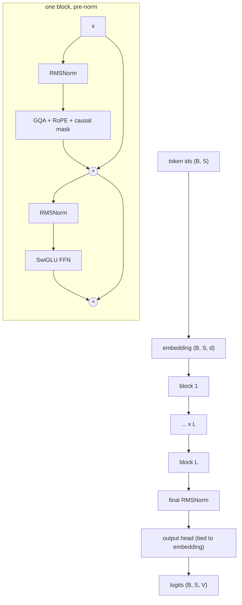

# The Modern Decoder-Only Transformer

The architecture in the *Attention Is All You Need* diagram is not the architecture you will be asked to implement. Roughly every component has been replaced since 2017, and interviewers care about the replacements — because knowing that RMSNorm replaced LayerNorm is common knowledge, but knowing *why* separates people who have read a model card from people who have read a model.

This module is the reference you should be able to reconstruct from memory, on a whiteboard, in five minutes.

## The current default stack

| Component | 2017 original | Current default | One-line reason |
|---|---|---|---|
| Norm placement | Post-norm | **Pre-norm** | Clean residual path; trains deep stacks without warmup gymnastics |
| Norm type | LayerNorm | **RMSNorm** | Same benefit, no mean subtraction, fewer ops and params |
| Position | Learned or sinusoidal absolute | **RoPE** | Relative by construction; extrapolates; nothing added to the residual stream |
| Attention | MHA | **GQA** | Shrinks the KV cache by 4–8x at negligible quality cost |
| FFN | ReLU, 4d | **SwiGLU, 8d/3** | Gating wins at fixed parameter count |
| Bias terms | Everywhere | **Removed** | No measurable quality cost, slightly better stability |
| Output head | Separate | **Tied at small scale, untied at large** | Saves $Vd$ — 31% of GPT-2 small, under 1% of a 70B |

## What gets asked

- Implement multi-head causal self-attention. (Then: now make it GQA. Then: now add a KV cache.)
- Why divide by $\sqrt{d_k}$?
- Why pre-norm instead of post-norm?
- RMSNorm versus LayerNorm — what is dropped and why is it fine?
- Name every way of encoding position and give the trade-offs.
- How does RoPE work, and why does it extrapolate better than learned positional embeddings?
- MHA versus MQA versus GQA. What does each cost, and what does each buy?
- GQA shrinks the cache by sharing heads. What does MLA do instead, and why does RoPE complicate it?
- Why is the causal mask applied before the softmax and not after?
- What is weight tying and when does it matter?

## The one thing to over-prepare

Attention. It is the single most-asked implementation in the entire loop. You should be able to write causal multi-head self-attention, with the reshape, the scaling, the mask, and the head merge, in under fifteen minutes, from an empty file, while explaining each line.

The next four modules build exactly that, then break it and make you fix it.
