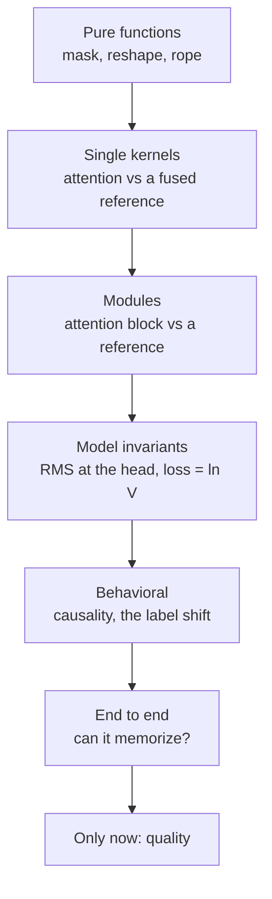

# A Method for Finding Invisible Bugs

## Why these bugs are hard

Every bug in this module shares one property: **it does not crash.** Deep learning code has an unusually large surface of failures that produce plausible tensors of the right shape carrying the wrong numbers, and the loss curve looks fine for all of them.

Worse, several make the loss look *better*. A leaky causal mask lets the model read the answer, so training loss plummets. An unshifted loss turns next-token prediction into copy-the-input, which is trivially learnable. If your only instrument is the loss curve, these are indistinguishable from success.

## The ladder

The method is bisection over the *system*, not over the input.

Each level can only be trusted once every level above it passes. That is why the probes are ordered, and why "fix the first failure and rerun" is the instruction rather than "read all the failures".

## The invariants worth knowing by heart

These are what let you write probes for a component you did not implement.

| Invariant | What it catches |
|---|---|
| `causal_mask(n).sum(1) == [1, 2, ..., n]` | `triu`/`tril` swap, off-by-one on the diagonal |
| `merge_heads(split_heads(x)) == x` | half of all reshape bugs |
| head `h` equals `x[..., h*dh:(h+1)*dh]` | the other half — right shape, wrong axis |
| attention with an open mask equals non-causal SDPA | a missing or wrong softmax scale |
| RoPE preserves vector norms | a sign error turning the rotation into a reflection |
| hidden RMS entering the head is ≈ 1 | a missing final norm |
| loss at init ≈ `ln V` | output scale, answer leakage, gradient flow |
| perturbing token `t` leaves outputs `< t` fixed | any causality leak |
| oracle logits for the *next* token give loss ≈ 0 | the label shift, in isolation from the model |

That last one is worth dwelling on. You can test the loss function **without a model at all**, by feeding it hand-built logits that perfectly predict the next token and checking the loss is zero, then logits that perfectly predict the *current* token and checking the loss is large. This isolates the objective from every other possible bug, and it is exactly the kind of probe that impresses in an interview.

## The bug taxonomy

**Masking.** `triu` for `tril`, `diagonal=1` for `diagonal=0`, masking after the softmax, a finite sentinel instead of `-inf`, or forgetting the mask entirely when a KV cache is present. Signature: causality fails; loss is suspiciously low.

**Reshape.** `view(B, H, S, dh)` where you needed `view(B, S, H, dh).transpose(1, 2)`. The shape is identical, so nothing complains, but heads are now slices of the *sequence*. Signature: the model trains to a mediocre plateau and nothing looks wrong.

**Missing scalars.** No `1/sqrt(head_dim)`; a `1/N` applied twice or zero times; a temperature not applied. Signature: unstable training at small head dimension, hopeless at large.

**Applied to the wrong tensor.** RoPE on V. Dropout on the residual instead of the sublayer output. Weight decay on norms and biases. Signature: subtle, persistent quality loss.

**Constructed but unused.** `self.norm_f` built in `__init__` and never called; a scheduler created and never stepped; a `.to(device)` whose result is discarded. Signature: quiet degradation, and the code reads as correct.

**Off-by-one in the objective.** Loss not shifted, or shifted twice, or labels not masked at padding. Signature: either an implausibly low loss, or a plateau at 3–4 that no amount of scale fixes.

## What the interviewer is scoring

Not how fast you find bug three. They are watching for:

- **Do you form a hypothesis before you change code?** "The loss is low but generation is broken, so something is leaking the answer — let me test causality" beats poking at lines.
- **Do you test one thing at a time?** Changing three lines and rerunning tells you nothing.
- **Do you know the invariants?** Reaching for `ln V` unprompted says you have debugged a real training run.
- **Do you distrust a passing test?** The memorization probe passes with a broken loss shift. Noticing that out loud is the strongest single signal available in this exercise.
