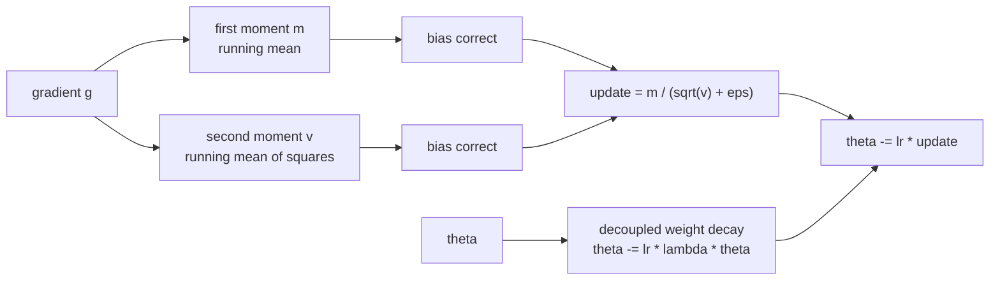

# Training Dynamics

Everything in this module exists because a training run failed at some point and somebody worked out why.

That is the frame to carry into the interview. Warmup is not a convention — it is a fix for a specific pathology in Adam's early steps. Gradient clipping is not hygiene — it is a response to what a single bad batch does to a large model. When you can name the failure a technique prevents, you are answering a different question from someone reciting a config file.

## What gets asked

- Write AdamW from scratch. (Yes, from memory. It comes up.)
- Why does Adam need bias correction?
- Why warmup? Why cosine? What is warmup-stable-decay and why did people move to it?
- What is the difference between Adam and AdamW, exactly?
- Your loss spikes at step 40,000. Walk me through the diagnosis.
- How would you pick a learning rate for a model 10x larger than the one you tuned on?
- Why does batch size interact with learning rate, and how?

## The optimizer, in one picture

Two running averages, one per parameter. The first gives momentum. The second gives a per-parameter learning rate. The bias correction fixes the fact that both start at zero. Weight decay is applied to the parameter directly, not folded into the gradient — that decoupling is the whole of AdamW.

## The one to over-prepare

**Write AdamW from scratch.** It is short, it is asked, and it is embarrassing to fumble. The next module makes you do it. Aim for fifteen minutes from an empty file, including the bias correction and the parameter-group handling.
