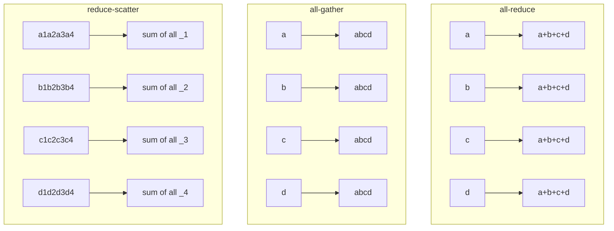

# Parallelism and Distributed Training

"What is 5D parallelism?" is a real rapid-fire question, and the good answer is not a list. It is: here are the five things you can split, here is what each costs in communication, and here is the order you reach for them.

You are unlikely to be asked to implement a parallelism strategy in an interview. You are quite likely to be asked to reason about one.

## The five axes

| Axis | What is split | Communication | When to use it |
|---|---|---|---|
| **Data** | the batch | all-reduce of gradients, once per step | always, first |
| **Tensor** | matrices within a layer | all-reduce twice per layer | when a layer will not fit; keep inside one node |
| **Pipeline** | layers across devices | point-to-point activations at stage boundaries | across nodes, when the model will not fit |
| **Context** | the sequence | all-gather of K and V in attention | very long context |
| **Expert** | MoE experts | all-to-all token routing | MoE models |

## The prerequisite: collectives

Everything above is built from five operations. You should be able to describe each in one line and know its cost.

The identity worth knowing: **all-reduce = reduce-scatter + all-gather**, and each half moves the same volume. That is why ZeRO stage 2 can shard gradients at no extra communication cost — it is already doing both halves.

## What gets asked

- What is 5D parallelism? Which do you reach for first?
- Why does tensor parallelism have to stay inside a node?
- What is the pipeline bubble and how do you shrink it?
- Explain ZeRO stages 1, 2, 3.
- What is the difference between ZeRO-3 and FSDP?
- How do you shard a 70B model across 8 GPUs?
