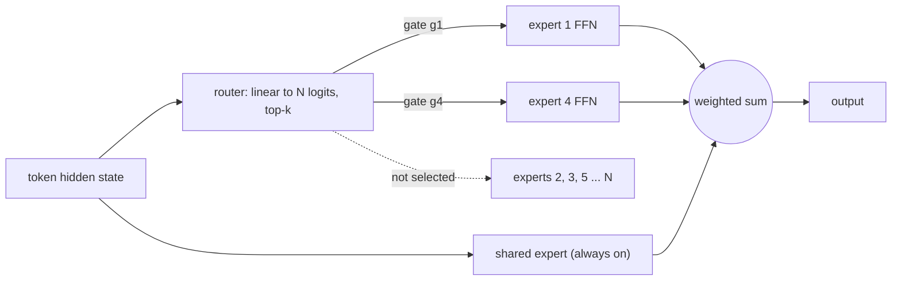

# Mixture-of-Experts

The main track taught you to count parameters with $12Ld^2$ and to assume every parameter runs on every token. That assumption is now false for most frontier models, and the gap between "parameters you store" and "parameters you compute with" is one of the most reliable follow-up questions in a systems interview.

This module is optional. Take it if you want to be able to answer "how would you scale this model further" with something other than "make $d$ bigger."

## The one-sentence version

Replace each FFN with $N$ parallel FFNs and a small router that sends each token to $k$ of them. Capacity grows with $N$; compute grows with $k$.

The router is the whole design. It is a single linear layer — often the smallest weight matrix in the model — and it decides the FLOPs, the memory traffic, and the load balance of everything downstream.

## What gets asked

- Why does an MoE have more parameters but the same training FLOPs as a dense model?
- What is the router, and what happens if it collapses onto a few experts?
- What is the auxiliary load-balancing loss, and what is wrong with it?
- Why is expert parallelism harder than tensor parallelism?
- Your MoE trains fine and serves terribly. Why?
- When would you *not* use an MoE?

## The trap

Almost everyone can say "MoE gives you more parameters for the same compute." Far fewer can say what it costs — and the cost is where the interview goes. You still hold every expert in memory, you still move tokens across the network to reach them, and your step time is set by whichever expert got the most tokens. An MoE is a *memory-and-interconnect* trade against compute, not free capacity.

Read the theory tab, then the tips tab for the rapid-fire answers.
