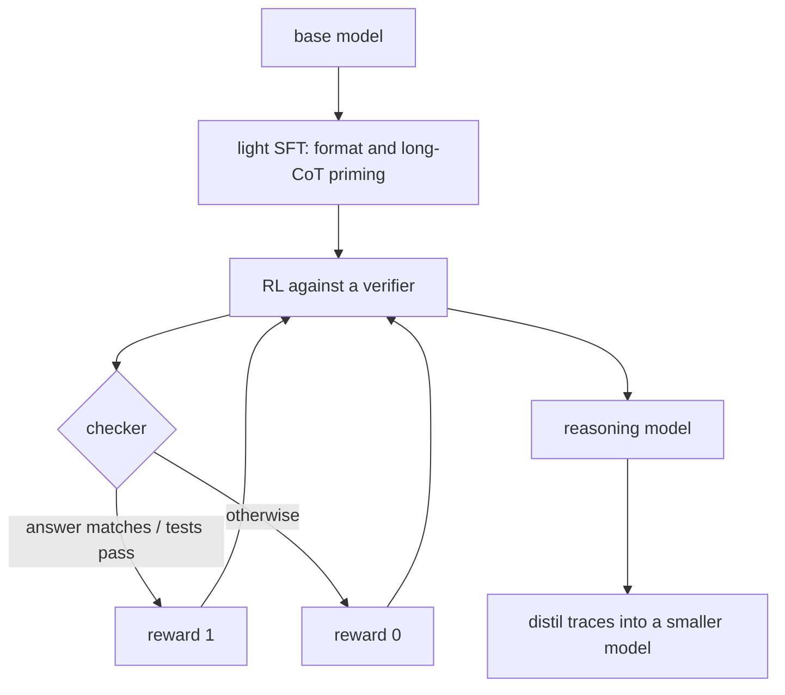

# Reasoning Models and Test-Time Compute

Module 21 taught you two axes: parameters and data. Since the o1 and R1 generation there is a third — how much compute a model spends *per question, at inference* — and it does not behave like the other two.

This module is optional, and it is the one most likely to come up unprompted. "What do you make of reasoning models?" is a research-discussion question that separates people who read the model card from people who thought about it.

## The shape of the thing

The striking result from this line of work is how *little* is needed. No process reward model scoring each step, no learned reward model to hack, no tree search at training time. A binary checker, a policy-gradient method, and enough compute produce long chains of thought, self-checking, and backtracking without anyone specifying them.

## What gets asked

- What is RLVR and why do verifiable rewards change the picture?
- Why does RL on a checker produce longer outputs without anyone rewarding length?
- Where does test-time compute stop paying?
- pass@k versus majority voting versus best-of-n — when is each one a legitimate metric?
- Is the chain of thought faithful? Should you train on it?
- Why is a distilled reasoning model so much cheaper than an RL-trained one, and what do you lose?
- How do you evaluate a model whose answer quality depends on how long you let it think?

## The trap

The tempting summary is "reasoning models think longer, so they do better." The interesting parts are all in the exceptions: longer thinking does nothing for problems the model fundamentally cannot do, it *hurts* on easy ones through overthinking, and most of the headline pass@k numbers are not achievable without a verifier at inference time. Being able to name those three is the difference between having read a blog post and having thought about the regime.
