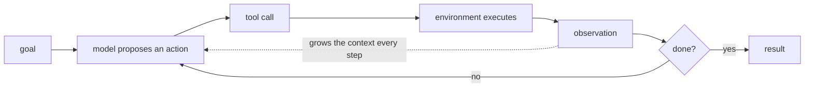

# Agents and Long-Horizon Work

A large share of the roles you are interviewing for now exist because labs are trying to make models that *act* over many steps rather than answer in one. That makes this a likely topic even in a research interview, and it is the one where the gap between marketing language and engineering reality is widest.

This module is optional. Its value is mostly defensive: it gives you precise things to say about a subject where vague enthusiasm is the default and is easy to spot.

## The loop

Everything hard about agents is visible in that diagram. The loop is trivial. What is not trivial: every pass adds observations to a context that has a fixed budget, every step is an independent chance to fail, and the environment is usually not under your control.

## What gets asked

- Why do agents fail at long tasks even when each individual step looks fine?
- What is the difference between an agent and a chain of prompts?
- How would you train a model to use tools? Where does the reward come from?
- How do you evaluate an agent when the environment is stateful and the task takes hours?
- What do you do when the context fills up?
- Why is a model that recovers from mistakes worth more than one that makes fewer?

## The framing worth having

Agent capability is dominated by **horizon length**, not by per-step intelligence. A model with 99% per-step reliability — which sounds excellent — is a coin flip over a 70-step task. That single piece of arithmetic explains most of what agent engineering actually consists of, and it is where this module starts.
