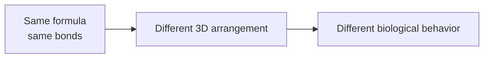

## Why shape is not just a drawing detail

Biochemistry happens in three dimensions. A molecule is not only a list of
atoms and bonds; it is also an object with a particular spatial arrangement.
That arrangement can decide whether an enzyme binds it tightly, ignores it,
or treats it as an inhibitor.

The most important idea is **chirality**: some molecules come in left- and
right-handed forms that have the same connectivity but cannot be placed on
top of each other by rotation.

Your hands are the usual analogy. The left hand and right hand have the same
parts in the same order, but a left glove does not fit a right hand. Enzyme
active sites are much more like gloves than like flat diagrams.

## Chiral centers

A common source of chirality is a tetrahedral carbon attached to four
different groups. Such an atom is often called a **stereocenter** or
**chiral center**.

For an amino acid, the alpha carbon is usually chiral because it is attached
to:

- an amino group,
- a carboxyl group,
- a hydrogen,
- and a side chain.

Glycine is the exception: its side chain is another hydrogen, so the alpha
carbon does not have four different substituents.

## Enantiomers and diastereomers

Two stereoisomers can be related in different ways:

- **Enantiomers** are non-superimposable mirror images. Every chiral center is
  inverted between the pair.
- **Diastereomers** are stereoisomers that are not mirror images. At least one
  stereocenter changes, but not all of them.

Enantiomers often have identical physical properties in an achiral
environment: same melting point, same solubility, same NMR pattern in a
simple solvent. Biology is not achiral. Proteins, nucleic acids, sugars, and
membranes are built from chiral monomers, so they can strongly distinguish
between enantiomers.

## L/D is not the same as R/S

You will see two stereochemical naming systems:

- **R/S** assigns absolute configuration using Cahn-Ingold-Prelog priority
  rules.
- **L/D** is a historical biochemical convention that compares a molecule's
  configuration to glyceraldehyde.

Do not mentally translate "L" into "left-handed" or "S". The systems answer
different questions. Most protein amino acids are **L-amino acids**, but most
of them are **S** by R/S rules. Cysteine is a famous exception: the sulfur in
its side chain changes the priority ordering, so L-cysteine is usually **R**.

For this course, the key practical fact is simpler: ribosomal proteins are
built almost entirely from L-amino acids, and that shared handedness makes
regular folds possible.

## Biological specificity

A protein binding pocket is chiral because it is made from chiral amino acids.
When a ligand enters the pocket, many weak interactions must line up at once:
hydrogen bonds, hydrophobic contacts, electrostatic contacts, and steric fit.

If an enantiomer is flipped, some atoms that should donate a hydrogen bond may
point away, and atoms that should tuck into a hydrophobic patch may collide
with polar groups. The molecule can have the right formula and still present
the wrong 3D pattern.

This is why two enantiomers of a drug can have different potency, metabolism,
or toxicity. One may fit a target protein well; the other may bind weakly,
bind a different protein, or be cleared differently.

## Why proteins care

Proteins care about stereochemistry for three linked reasons:

1. **Backbone geometry**: L-amino acids favor the ordinary right-handed alpha
   helices and beta-sheet arrangements used by natural proteins.
2. **Side-chain packing**: stereochemistry determines where side chains point
   as the chain folds.
3. **Recognition**: enzymes and receptors read a molecule's 3D pattern, not
   just its 2D connectivity.

Stereochemistry is therefore not an advanced naming nuisance. It is one of
the reasons a sequence can fold into a reproducible structure and recognize
specific partners.

## Recap

- Chiral molecules have non-superimposable mirror-image forms.
- Enantiomers are mirror-image stereoisomers; diastereomers are stereoisomers
  that are not mirror images.
- L/D and R/S are different labeling systems.
- Biological macromolecules are chiral, so they can distinguish enantiomers.
- Protein folding and molecular recognition depend on consistent 3D geometry.

Next, we will zoom from side-chain handedness to the peptide bond and the
restricted geometry of the protein backbone.
