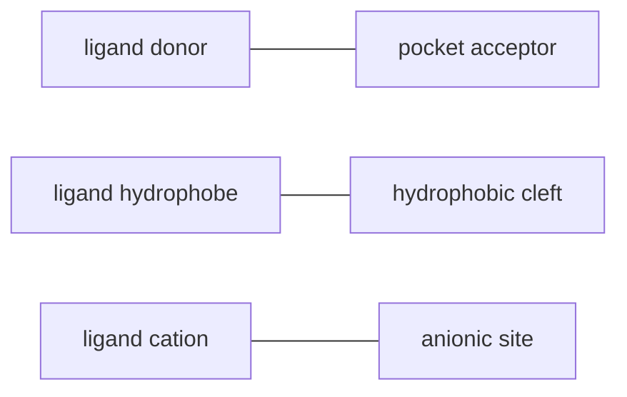

## A minimal stereochemical model

A tetrahedral atom with four different substituents has two possible spatial
arrangements. If the groups are labeled $a$, $b$, $c$, and $d$, the two
arrangements have the same bond graph but opposite handedness.

The protein-relevant consequence is that a coordinate transformation that
reflects the molecule changes the sign of handedness. Rotations and
translations preserve handedness; mirror reflection does not.

## Chiral recognition requires at least three contacts

A useful rule of thumb is the **three-point attachment model**. Suppose a
binding pocket recognizes three ligand features:

One enantiomer may satisfy all three contacts at once. Its mirror image may be
able to satisfy one or two, but the third feature often points to the wrong
side of the pocket. A small stereochemical inversion can therefore create a
large binding difference.

This is not a strict theorem. Flexible ligands and flexible proteins can
adapt. But every adaptation costs entropy, strain energy, or both.

## R/S in one paragraph

R/S labels are assigned by ranking the four substituents attached to a chiral
center using atomic number and connectivity. With the lowest-priority group
pointing away, trace priorities 1 to 2 to 3:

- clockwise gives $R$,
- counterclockwise gives $S$.

The method is precise, but the biological lesson is not the label itself. The
important point is that stereocenters encode orientation constraints that
persist through reactions, binding, and folding.

## Homochirality and regular protein folds

Natural proteins use one dominant backbone handedness: L-alpha amino acids.
Because each residue has the same stereochemical relationship between the
backbone and side chain, local backbone conformations repeat cleanly. This
supports regular motifs such as alpha helices and beta strands.

If a chain randomly mixed L- and D-residues, the allowed local backbone
geometries would alternate in a way that disrupts ordinary secondary
structure. D-amino acids are biologically useful in some specialized contexts,
such as bacterial cell walls and engineered peptides, but they are not the
default building blocks of ribosomal proteins.

## Chirality beyond amino acids

Sugars, nucleotides, cofactors, and lipids also have stereochemical patterns.
The ribose in RNA, the deoxyribose in DNA, and the many stereocenters in
carbohydrates are all read by proteins. A protein that binds glucose does not
just bind "$C_6H_{12}O_6$"; it binds a specific 3D display of hydroxyl groups.

That same logic will return when we study folding: the chain's final structure
is the one that lets thousands of local stereochemical preferences coexist.
