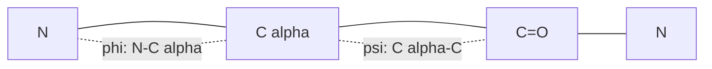

## The backbone is a constrained chain

A protein is often introduced as "a chain of amino acids." That is true, but
it can be misleading. The chain is not freely jointed. The peptide bond has
partial double-bond character, and the allowed rotations around the backbone
are strongly constrained by steric clashes.

Those constraints are what make helices, sheets, turns, and loops possible.

## Forming a peptide bond

A peptide bond links the carboxyl group of one amino acid to the amino group
of the next. In simplified organic chemistry terms, it is an amide formed by
condensation:


$$
\text{amino acid}_1 + \text{amino acid}_2 \rightarrow
\text{dipeptide} + H_2O
$$

The reverse reaction is **hydrolysis**, where water breaks the amide bond.
In cells, ribosomes form peptide bonds during translation, and proteases
catalyze hydrolysis when proteins are degraded or processed.

Protein sequences are written from the **N-terminus** to the **C-terminus**:

```text
N-terminus -- residue 1 -- residue 2 -- residue 3 -- C-terminus
```

## Amide resonance and planarity

The peptide bond is an amide. The nitrogen lone pair can overlap with the
carbonyl pi system, creating resonance:

$$
O=C-NH \leftrightarrow ^{-}O-C=N^{+}H
$$

Because of this resonance, the $C-N$ peptide bond has partial double-bond
character. It is shorter and harder to rotate around than a normal single
bond. The atoms around the peptide bond tend to lie in one plane.

This planarity means the backbone is built from relatively rigid peptide
planes connected by two main rotating bonds per residue.

## Phi and psi

The two key backbone torsion angles are:

- $\phi$ (phi): rotation around the $N-C_\alpha$ bond.
- $\psi$ (psi): rotation around the $C_\alpha-C$ bond.



The peptide bond torsion is usually called $\omega$ (omega). For ordinary
peptide bonds, $\omega$ is usually near $180^\circ$ (trans). The cis form near
$0^\circ$ is rare, except it is less rare before proline.

## Ramachandran intuition

A **Ramachandran plot** maps allowed combinations of $\phi$ and $\psi$.
Most combinations are forbidden because atoms would collide. The allowed
regions correspond to familiar secondary structures:

- alpha-helical conformations,
- beta-strand conformations,
- and a smaller set of turn/loop conformations.

You do not need to memorize the plot yet. The intuition matters more:
protein backbones are flexible enough to fold but constrained enough to make
recurring local shapes.

## Proline and glycine

Two residues deserve special attention:

- **Proline** has a side chain that loops back to the backbone nitrogen. This
  restricts $\phi$ and removes the normal backbone amide hydrogen. Proline can
  kink helices and often appears in turns.
- **Glycine** has only hydrogen as its side chain. It is small, achiral at the
  alpha carbon, and unusually flexible. Glycine often appears where the
  backbone needs to adopt tight or otherwise strained angles.

These are not "good" or "bad" residues. They are geometry tools.

## Recap

- Peptide bonds form by condensation and break by hydrolysis.
- Amide resonance gives peptide bonds partial double-bond character.
- Peptide bond planarity leaves $\phi$ and $\psi$ as the main backbone
  rotations.
- Ramachandran plots summarize which angle pairs avoid steric clashes.
- Proline restricts the backbone; glycine loosens it.

Next, we will look at the weak interactions that make folded structures
stable once the backbone can explore these allowed conformations.
