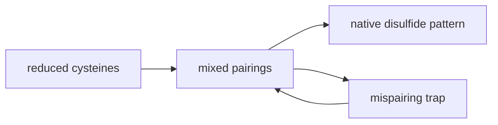

## Cysteine is a chemical switch

Cysteine looks modest: its side chain is a thiol, written $-SH$. But that
thiol can lose a proton, attack electrophiles, coordinate metals, and form
disulfide bonds. Because of that, cysteine often acts as a catalytic residue,
a redox sensor, or a structural staple.

The key pair is:

$$
R-SH \leftrightarrow R-S^- + H^+
$$

The neutral form is a **thiol**. The deprotonated form is a **thiolate**.
Thiolate is much more nucleophilic and reactive.

## Cysteine thiolate pKa

A free cysteine side-chain thiol has a pKa around 8.3. At physiological pH,
some fraction is deprotonated, but most is neutral unless the protein
environment shifts the pKa.

Proteins can stabilize the thiolate form by placing cysteine near positive
charges, hydrogen-bond donors, metal ions, or other polar groups. Catalytic
cysteines often have lowered pKa values so that the reactive thiolate is
available near neutral pH.

## Oxidation and reduction

Two cysteine thiols can be oxidized to form a **disulfide bond**:

$$
2R-SH \rightarrow R-S-S-R + 2H^+ + 2e^-
$$

Reduction reverses the process:

$$
R-S-S-R + 2H^+ + 2e^- \rightarrow 2R-SH
$$

A disulfide is covalent, unlike the noncovalent contacts from the previous
module. It can strongly constrain a protein's fold by tying two parts of the
chain together.

## Where disulfides form

Cell compartments have different redox environments:

- The **cytosol** is generally reducing. Disulfide bonds are usually not
  stable there, and cysteines tend to remain reduced.
- The **secretory pathway** and extracellular space are more oxidizing.
  Disulfide bonds are common in secreted proteins, membrane-protein domains,
  antibodies, and peptide hormones.

This environmental difference is not just trivia. A protein designed to be
secreted may rely on disulfides for stability, while a cytosolic protein may
use cysteine for catalysis or regulation without forming permanent disulfide
bonds.

## Disulfides stabilize by reducing freedom

A disulfide bond can stabilize a folded protein by reducing the number of
unfolded conformations available to the chain. If two distant segments are
tethered, the unfolded state has less entropy. That can make the folded state
relatively more favorable.

Disulfides also help maintain specific extracellular structures where the
environment is harsh: variable pH, proteases, dilution, and mechanical stress.

## Mispairing

Disulfides are powerful, but they can also go wrong. A protein with several
cysteines may form incorrect pairings. These **mispairings** can trap
misfolded states or slow folding.

Cells use folding helpers such as protein disulfide isomerases to reshuffle
incorrect disulfides until the native pattern is reached.

## Recap

- Cysteine can exist as a neutral thiol or reactive thiolate.
- Protein environments can shift cysteine pKa and tune reactivity.
- Oxidation forms disulfides; reduction breaks them.
- The cytosol is generally reducing, while secretory and extracellular spaces
  are more oxidizing.
- Disulfides can stabilize folded proteins but can also mispair during
  folding.

These ideas prepare you for protein folding because disulfides are one of the
few common covalent constraints superimposed on the mostly noncovalent folding
problem.
