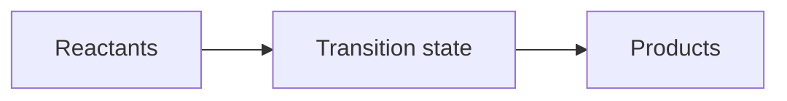

## Two questions: where, and how fast

Thermodynamics asks: where is equilibrium?

Kinetics asks: how fast do we get there?

Those questions often point in different directions. A reaction can be strongly favored but painfully slow. A protein can have a very stable native fold but still get stuck in a misfolded intermediate. Enzymes and catalysts matter because biology cannot wait for every favorable reaction to happen on its own.

## Activation energy

A reaction coordinate diagram has reactants, products, and a high-energy transition state between them:

The activation energy is the uphill climb from the reactants to the transition state:

$$
E_a = G^\ddagger - G_R
$$

where $G^\ddagger$ is the transition-state free energy.

The overall reaction free energy is different:

$$
\Delta G = G_P - G_R
$$

Lowering $\Delta G$ makes products more favored at equilibrium. Lowering $E_a$ makes the reaction faster.

## Transition states are not intermediates

A transition state is a fleeting, highest-energy arrangement along a reaction path. It is not a stable molecule you can usually bottle. An intermediate is a local valley: higher or lower than the starting material, but stable enough to have a finite lifetime.

This distinction matters in biochemistry. Enzymes often bind and stabilize transition-state-like geometries more than they stabilize ordinary substrates. That selective stabilization lowers the barrier.

## Catalysts and enzymes

A catalyst increases reaction rate without being consumed. It does this by offering a lower-barrier path:

$$
E_{a,\text{cat}} < E_{a,\text{uncat}}
$$

An enzyme may lower a barrier by:

- positioning reactive groups close together
- excluding water from a reactive site
- donating or accepting protons
- stabilizing charge buildup in a transition state
- straining a substrate toward a reactive geometry

The catalyst does not change the equilibrium constant for the same net reaction. It accelerates both forward and reverse directions so equilibrium is reached faster.

## Arrhenius intuition

The Arrhenius equation is often written:

$$
k = A e^{-E_a / RT}
$$

The exact prefactor $A$ depends on collision frequency, orientation, and molecular details. The exponential term gives the main intuition: higher barriers sharply reduce rates.

At room temperature, $RT$ is only about $2.5\ \text{kJ/mol}$. A modest barrier change can become a large rate change because it sits in an exponent.

## Folding traps versus thermodynamic stability

Protein folding has the same split between equilibrium and rate. The native state may be the lowest-free-energy state, but the chain still has to find it.

A folding trap is a local minimum: a conformation that is not the most stable final state but is stable enough to slow escape. Examples include:

- a hydrophobic patch packed in the wrong place
- a non-native salt bridge
- a proline in the wrong cis/trans state
- an incorrect disulfide pairing

The native state is thermodynamically stable if it has lower free energy than alternatives. Folding is kinetically efficient if the path to that state has manageable barriers.

## Recap

- $\Delta G$ controls equilibrium preference.
- $E_a$ controls rate.
- Transition states are high-energy bottlenecks, not stable resting points.
- Enzymes speed reactions by lowering barriers, not by changing the final equilibrium.
- Proteins can be thermodynamically stable but kinetically trapped.

Next, the course turns back to amino acids and asks how side-chain chemistry creates the interactions that make these landscapes possible.
