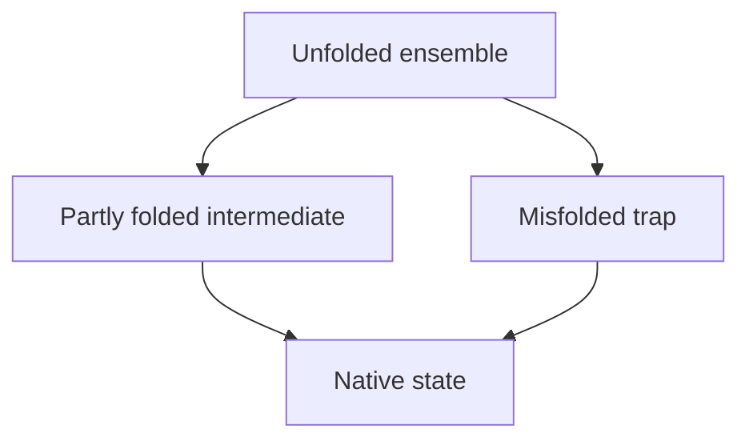

## Rates, barriers, and pathways

Kinetics describes the rates of chemical change. It depends on barriers,
pathways, and molecular encounters.

For a simple reaction:

$$
R \rightarrow P
$$

there are two different energy differences:

$$
\Delta G = G_P - G_R
$$

and

$$
\Delta G^\ddagger = G^\ddagger - G_R
$$

The first describes product favorability. The second describes the activation barrier.

## Why catalysts do not change equilibrium

For a reversible reaction:

$$
R \rightleftharpoons P
$$

the equilibrium constant depends on the free-energy difference between $R$ and $P$:

$$
K = e^{-\Delta G^\circ/RT}
$$

A catalyst provides a lower-barrier route between the same endpoints. Since the endpoints are unchanged, $\Delta G^\circ$ and $K$ are unchanged. The system simply approaches equilibrium faster.

## Enzyme active sites

Enzyme active sites are not just sticky pockets. A pocket that binds the substrate too tightly can slow the reaction by stabilizing the ground state. Powerful catalysts often stabilize the transition state more than the substrate.

This is why transition-state analogs can be potent inhibitors: they resemble the shape or charge pattern the enzyme is optimized to bind.

## Protein folding as a landscape

Protein folding is often described as a funnel. The native state sits near the bottom, but the sides are rough:

The roughness represents kinetic barriers. A mutation can:

- lower the native state's free energy
- raise or lower an intermediate's free energy
- change a barrier between states
- create a new trap

This is why protein engineering cannot be only a stability calculation. A design also has to fold on a usable timescale.
