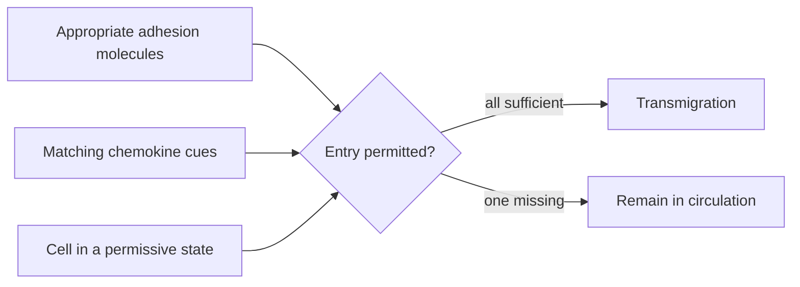

# Deeper theory: traffic, residence, and sampling

## Encounter models are useful when they stay humble

For match frequency $f$ and $n$ effective samples,

$$P(\text{encounter})=1-(1-f)^n.$$

For small $f$, this is approximately $1-e^{-fn}$. The model is not a literal
description of a node: cells revisit partners, dwell times vary, chemokines bias
movement, and peptide-MHC density changes. It does isolate the design variable
that anatomy controls: effective sampling.

## Traffic is actively gated

Leukocyte movement is not passive circulation. Chemokines activate integrins;
selectins support rolling; integrin-ligand binding creates firm arrest; cells
then cross endothelium. Naive lymphocytes use homing programs that favor lymph
nodes. Inflammation induces a different vascular address in tissue. Activated
cells rewrite their own adhesion and chemokine-receptor repertoire.

A useful abstraction for entry into a compartment is an AND gate:

## Three information channels

Immune decisions integrate:

- **identity:** molecular structure recognized by PRR, BCR, TCR, or antibody;
- **context:** damage, cytokines, costimulation, inhibitory signals;
- **position:** tissue, vessel, lymphoid zone, and reachable partners.

Receptor binding alone is therefore rarely a complete causal explanation.
Strong TCR binding without costimulation can produce nonresponse; antibody
binding can neutralize, opsonize, activate complement, or do little depending
on epitope and Fc context.

## Vocabulary worth keeping exact

- An **antigen** is specifically recognized by antibody/BCR or by a TCR as a
  peptide-MHC complex.
- An **immunogen** induces a response in a particular context.
- An **epitope** is the recognized molecular feature.
- A **clone** is a lineage sharing a rearranged antigen receptor.
- An **effector** is a functional state, not an ancestry label.
