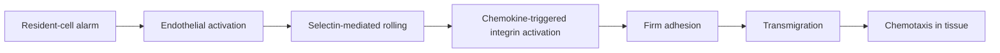

# Innate immunity: deciding when to escalate

Two patients arrive with fever and low blood pressure. One has a rapidly
growing bacterial infection; the other has sterile tissue damage after major
trauma. Both can activate overlapping inflammatory circuits. The immune system
does not own a perfect "pathogen detector." It infers danger from molecular
identity, subcellular location, tissue damage, and missing inhibitory signals.

Module 1 supplied the map. This module starts the response on that map: resident
cells recognize disturbance, blood vessels change state, and soluble and cellular
effectors are delivered to the affected compartment.

*Innate sensors respond to both molecular identity and location. Endosomal and
cytosolic nucleic-acid sensors use different pathways, but both can trigger
interferon and inflammation.*

## Learning objectives

- predict sensor output from ligand **and location**;
- explain leukocyte recruitment as a controlled delivery sequence;
- trace three complement starts to C3 cleavage and downstream effects;
- model NK-cell and inflammasome decisions as signal integration;
- distinguish evidence that a pathway initiates disease from evidence that it
  merely accompanies tissue injury.

## A receptor panel, not a single alarm

| Evidence | Example sensor system | Why location helps | Typical output |
|---|---|---|---|
| microbial surface chemistry | surface TLRs, lectins | exposed at a barrier or phagosome | inflammatory transcription |
| nucleic acid after uptake | endosomal TLRs | samples engulfed material | interferon or inflammation |
| viral replication features | RIG-I-like receptors | unusual RNA in cytosol | type I interferon |
| DNA in cytosol | cGAS-STING | host DNA should be contained | interferon and inflammation |
| membrane or ionic disruption | inflammasome sensors | reports altered cell physiology | IL-1 family cytokines, pyroptosis |

PAMP and DAMP are descriptions, not verdicts. Mitochondrial DNA released by
injury can activate pathways also used against infection. Conversely, a virus
can hide or antagonize the very signatures that would expose it.

## Inflammation is logistics

At an infected venule, the sequence is:

Deleting any step gives a different phenotype. A patient can have abundant
neutrophils in blood yet poor tissue recruitment if firm adhesion fails. This
is why a blood count is not a complete assay of innate defense.

*False-colored scanning electron micrograph of a neutrophil contacting and
engulfing clusters of *S. aureus*. The image shows phagocytosis, not successful
killing; oxidative-burst defects can occur despite normal uptake.*

## Complement: amplification on a surface

Classical, lectin, and alternative initiation routes all form C3 convertases.
C3 cleavage creates C3b, which tags surfaces, and C3a, which contributes to
inflammation. Surface C3b helps form more convertase and later C5 convertase.
C5a recruits and activates cells; terminal components can form a membrane
attack complex.

The dramatic pore is not the whole story. For many bacteria, **opsonization**
is the decisive result: C3 fragments turn a hard-to-grip capsule into a target
for complement-receptor-bearing phagocytes.

### A small amplification model

If each surface-bound convertase produces $k$ useful C3b molecules before it is
inactivated, and fraction $q$ of those seed another convertase, a crude
branching ratio is $R=kq$.

- $R<1$: deposition tends to die out.
- $R>1$: deposition can amplify rapidly.

Host regulators lower $k$, $q$, or convertase lifetime. A microbial surface
that fails to recruit those regulators can cross the amplification threshold.
Here $R$ is not the epidemiological reproduction number used later in the
vaccine module. It is the expected number of new convertases seeded by one
existing convertase in this simplified surface model.

## The septic plasma experiment

Researchers incubate the same bacterial strain in three plasma samples and
measure surface C3b fluorescence after 10 minutes:

| Plasma condition | Median fluorescence (AU) | Add-back result |
|---|---:|---|
| healthy control | 820 | not applicable |
| patient | 75 | rises to 790 with purified C3 |
| heat-inactivated control | 18 | remains low |

The patient result localizes the defect more strongly than the fever does. The
C3 add-back rescue supports a missing or nonfunctional C3 component; heat
inactivation shows that deposition depends on heat-labile plasma proteins. It
does **not** identify why the patient became deficient, nor prove that every
infection phenotype is caused only by C3.

## Cellular decisions use opposing evidence

For an NK cell, define a toy decision score. The coefficients are invented for
this example; they represent relative influence, not universal constants:

$$
S = 1.4(\text{stress ligand}) + 1.0(\text{Fc signal}) - 1.8(\text{MHC-I inhibition}).
$$

Let each input be 0 or 1 and killing occur when $S>0.5$.

| Target | Stress | Antibody Fc | MHC-I | Prediction |
|---|---:|---:|---:|---|
| healthy cell | 0 | 0 | 1 | spare |
| infected, MHC-I-low cell | 1 | 0 | 0 | kill |
| antibody-coated cell with MHC-I | 0 | 1 | 1 | spare in this toy model |
| stressed, antibody-coated cell | 1 | 1 | 1 | kill |

Real NK cells have many receptors and context-dependent weights. The table's
purpose is to replace "missing self causes killing" with the more accurate idea
of weighted activating and inhibitory evidence.

This activating-minus-inhibitory structure returns in T-cell priming, tolerance,
checkpoint blockade, and engineered receptors. The molecules and weights change;
the reasoning pattern does not.

## Inflammasomes use staged permission

Many inflammasome responses require priming that increases pathway components,
followed by an activation signal indicating disruption. This two-step logic
reduces accidental firing. Once activated, inflammatory caspases process IL-1
family cytokines and can trigger pyroptosis. Useful containment can become
pathology when activation is systemic, prolonged, or disconnected from a
clearable threat.

## Causal challenge

A study finds high plasma IL-1 in severe disease. Which claim is justified?

1. IL-1 caused the disease.
2. IL-1 marks inflammation but its causal role is unresolved.
3. Blocking IL-1 must improve survival.

Only claim 2 follows from association. Causal support would require genetics,
timed perturbation, tissue measurements, or a well-controlled intervention,
plus attention to infection risk.

## Recap

- Innate sensors interpret chemistry in anatomical and subcellular context.
- Inflammation is a multistep delivery program.
- Complement is a regulated surface-amplification system centered on C3.
- NK cells and inflammasomes integrate multiple signals rather than obeying one
  universal trigger.
- A high inflammatory marker does not, by itself, identify a therapeutic target.
