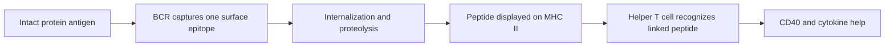

# B cells and antibodies: one binding site, several jobs

An antibody can bind a virus tightly and still fail as a drug. It may recognize
an irrelevant surface, fall off too quickly in the airway, or carry an Fc region
that recruits the wrong biology. "High affinity" is one measurement, not a
complete product specification.

Innate immunity now becomes part of the antibody story. B cells provide
specific recognition, while the antibody Fc region recruits complement,
phagocytes, NK cells, and tissue-specific transport systems introduced in the
previous module.

*V(D)J recombination and somatic hypermutation shape antigen binding. Class
switching changes the heavy-chain constant region and effector function while
usually preserving antigen specificity.*

## Learning objectives

- map antibody domains to binding and effector recruitment;
- separate V(D)J recombination, somatic hypermutation, and class switching by
  timing, enzyme, and DNA target;
- calculate occupancy from $K_D$ and interpret association/dissociation data;
- distinguish affinity from avidity;
- design evidence for neutralization rather than binding alone.

## The molecular division of labor

Two heavy chains and two light chains form an immunoglobulin. Paired variable
domains create two antigen-binding sites. Heavy-chain constant domains define
isotype and interact with Fc receptors, complement, and transport systems.

Membrane immunoglobulin plus signaling proteins forms the B-cell receptor. A
plasma cell can secrete an antibody with the same rearranged variable region.
The physical format changes while target recognition can remain continuous.

## Three DNA-editing events that students often blur

| Process | When | Main DNA change | Changes antigen specificity? |
|---|---|---|---|
| V(D)J recombination | developing B cell, before antigen | joins inherited V, D, J segments; junctions vary | creates it |
| Somatic hypermutation | activated B cell, germinal center | point mutations in variable region | often |
| Class-switch recombination | activated B cell | replaces heavy-chain constant region | no, if variable region is unchanged |

RAG proteins initiate V(D)J recombination. AID supports both somatic
hypermutation and class switching, but the outcomes differ because the target
regions and repair processes differ.

## Linked recognition: why B and T cells can cooperate safely

A B cell binds an intact protein through its BCR, internalizes it, and presents
derived peptides on MHC class II. A helper T cell recognizes one of those
peptide-MHC complexes and provides CD40 and cytokine signals. The BCR epitope
and T-cell peptide need not be identical; they must come from the same captured
molecular complex.

## Read the binding data

Three monoclonal antibodies bind the same viral protein:

| Antibody | $k_{on}$ ($M^{-1}s^{-1}$) | $k_{off}$ ($s^{-1}$) | $K_D=k_{off}/k_{on}$ | Neutralization IC50 |
|---|---:|---:|---:|---:|
| A | $1\times10^5$ | $1\times10^{-3}$ | 10 nM | 0.2 nM |
| B | $1\times10^6$ | $1\times10^{-2}$ | 10 nM | 80 nM |
| C | $2\times10^5$ | $2\times10^{-4}$ | 1 nM | no neutralization |

Antibodies A and B have the same equilibrium affinity but different kinetics.
C binds most tightly yet does not neutralize, strongly suggesting that its
epitope does not control entry or another essential viral step. A's potency may
reflect epitope, geometry, or kinetic fit; the table alone cannot isolate which.

For a one-site equilibrium model, fractional occupancy is

$$
\theta=\frac{[L]}{[L]+K_D}.
$$

Here $\theta$ is the fraction of binding sites occupied, $[L]$ is free ligand
concentration, and $K_D$ is the ligand concentration that gives half occupancy
in this simplified model. At $[L]=10$ nM, both A and B have $\theta=0.5$. That equal
occupancy still does not imply equal performance in a dynamic infection assay.

## Affinity is not avidity

Affinity describes one binding interaction. Avidity describes the combined
stability of multiple contacts. Pentameric IgM can grip a repetitive surface
through many modest-affinity sites; losing one contact need not release the
whole complex. Geometry determines whether multivalency is possible.

## Class switching changes deployment

| Isotype | Useful first-pass role | A question to ask |
|---|---|---|
| IgM | early secretion, high valency, complement | is target geometry repetitive? |
| IgG | systemic neutralization and Fc functions | which subclass and Fc receptor? |
| IgA | mucosal transport and barrier protection | monomeric or secretory form? |
| IgE | mast cells, eosinophils, helminths, allergy | is Fc-bound antibody triggering tissue cells? |

These are not rigid job titles. Glycosylation, concentration, subclass, tissue,
and epitope geometry all modify function.

## Germinal centers run an evolutionary experiment

*H&E of a secondary follicle. The germinal center contains a dense dark zone
for B-cell proliferation and a paler light zone for selection, surrounded by a
mantle of small naive B cells.*

Activated B cells mutate variable regions, compete for antigen displayed in
follicles, present captured antigen to T follicular helper cells, and receive
unequal survival and proliferation signals. Selection does not directly "read"
$K_D$. It rewards the cellular consequences of capture and presentation in a
competitive environment.

This can improve affinity while narrowing breadth. A lineage optimized for one
viral strain may lose binding to a future variant.

## Experimental design: choose a respiratory-virus antibody

Your team must advance one candidate. Require at least:

1. binding kinetics to the native viral surface protein;
2. a cell-entry neutralization assay;
3. escape mapping across variant residues;
4. an Fc-function assay appropriate to the intended isotype;
5. a mucosal or airway-relevant exposure model.

Explain what failure mode each assay catches. A large ELISA signal alone cannot
distinguish neutralizing from decorative binding.

## Recap

- V(D)J recombination creates specificity before exposure.
- Hypermutation can alter specificity; class switching changes effector context.
- Equal $K_D$ can hide different kinetics, and tight binding can be nonfunctional.
- Avidity depends on valency and geometry.
- Germinal-center selection acts on cellular performance, not an affinity meter.
