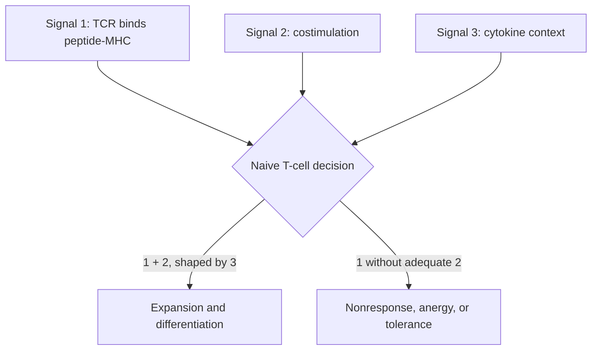

# T cells and MHC: seeing a cell's internal report

Antibodies inspect intact surfaces. Most T cells inspect short molecular reports
displayed by MHC molecules. This difference lets a cytotoxic T cell detect a
virus replicating inside a cell, but it also creates a strict condition: the
right peptide must be generated, loaded onto the right MHC allele, and seen by
the right T-cell receptor.

The contrast with module 3 is deliberate: BCRs and antibodies bind intact
structures, whereas conventional TCRs recognize processed peptide-MHC. Linked
recognition lets these two recognition systems cooperate without requiring
them to bind the same molecular feature.

*MHC I mainly displays cytosolic peptides to CD8 T cells, while MHC II displays
endosomal peptides to CD4 T cells. Cross-presentation allows dendritic cells to
place captured antigen on MHC I and prime naive CD8 cells.*

## Learning objectives

- trace peptide generation and loading for MHC I and MHC II;
- explain MHC restriction using an experiment rather than a slogan;
- separate signal 1, signal 2, and signal 3 during naive T-cell activation;
- predict consequences of antigen-processing or costimulation defects;
- interpret killing data without confusing recognition and effector failure.

## Two presentation routes

| Feature | MHC class I | MHC class II |
|---|---|---|
| Main protein source | cytosol | endosome/phagosome |
| Main responding T cell | CD8 | CD4 |
| Broad expression | most nucleated cells | professional APCs and inducible contexts |
| Core job | report intracellular state | report captured extracellular material |

In the class I route, cytosolic proteins are degraded, peptides are transported
toward the endoplasmic-reticulum loading machinery, and stable peptide-MHC I
complexes reach the surface. Viruses that block peptide transport or MHC I
surface expression reveal how important each step is.

In the class II route, internalized proteins are degraded in acidified
compartments. Class II molecules are protected from premature peptide binding
during trafficking; peptide-loading machinery then favors stable complexes.

*Computer-rendered dendritic-cell surface based on 3D electron microscopy. Its
broad membrane folds increase contact area, but cell shape alone does not show
whether the cell is mature or able to prime naive T cells.*

## The classic restriction experiment, rebuilt

A CD8 T-cell clone was raised against viral peptide P in a person carrying MHC
allele HLA-A*02. Researchers test four target cells:

| Target | Peptide P present? | HLA-A*02 present? | Percent killed |
|---|---:|---:|---:|
| 1 | yes | yes | 82 |
| 2 | yes | no | 4 |
| 3 | no | yes | 3 |
| 4 | no | no | 2 |

The clone recognizes the **combination** of peptide and a particular MHC. It is
not enough for the target to contain the peptide, and the MHC allele alone is
not the antigen. This is MHC restriction as a data pattern.

### Controls that make the conclusion stronger

- Confirm equal target viability before adding T cells.
- Verify HLA-A*02 surface abundance.
- Pulse targets with synthetic peptide to bypass processing.
- Measure T-cell degranulation as well as target death.

If an infected target is not killed but peptide pulsing rescues killing, the
defect lies upstream of surface peptide-MHC: antigen abundance, proteolysis,
transport, or loading. If peptide-MHC is abundant and degranulation occurs but
the target survives, investigate the killing machinery or target resistance.

## Naive activation is a multi-input decision

Signal 1 supplies antigen specificity. Signal 2 reports that an appropriately
activated presenter is authorizing the response. Signal 3 biases differentiation.
These categories are teaching abstractions; real contacts contain many positive,
negative, mechanical, and metabolic inputs.

This is the activation-balance model from innate immunity with named T-cell
inputs. Later, peripheral tolerance and checkpoint therapy will change the
inhibitory side of the same balance rather than changing antigen specificity.

## Why an infected epithelial cell does not usually prime a naive T cell

The epithelial cell may display viral peptide-MHC I and be an excellent target
for an already activated cytotoxic T cell. It usually lacks the migration,
costimulation, and lymph-node context needed to activate a rare naive clone.
Specialized dendritic cells can capture infected-cell material, migrate, and
cross-present antigen to prime CD8 T cells.

Priming and killing are different cellular conversations.

## Clonal expansion has startling arithmetic

If one activated T cell divides once every 8 hours for 5 days with no loss, the
upper-bound clone size is

$$
N=2^{(5\times24)/8}=2^{15}=32{,}768.
$$

Here $N$ is the number of descendants from one starting cell and the exponent is
the number of possible divisions. Real division is asynchronous and cells die or stop cycling, but exponential
growth explains how a nearly undetectable precursor becomes a measurable
effector population. It also explains why contraction is necessary after the
antigen and inflammatory context disappear.

## CD4 and CD8 are not merely "helper" and "killer" labels

CD8 T cells commonly kill infected or altered cells and secrete cytokines. CD4
T cells can activate macrophages, help B cells, organize barrier responses,
support cytotoxic responses, or restrain immunity. Function depends on
differentiation state and tissue, not only coreceptor.

## Case: immune escape or assay artifact?

A tumor loses recognition by a T-cell clone. Sequencing shows the target protein
is unchanged. List at least four remaining explanations:

1. loss of the restricting MHC allele;
2. impaired peptide processing or transport;
3. reduced target-protein expression despite unchanged sequence;
4. inhibitory signaling or T-cell dysfunction;
5. failure of T cells to enter the tumor;
6. technical failure in the assay.

The unchanged antigen sequence closes only one branch of the causal tree.

## Recap

- T cells recognize peptide-MHC combinations, not free peptide.
- Class I and II sample different protein compartments through different routes.
- Cross-presentation connects captured antigen to CD8 priming.
- Naive activation requires antigen plus authorization and contextual signals.
- Loss of killing can arise from presentation, recognition, trafficking, or
  effector defects.
