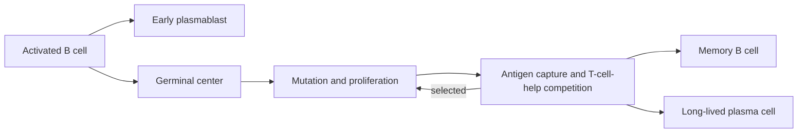

# Coordinated response and memory: read the whole time course

On day 0, a volunteer receives an influenza vaccine. On day 1, innate signals
are visible. On day 7, plasmablasts peak in blood. Weeks later, most expanded
cells are gone, yet antibody and memory persist. Six months later a booster
produces a faster response.

No single snapshot explains this trajectory. Protection is built by timed
handoffs among tissues, cell populations, and molecular products.

This module is the first full synthesis. Follow one response through the anatomy
of module 1, innate escalation of module 2, B-cell selection of module 3, and
T-cell priming of module 4, then ask which products remain after contraction.

*Different parts of an immune response peak at different times. The y-axis is
qualitative: falling effector counts during contraction can coexist with
persistent antibody and memory cells.*

## Learning objectives

- narrate a response from tissue detection through priming and return;
- explain germinal-center dark-zone and light-zone work without treating them
  as a one-way assembly line;
- distinguish long-lived plasma cells, memory B cells, circulating T-cell
  memory, and tissue-resident memory;
- fit a simple expansion/contraction model to qualitative data;
- identify what a blood assay can and cannot reveal about protection.

## One response, several clocks

| Approximate phase | Dominant event | What a blood sample might show |
|---|---|---|
| minutes to day 2 | sensing, inflammation, antigen transport | cytokines, recruited-cell changes |
| days 2-7 | T- and B-cell priming, rapid clonal expansion | activated cells, early plasmablasts |
| weeks | germinal-center selection, effector action | rising antibody, changing clonotypes |
| weeks to months | contraction and niche formation | falling effectors, persistent antibody |
| later re-exposure | recall from antibody and memory cells | faster expansion and antibody increase |

The ranges overlap and vary by pathogen, vaccine, route, age, and assay. Their
value is to prevent a category error: "the immune response" is not one peak.

## The T-B handoff

B cells bind intact antigen in follicles, internalize it, and display linked
peptides. Activated helper T cells and B cells meet near the T-B border. Some B
cells become short-lived antibody-secreting cells, providing speed. Others enter
germinal centers, accepting delay in exchange for iterative selection.

Spatial cycling matters. The germinal center repeatedly couples variation to a
performance test; it is not a chamber where affinity simply rises with time.

## Expansion and contraction as population dynamics

Let antigen-specific cell number be $N(t)$:

$$
\frac{dN}{dt}=[r(t)-d(t)]N.
$$

Here $N(t)$ is clone size at time $t$, $r(t)$ is the per-cell rate of division or
recruitment into the measured population, and $d(t)$ is the per-cell rate of loss
through death or departure. Their difference is the net rate $g(t)=r(t)-d(t)$.
During priming, growth and survival signals make $g>0$. After pathogen control,
antigen and inflammatory support decline, making $g<0$ for most effectors.

If a clone grows from 20 to 20,000 cells in 6 days, its net exponential rate is

$$
g=\frac{\ln(20{,}000/20)}{6}\approx1.15\ \text{day}^{-1}.
$$

If it then falls to 600 cells over 12 days,

$$
g=\frac{\ln(600/20{,}000)}{12}\approx-0.29\ \text{day}^{-1}.
$$

The same growth-minus-loss model will return for treatment-sensitive and resistant
tumor clones and for engineered cell therapies. The biological causes of the
rates differ, but the time-course question is the same.

The 600 survivors are not merely random leftovers. Differentiation history,
metabolism, cytokine access, and niche occupancy influence persistence.

## Four durable products that are not interchangeable

| Product | What persists | What it provides |
|---|---|---|
| Long-lived plasma cell | secreting cell in a supportive niche | antibody without reactivation |
| Memory B cell | responsive clone | adaptable recall and new antibody secretion |
| Circulating memory T cell | recirculating antigen-experienced cell | surveillance and proliferative reserve |
| Tissue-resident memory T cell | locally retained cell | rapid response at a particular barrier |

A serum antibody assay measures a current product, not the full memory system.
A peripheral-blood sample may miss cells lodged in skin, gut, lung, or marrow.

*Multicolor immunofluorescence of mouse bone marrow. Arrows mark rare
IgG2b-positive memory B cells among blue nuclei and stromal markers, showing why
blood samples can miss tissue-resident immune populations.*

## Read the booster dataset

| Measurement | Day 0 | Day 7 | Day 28 | Six months | Day 7 after booster |
|---|---:|---:|---:|---:|---:|
| serum neutralization titer | 20 | 160 | 640 | 120 | 2,560 |
| antigen-specific memory B cells per million | 3 | 14 | 85 | 72 | 240 |
| circulating effector CD8 cells per million | 8 | 410 | 55 | 18 | 760 |

Questions:

1. Which row most clearly shows contraction?
2. Which measurement demonstrates a durable cellular reserve despite waning
   serum titer?
3. Does the booster prove tissue-resident memory formed? Why not?
4. Can the table distinguish new naive-clone recruitment from expansion of old
   memory clones? What additional data would help?

The last question needs lineage or receptor-sequence information over time. A
larger recall peak alone does not reveal which clones supplied it.

## Route changes the geography of memory

Compare intramuscular and intranasal delivery of the same antigen. A mucosal
route may better engage local IgA and airway-resident populations, but outcome
depends on formulation, safety, innate context, antigen persistence, and the
actual exposure site. "Mucosal is better" is not a mechanism.

A rigorous comparison would measure systemic IgG, mucosal antibody, circulating
memory, relevant tissue cells, adverse inflammation, and challenge outcome.

## Prior experience helps and constrains

Existing antibody can neutralize quickly, memory clones begin at higher
frequency, and experienced cells can respond rapidly. The same history can
focus recall on familiar epitopes, mask alternative epitopes, or let memory
clones outcompete useful naive clones. Memory is a head start, not a guarantee
of perfect adaptation to a variant.

## Recap

- Responses are trajectories with overlapping innate, effector, selection,
  contraction, repair, and memory phases.
- Germinal centers iterate mutation, capture, and helper-cell competition.
- Plasma cells, memory B cells, and T-cell memory preserve different capabilities.
- Blood is an accessible compartment, not a complete map of immune memory.
- Recall speed reflects prior state but can also inherit prior bias.
