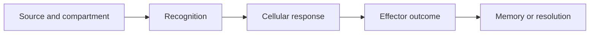

# Foundations cumulative test

This checkpoint uses experiments, time courses, and paired compartments. Treat
each question as a small model-selection problem, not a vocabulary prompt.

Use the same five coordinates introduced in module 1:

| Coordinate | Ask |
|---|---|
| recognition | what ligand-receptor or peptide-MHC interaction is required? |
| context | which activating or inhibitory inputs authorize the response? |
| compartment | can the relevant antigen and cells physically meet? |
| time | is the observation initiation, expansion, contraction, or memory? |
| control | which perturbation or comparison separates the explanations? |

| First ask | Then check |
|---|---|
| Where is antigen or signal located? | Which cells can physically encounter it? |
| What was perturbed? | Which upstream and downstream steps remain intact? |
| What changed over time? | Is the pattern expansion, contraction, or persistence? |
| What does an assay measure? | What stronger claim would require another control? |

Use this causal skeleton when a vignette feels crowded. It is a compact way to
connect the five coordinates rather than a second framework to memorize:

Before choosing, explain why the perturbation changes one arrow in the chain.
