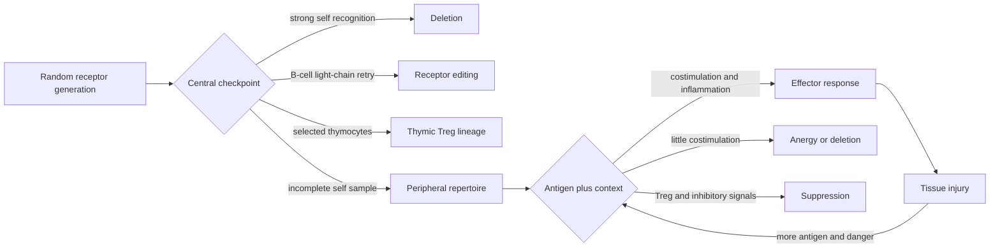

# The self-reactive clone that got away

A 12-year-old develops chronic diarrhea, eczema, and autoimmune thyroid disease.
His infant brother died after relentless enteropathy. Flow cytometry finds plenty
of CD4 T cells, but very few are `CD25-high FOXP3+`. The problem is not failure to
make an immune response. It is failure to stop one.

Random receptor assembly guarantees that self-reactive lymphocytes will be made.
Tolerance is therefore not a blacklist of forbidden receptors. It is a layered
control system that samples self during development, checks activation context in
the periphery, and actively restrains responses in tissues.

The first five modules explained how rare clones are generated, activated, and
remembered. The same machinery creates the central problem of this module: useful
coverage and dangerous self-reactivity arise from one diverse repertoire, so
control must operate during development and again in peripheral tissues.

## Questions to carry through the module

- Why does the thymus deliberately keep some self-reactive cells as regulatory T cells?
- What did thymus grafts, cell-transfer experiments, and FOXP3 mutations actually prove?
- When is a quiet immune system tolerant, and when is it merely drug-suppressed?
- How can a therapy reduce autoimmunity without deleting useful antimicrobial clones?

## Two checkpoints, different jobs

The central checkpoint lowers the frequency and avidity of dangerous clones. It
cannot be complete: not every tissue antigen is displayed, receptors cross-react,
and deleting every weakly self-reactive clone would leave holes in pathogen
coverage. Peripheral tolerance handles what escapes and what changes later.

## AIRE turns the thymus into a molecular atlas

Medullary thymic epithelial cells express proteins normally associated with
pancreas, skin, eye, and other peripheral tissues. AIRE helps drive this unusual
promiscuous gene expression. Antigen can be presented directly or transferred to
thymic dendritic cells.

Human genetics provides a natural perturbation: biallelic **AIRE** loss causes
autoimmune polyendocrine syndrome type 1, with characteristic organ-specific
autoimmunity. The phenotype is strong evidence that broad thymic antigen display
matters, but it does not mean AIRE is the only central-tolerance program.

*H&E of thymic medulla. The pink concentric whorls are Hassall corpuscles,
surrounded by small thymocytes. They identify medullary tissue but do not directly
measure AIRE expression or negative selection.*

| Fate | Trigger and location | What it accomplishes | What it cannot guarantee |
|---|---|---|---|
| clonal deletion | strong self peptide-MHC signal in thymus or marrow | removes a dangerous clone | complete sampling of self |
| receptor editing | continued light-chain rearrangement in immature B cell | changes specificity without discarding the whole cell | a harmless final receptor |
| thymic Treg selection | particular self-reactive signals plus lineage cues | converts some self recognition into active restraint | suppression in every tissue |
| anergy | antigen recognition with inadequate activation context | raises the response threshold | irreversible silence |
| peripheral deletion | repeated stimulation or loss of survival signals | contracts persistent clones | protection from newly recruited clones |

## The neonatal thymectomy experiment

In a classic mouse experiment, removing the thymus around day 3 of life caused
multi-organ autoimmune disease. The surprising rescue was not simply adding any
T cells: transfer of the appropriate CD4 regulatory population prevented disease.
Later depletion-and-transfer studies showed the converse: removing CD25-rich
regulatory cells from a T-cell inoculum could unleash autoimmunity in a recipient.

These experiments separate two ideas:

- **recessive tolerance** changes the dangerous clone itself by deletion, editing,
  anergy, or inhibitory signaling;
- **dominant tolerance** is imposed by another cell and can therefore be removed
  or transferred.

FOXP3 mutations in humans cause IPEX syndrome, while `Foxp3` mutation causes the
scurfy phenotype in mice. Together, genetics and transfer experiments establish
that regulatory T cells are a required lineage, not merely exhausted conventional
T cells wearing a marker.

## Tregs alter the local accounting

Tregs do not emit a single universal suppressive molecule. They change several
terms in the activation balance introduced for innate cells and T-cell priming:

$$
S_{\text{net}} = S_{\text{TCR}} + S_{\text{costim}} + S_{\text{cytokine}}
- S_{\text{inhibitory}} - S_{\text{regulatory}}.
$$

Each $S$ term denotes the effective contribution of the named input, not a
directly interchangeable laboratory unit. An effector program proceeds when
$S_{\text{net}}$ remains above a context-specific
threshold long enough. Tregs can reduce APC costimulation through CTLA-4, consume
IL-2 through high CD25 expression, produce suppressive mediators, alter metabolites,
and support tissue repair. None of these mechanisms works equally in every organ.

That spatial dependence matters. A Treg in blood is not useful if it cannot enter
an inflamed islet. A Treg that loses lineage stability in inflammatory cytokines
may not remain suppressive. A broadly expanded Treg pool may also impede tumor or
pathogen control.

## The transplant result that looks like tolerance

Suppose 100 kidney recipients receive a new therapy. At one year, 80 have no
rejection. That is encouraging, but it does not establish tolerance if all 80 are
still taking the drug. A stronger test asks what happens after carefully supervised
withdrawal while unrelated immunity remains intact.

| Observation | Compatible with tolerance? | Important alternative |
|---|---:|---|
| inflammation falls during treatment | yes | broad pharmacologic suppression |
| donor-reactive cells disappear from blood | yes | redistribution into tissue |
| vaccine response remains normal | supports specificity | vaccine tested a different immune compartment |
| graft survives after drug withdrawal | strongly supports durability | slow drug washout or low graft immunogenicity |
| donor-specific unresponsiveness with third-party response intact | strongly supports specificity | assay does not reproduce graft tissue context |

The evidentiary standard is counterfactual: would this immune system still answer
a dangerous unrelated antigen while declining the target antigen after treatment
has ended?

## Design a tolerance therapy

For autoimmune diabetes, compare four interventions: anti-CD3-mediated modulation,
systemic low-dose IL-2, insulin-peptide nanoparticles delivered in a tolerogenic
context, and engineered islet-homing Tregs. Score each from 1 to 5 for speed,
antigen specificity, tissue localization, durability, infection risk, and
manufacturing complexity. Then name one measurement that could falsify your
preferred mechanism.

The core design problem is not "how do we turn immunity down?" It is "which clone,
in which tissue, during which phase of disease, should learn not to attack?"

## Carry forward

In the next three modules, use normal regulation as the reference state.
Autoimmunity is sustained self-directed activation, hypersensitivity is damaging
effector deployment against an otherwise tolerable target, and immunodeficiency
is failure to mount or deliver a needed response. Similar symptoms can therefore
come from excess, misdirection, or absence at different points in the circuit.
