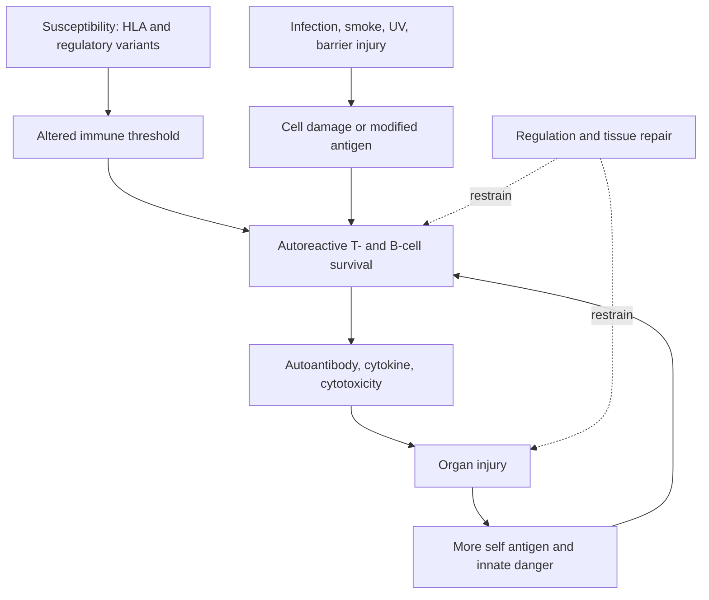

# Autoimmunity is a loop, not a switch

A 24-year-old arrives with pleuritic chest pain, swollen fingers, proteinuria,
and fatigue. Her antinuclear antibody is positive, anti-double-stranded DNA is
high, and serum C3 is low. A positive antibody does not yet explain nephritis.
The mechanistic story must connect failed clearance, adaptive recognition,
immune complexes, complement activation, and a kidney that filters plasma.

This is peripheral tolerance failure viewed as a time-dependent tissue loop.
Module 6 supplied the missing brakes; modules 2 through 5 supply the complement,
antibody, T-cell, trafficking, and memory mechanisms that can keep injury going
after an initiating trigger disappears.

## What you should be able to explain

- separate susceptibility, initiation, amplification, and organ injury;
- distinguish mimicry, epitope spreading, bystander activation, and neoepitopes;
- use treatment perturbations as evidence without confusing response with proof;
- interpret an autoantibody as cause, participant, predictor, or witness;
- explain why patients with the same diagnosis can require different therapies.

## Follow the causal loop

A trigger can disappear while the loop continues. That is why proving that an
infection preceded disease is not the same as proving that persistent infection
now drives disease.

## Four routes that should not be collapsed

| Mechanism | Defining claim | Strong evidence | Weak shortcut |
|---|---|---|---|
| molecular mimicry | one receptor recognizes microbial and self epitopes | cloned receptor binds both and transfers relevant function | sequence resemblance |
| epitope spreading | the response broadens after tissue damage | longitudinal appearance of new specificities after initial injury | many antibodies at one late time point |
| bystander activation | inflammatory context activates nearby autoreactive cells | activation without cross-reactive antigen recognition | inflammation happened nearby |
| neoepitope formation | modification creates a newly recognized self determinant | modification-dependent binding and presentation | modified protein exists in diseased tissue |

In rheumatoid arthritis, citrullination is mechanistically interesting because
post-translational conversion of arginine changes peptide chemistry. But finding
citrullinated proteins is not enough; the chain must include presentation,
receptor recognition, and pathogenic consequence.

## Four patients, four network architectures

| Disease | Early clue | Major adaptive role | Amplifier | Organ bottleneck |
|---|---|---|---|---|
| lupus | nuclear autoantibodies, photosensitivity | B-cell antibody and presentation; T-cell help | nucleic-acid sensing, type I interferon, immune complexes | glomerular deposition and local inflammation |
| rheumatoid arthritis | inflammatory small-joint synovitis | T cells and B cells recognizing modified self | macrophage cytokines, fibroblast persistence | pannus, cartilage loss, osteoclast activation |
| multiple sclerosis | neurologic episodes separated in time or space | T-cell entry and B-cell antigen presentation/organization | CNS-compartmentalized inflammation | demyelination plus irreversible axonal injury |
| type 1 diabetes | multiple islet autoantibodies before hyperglycemia | T-cell-mediated beta-cell attack with B-cell participation | epitope spreading and local inflammation | finite beta-cell reserve |

### Lupus: why complement can be low

Immune complexes containing nuclear antigen and antibody circulate and lodge in
vascular beds. Complement activation recruits inflammation and consumes
components, so low C3/C4 can accompany active immune-complex disease. Yet inherited
deficiency of early classical components can itself predispose to lupus by
impairing debris clearance. "Low complement" can therefore be consequence or cause,
depending on timing and genotype.

*Direct immunofluorescence of skin showing IgG along the dermal-epidermal
junction: a positive lupus band. The result supports immune-complex deposition,
but depends on the biopsy site and does not diagnose lupus nephritis.*

### Rheumatoid arthritis: the target tissue becomes an organ

The inflamed synovium contains macrophages, lymphocytes, endothelial changes, and
fibroblast states that can persistently produce cytokines and matrix-degrading
enzymes. Anti-TNF success demonstrates that TNF is an important amplifier in many
patients. Nonresponse demonstrates that it is not the sole architecture.

### Multiple sclerosis: what B-cell depletion taught us

Anti-CD20 therapy can markedly reduce new inflammatory lesions even though it
does not directly remove most long-lived plasma cells. This result weakens a story
in which soluble antibody is the only B-cell contribution and supports roles in
antigen presentation, cytokine production, and lymphoid organization.

*Axial double-inversion-recovery MRI in multiple sclerosis. Circles mark cortical
and juxtacortical lesions; arrows indicate additional lesions found on a companion
sequence. MRI distribution supports the diagnosis but must be combined with time
course and exclusion of mimics.*

### Type 1 diabetes: two clocks are running

Immune activity and beta-cell reserve are different state variables. A therapy can
slow attack yet fail clinically if too little functional mass remains. Conversely,
cell replacement without immune control places new beta cells into the same hostile
environment.

## A biomarker is not a mechanism

Imagine an autoantibody assay with 90% sensitivity and 90% specificity in a
population where disease prevalence is 1%. Among 10,000 people:

- about 90 true cases test positive;
- about 990 healthy people test positive;
- the positive predictive value is only $90/(90+990) \approx 8.3\%$.

The same test is far more useful in a high-risk clinic than as population
screening. Pretest probability changes interpretation even when assay performance
does not.

This begins a diagnostic thread that continues in allergy and immunodeficiency:
sensitivity and specificity describe a test, but positive and negative predictive
values also depend on how common the condition is in the tested population.

## Audit the mimicry claim

Claim: "Virus X causes disease Y through molecular mimicry." Build an evidence
ladder:

1. exposure precedes disease more often than expected;
2. a receptor cloned from the patient binds both viral and self antigen;
3. structural or mutational work maps the shared recognition features;
4. perturbing that receptor or epitope changes disease in a relevant model;
5. the mechanism is detectable before extensive tissue damage.

At every rung, test alternatives: shared genetics, surveillance bias, tissue
damage exposing antigens, nonspecific cytokine activation, or treatment effects.

## Treatment as a perturbation experiment

| Intervention | Immediate mechanistic prediction | Result that challenges the story |
|---|---|---|
| B-cell depletion | fewer antigen-presenting/cytokine-organizing B cells | disease persists despite deep tissue depletion |
| cytokine blockade | downstream inflammatory program falls quickly | target engagement occurs but tissue program is unchanged |
| lymphocyte trafficking block | fewer new cells enter target organ | progression continues from compartmentalized resident cells |
| immune reset | pathogenic repertoire contracts and rebuilds differently | relapse returns with the same clones and state |

Clinical response says the perturbed node mattered. It does not automatically say
that node initiated disease.

## Case conference

Return to the patient with nephritis. Draw three arrows linking anti-DNA antibodies
to kidney injury, then name a test at each arrow: antibody specificity/affinity,
complex formation and complement activation, and renal biopsy localization. Finally,
identify which evidence would change treatment today and which would mainly improve
the causal model.

## Carry forward

Do not use "immune overreaction" as the explanation. Name the recognized target,
dominant effector, injured compartment, feedback that sustains disease, and
control that failed. The hypersensitivity module keeps this discipline but
organizes injury by effector mechanism and timing.
