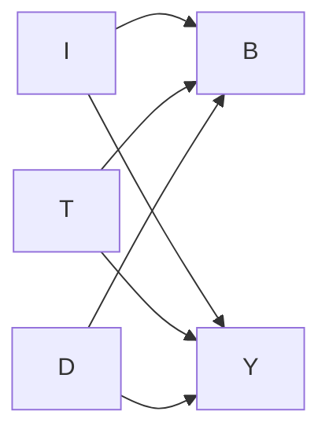

# Deeper theory: causal graphs and mixed diseases

Let genotype $G$, exposure $E$, immune state $I$, tissue damage $T$, treatment $D$,
and measured biomarker $B$ contribute to outcome $Y$. Several graphs can produce
the same correlation between $B$ and $Y$:

If both biomarker and symptoms fall after treatment, the biomarker may be a mediator,
a downstream consequence, or simply another treatment-responsive readout. A
mechanistic trial should predefine target engagement, pathway response, tissue
effect, clinical effect, and an infection or toxicity measure.

## Average benefit can hide opposite effects

Suppose a trial mixes 60 interferon-high patients and 40 fibrosis-dominant patients.
A drug improves a 10-point activity score by 6 points in the first group but worsens
it by 3 in the second:

$$\Delta_{\text{average}} = 0.6(-6) + 0.4(+3) = -2.4.$$

Here the weights 0.6 and 0.4 are the subgroup fractions, while -6 and +3 are
their mean score changes; negative values indicate improvement on this
hypothetical activity scale. The modest average conceals a useful drug and a harmed subgroup. An endotype is
valuable only if defined reproducibly before outcome inspection and validated in a
new cohort. Post hoc subgroup carving can manufacture apparently precise stories.

## Three meanings of "autoantibody positive"

An autoantibody may be directly pathogenic, may amplify antigen uptake and
inflammation, or may merely record a breached tolerance checkpoint. Ask whether
purified antibody transfers function, whether removing antibody changes disease,
whether the target is accessible in vivo, and whether titer tracks the relevant
tissue process.
