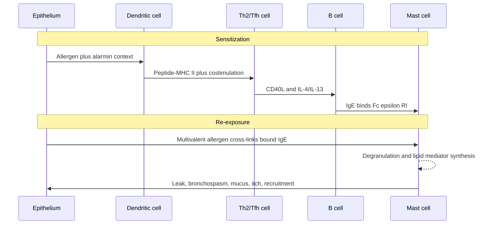

# When defense becomes the emergency

Minutes after eating a cookie at a school party, a teenager develops hives,
vomiting, wheeze, and dizziness. Blood pressure is 78/42 mmHg. Her first peanut
exposure did not cause this scene; it built the molecular apparatus that made the
second exposure dangerous.

Hypersensitivity types are mechanisms of injury, not grades of severity. Type I
can kill in minutes, Type II can alter a receptor without killing a cell, Type III
depends on soluble complexes and where they deposit, and Type IV is executed by T
cells over hours to days.

Autoimmunity classified disease by a self-directed causal loop. Hypersensitivity
classification asks a different question: which immune effector produces injury?
The categories can include self or foreign targets and can overlap within one
patient, so they should not replace the five-coordinate mechanism.

## Mechanism before mnemonic

| Type | Recognition and effector | Typical timing | Tissue logic | Example |
|---|---|---|---|---|
| I | allergen-specific IgE on mast cells/basophils | minutes; late phase hours later | vasoactive and smooth-muscle mediators | anaphylaxis, allergic asthma |
| II | IgG/IgM against cell surface or matrix | hours to days | opsonization, complement, receptor activation/blockade | autoimmune hemolysis, Graves disease |
| III | soluble antigen-antibody complexes | hours to days | deposition plus complement and neutrophils | serum sickness, some vasculitis |
| IV | antigen-specific T cells | roughly 24-72 hours | cytokine inflammation or direct cytotoxicity | contact dermatitis, tuberculin reaction |

One patient can contain more than one row. Asthma, for example, can combine IgE,
eosinophilic inflammation, epithelial alarmins, neural responses, and remodeling.

## The two-exposure architecture of IgE allergy

Sensitization means allergen-specific IgE exists. Clinical allergy means exposure
reproducibly causes symptoms. The distinction explains why a positive skin-prick
or serum IgE test can coexist with eating the food safely.

## Why epinephrine comes first

Anaphylaxis joins several physiological failures at once:

- vasodilation lowers systemic vascular resistance;
- vascular leak lowers effective circulating volume;
- airway edema narrows the upper airway;
- bronchial smooth-muscle contraction narrows the lower airway;
- mucus and gastrointestinal contraction add obstruction and fluid loss.

Intramuscular epinephrine addresses this system through alpha-adrenergic
vasoconstriction and reduced edema, beta-1 cardiac support, and beta-2
bronchodilation plus reduced mediator release. Antihistamines may improve itch and
hives; they do not reliably reverse shock or airway compromise.

## A threshold, not an allergen on/off switch

Mast-cell activation depends on allergen dose, valency, epitope spacing, IgE
affinity and clonality, Fc-receptor density, inhibitory receptors, and tissue
state. Cofactors such as exercise, infection, alcohol, or NSAID exposure can shift
the response threshold. This is the course's activation-balance model again, but
the inputs are not measured on a shared scale and do not justify a fitted-looking
equation here. The useful prediction is that reaction thresholds can vary between
days and that "the dose was small" does not settle risk.

*Dermographism: stroking the skin produces raised linear wheals through mast-cell
mediator release. Typical urticaria blanches and each lesion resolves within
about 24 hours; painful or persistent lesions suggest another diagnosis.*

## The late phase rewrites the tissue

Preformed histamine acts quickly. Newly synthesized leukotrienes and prostaglandins
extend bronchoconstriction and vascular effects. Cytokines recruit eosinophils and
other leukocytes over hours. Repeated epithelial injury, type 2 cytokines, and
repair can produce mucus-cell change, smooth-muscle growth, and altered barrier
function.

ILC2s can respond rapidly to epithelial cytokines such as IL-33, IL-25, and TSLP
without rearranged antigen receptors. Eosinophils contribute granule proteins,
lipid mediators, and remodeling signals. This is a normal barrier-defense toolkit
deployed against the wrong target or at the wrong magnitude.

## Three non-IgE injuries

**Type II, receptor activation:** In Graves disease, antibody binding stimulates
the TSH receptor. No cell must be lysed for disease to occur.

**Type III, geometry of deposition:** Complex size, antigen-antibody ratio, charge,
blood flow, and filtration influence where complexes settle. Complement fragments
then recruit neutrophils, whose attempted clearance can damage vessel walls.

**Type IV, memory T cells in skin:** Nickel ions alter or bridge molecular contacts
recognized by T cells. On re-exposure, resident and recruited T cells produce a
delayed eczematous reaction. The delay reflects cellular recruitment and gene
expression, not a weaker response.

## Read a diagnostic test with Bayes

*Skin-prick testing is interpreted against positive histamine and negative
controls. A larger allergen wheal shows sensitization, not necessarily clinical
allergy; the exposure history remains essential.*

Assume a food-specific IgE test has 90% sensitivity and 80% specificity. In 1,000
children with a 5% pretest probability:

| Outcome | Allergic | Not allergic |
|---|---:|---:|
| positive test | 45 | 190 |
| negative test | 5 | 760 |

The positive predictive value is $45/(45+190) \approx 19\%$. In a child with a
convincing immediate reaction history, the pretest probability is much higher and
the same result means something different. Tests detect sensitization; history and,
when appropriate and safe, controlled challenge establish clinical reactivity.

This is the same base-rate effect as the autoantibody example in the previous
module. The next module converts the same reasoning into prior and posterior odds.

## Targeted therapies are pathway probes

| Intervention | Node perturbed | Useful prediction | What response does not prove |
|---|---|---|---|
| anti-IgE | free IgE and Fc-receptor loading | fewer IgE-driven exacerbations | IgE initiated all airway disease |
| IL-4R alpha blockade | IL-4/IL-13 signaling | benefit in type 2-high disease | every patient shares that endotype |
| anti-IL-5 pathway | eosinophil survival/traffic | fewer eosinophilic exacerbations | eosinophils are the only source of damage |
| allergen immunotherapy | repeated controlled antigen exposure | higher reaction threshold, altered antibody/cell response | permanent tolerance in every patient |

## Emergency-room handoff

For the teenager in shock, list actions in order and attach a physiological reason
to each. Then distinguish acute stabilization from the later work: identify the
trigger, prescribe and teach epinephrine use, assess asthma and cofactors, and
decide whether specialist-supervised challenge or immunotherapy is appropriate.

Finally, classify these without relying on memorized examples: transfusion reaction,
serum sickness after a foreign protein drug, poison ivy dermatitis, and a positive
peanut IgE test in someone who eats peanuts weekly without symptoms.

## Carry forward

The next module inverts the question. Instead of asking how an intact effector
system damages tissue, ask which missing or nonfunctional component best explains
the pathogen, site, age of onset, and laboratory pattern.
