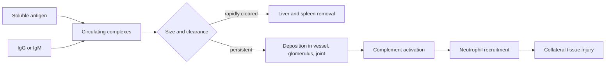

# Deeper theory: thresholds, complexes, and desensitization

## Immune-complex disease has a concentration window

Large complexes formed near antibody excess are often cleared efficiently. Very
small complexes formed in antigen excess can persist and deposit. The dangerous
region is therefore not simply "more antibody means more disease." Stoichiometry,
clearance, complement, vascular permeability, and local filtration all matter.

## Desensitization and durable tolerance are not synonyms

Rapid drug desensitization can create a temporary hyporesponsive state that
requires uninterrupted exposure; stopping the drug may allow reactivity to return.
Allergen immunotherapy unfolds over longer periods and may change blocking IgG,
mast-cell thresholds, T-cell programs, and regulatory responses. Outcomes vary by
allergen, route, duration, and patient.

An experiment that shows a higher challenge threshold next week demonstrates
desensitization. Durable tolerance requires persistence after a substantial period
without exposure or treatment.

## Diagnostic likelihood ratios

For sensitivity $Se$ and specificity $Sp$:

$$LR^+ = \frac{Se}{1-Sp}, \qquad LR^- = \frac{1-Se}{Sp}.$$

Sensitivity $Se$ is the probability of a positive result among affected people;
specificity $Sp$ is the probability of a negative result among unaffected people.
$LR^+$ describes how much a positive result changes the odds, and $LR^-$ does the
same for a negative result. Convert prior odds to posterior odds by multiplying by the likelihood ratio. This
forces the test result to modify a clinical history rather than replace it.
