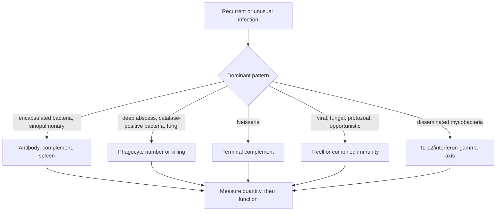
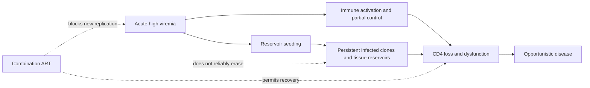

# The pathogen is pointing at the broken pathway

An 8-month-old has pneumonia, persistent thrush, chronic diarrhea, and poor growth.
Two older male relatives died in infancy. His absolute lymphocyte count is very
low; the chest radiograph lacks a visible thymic shadow. Before naming a gene, the
case already localizes the failure: early onset, multiple pathogen classes, and
absent T-cell development imply a combined immune defect.

Immunodeficiency diagnosis is reverse engineering. Pathogen, anatomical site, age,
family history, vaccine response, medication exposure, and laboratory function are
observations of a hidden system.

This is the inverse problem of modules 6 through 8. Start with the normal circuit
from modules 1 through 5, then localize which recognition, delivery, effector, or
memory step is absent. A pathway name is useful only after the phenotype has
located the broken function.

## Start with localization

Patterns are likelihood clues, not deterministic labels. Bronchiectasis, aspiration,
cystic fibrosis, barrier injury, exposure, and immunosuppressive drugs can imitate
primary immune defects.

## The bedside-to-bench matrix

| Failed layer | Infection clue | First-line measurement | Functional follow-up |
|---|---|---|---|
| antibody | recurrent otitis, sinusitis, pneumonia after maternal IgG wanes | IgG/IgA/IgM, B-cell count | vaccine-specific titers |
| complement | invasive Neisseria or recurrent pyogenic disease | CH50 and AH50 | individual component assay |
| neutrophil number | bacterial/fungal infection with neutropenia | CBC with differential | serial counts, marrow if indicated |
| neutrophil oxidative burst | deep abscesses, catalase-positive organisms | normal count may coexist | dihydrorhodamine flow assay |
| T-cell/combined | thrush, chronic diarrhea, opportunists, live-vaccine disease | absolute lymphocyte count, T/B/NK subsets | proliferation or pathway/genetic assay |
| splenic function | severe encapsulated bacteria | smear/anatomy/history | vaccine response and clinical context |

Quantity and function must be separated. Present B cells do not guarantee antibody
production. A normal neutrophil count does not guarantee oxidative killing.

*Grocott methenamine silver stain of bronchoalveolar lavage showing clustered
*Pneumocystis* cyst walls. Pneumocystis pneumonia suggests impaired cell-mediated
immunity, but the organism does not identify the underlying cause.*

## Complement as a pathway experiment

CH50 tests the classical pathway through the terminal components; AH50 tests the
alternative route through the shared terminal pathway.

| CH50 | AH50 | Initial localization |
|---:|---:|---|
| low | normal | early classical component |
| normal | low | alternative-pathway component |
| low | low | shared terminal component, C3, or major consumption |
| normal | normal | major tested pathway defect less likely |

These are screening patterns. Specimen handling and active complement consumption
can complicate interpretation.

## Three primary defects, three mechanistic chains

### Severe combined immunodeficiency

Different mutations can block cytokine signaling, purine metabolism, DNA repair,
or antigen-receptor rearrangement. T/B/NK counts create useful phenotypic branches,
but counts alone do not reveal the gene. T-cell failure also impairs T-dependent
antibody responses, so B cells may be present yet ineffective.

Newborn screening measures T-cell receptor excision circles, by-products of TCR
rearrangement that mark recent thymic production. A low result is a screen for poor
T-cell output, not a final diagnosis. Early detection matters because infection and
organ damage can precede definitive stem-cell or gene-based therapy.

### Chronic granulomatous disease

NADPH oxidase failure impairs the respiratory burst used in phagocyte killing.
Patients can have normal neutrophil numbers but recurrent deep infections and
granulomas. The dihydrorhodamine assay asks whether stimulated neutrophils oxidize
a fluorescent substrate, directly testing function.

### Common variable immunodeficiency

CVID is a heterogeneous phenotype of low immunoglobulin and poor specific-antibody
responses, often with recurrent sinopulmonary infection and sometimes autoimmunity,
lymphoproliferation, or enteropathy. It is a diagnosis assembled from phenotype,
functional antibody failure, and exclusion of secondary causes, not one pathway.

## Secondary causes are often the prior

Globally and in adult practice, acquired immunodeficiency is more common than a new
monogenic diagnosis. Ask about malnutrition, HIV, diabetes, protein loss, malignancy,
splenectomy, transplantation, chemotherapy, glucocorticoids, and targeted biologics.

Drug mechanism predicts risk. B-cell depletion may blunt new antibody responses;
T-cell-directed therapy can enable opportunists; complement inhibition raises
susceptibility to encapsulated organisms, especially Neisseria. Prevention belongs
in the treatment plan: vaccination timing, prophylaxis, screening, and patient
education should follow the targeted pathway.

## HIV is an ecological and evolutionary process

*Transmission electron micrograph of HIV-1 virions with dense conical cores.
Electron microscopy shows viral structure, but HIV is diagnosed and monitored
with antigen/antibody tests, nucleic-acid testing, viral load, and CD4 count.*

Combination antiretroviral therapy suppresses replication at multiple viral steps,
raises the barrier to resistance, and permits substantial immune recovery. It does
not reliably eliminate integrated, latent, or clonally maintained provirus. A cure
claim must distinguish:

- **suppression:** virus remains controlled while therapy continues;
- **remission:** control persists for a defined period without therapy;
- **eradication:** no replication-competent reservoir remains;
- **prevention:** new infection is blocked.

Broadly neutralizing antibodies may block diverse variants and recruit Fc effector
functions, but viral diversity, escape, tissue access, and reservoir persistence
remain constraints.

## Bayesian localization in a real consult

Suppose terminal-complement deficiency has prior probability 1% among patients with
recurrent bacterial infections. A history of two invasive Neisseria infections has
a hypothetical likelihood ratio of 40.

As in the allergy module, a likelihood ratio tells how strongly evidence updates
odds. "Prior" means before using this clue; "posterior" means after using it.

$$
\text{prior odds}=\frac{0.01}{0.99}=0.0101,
$$

$$
\text{posterior odds}=0.0101\times40=0.404,
\qquad
P=\frac{0.404}{1+0.404}\approx28.8\%.
$$

The clue raises suspicion enormously but does not finish the diagnosis. CH50/AH50
testing now has a rational place in the workup.

## Aging remodels rather than simply weakens immunity

Thymic output and naive repertoire diversity decline; memory populations and clonal
hematopoiesis can expand; stromal niches change; inflammatory mediators may rise;
and vaccine responses to new antigens can become less durable. At the same time,
chronological age poorly captures frailty, CMV history, nutrition, medication, and
comorbidity.

This mixed phenotype explains why "immune boosting" is a poor design goal. An older
adult may need better antigen presentation and memory formation without more chronic
inflammation.

## Take the consult

For each case, state a leading compartment, a dangerous alternative, and the minimum
tests that distinguish them:

1. a 9-month-old with recurrent pneumococcal otitis after previously being well;
2. a teenager with a second episode of meningococcal meningitis;
3. an adult with liver abscesses, normal neutrophil count, and an unusual catalase-positive bacterium;
4. a transplant recipient with fever after T-cell-depleting therapy;
5. a 72-year-old with poor vaccine response but high inflammatory markers.

Do not order every immune assay. Each test should answer a stated branch in the
causal model.

## Carry forward

Deficiency also constrains intervention. Vaccine design must account for which
responses a population can generate, and later checkpoint and cell therapies can
create predictable secondary immunodeficiencies by removing regulatory or
protective lineages.
