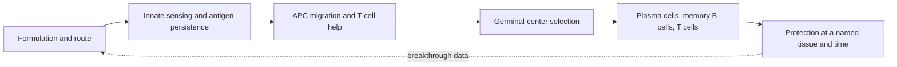

# Vaccines: engineering protection in time and space

A vaccine is a product specification for an immune response. It chooses what is
shown, where it is shown, how long it persists, which innate sensors see it, and
when the learner encounters it again. The useful question is therefore not
"Which platform is best?" but "Best for which pathogen, endpoint, population,
and delivery system?"

Vaccination is the constructive use of the first half of the course. It chooses
the antigen and innate context, routes material through the right compartment,
recruits B- and T-cell help, and leaves durable products. Immunodeficiency and
immune aging define populations in which one or more of those handoffs may fail.

*Vaccine design starts with the pathogen and the outcome to prevent. Infection,
symptomatic disease, severe disease, and transmission are different endpoints
and may require different immune responses.*

## Learning objectives

- turn pathogen biology into a target product profile;
- compare platforms using expression, localization, manufacturability, and risk;
- distinguish a correlate from a validated surrogate endpoint;
- interpret efficacy, absolute risk reduction, waning, and indirect protection;
- choose assays that match the intended site and timing of protection.

## Start with the failure you must prevent

Sterilizing immunity, prevention of symptomatic disease, prevention of severe
disease, and reduction of transmission are different endpoints. A fast
respiratory infection may require antibody already present at a mucosal surface;
memory recalled over several days may still protect the lung from severe disease
without preventing an upper-airway infection. A toxin-mediated disease can be
prevented by circulating neutralizing antibody even if bacterial colonization
still occurs.

| Design decision | Respiratory virus with antigenic drift | Stable bacterial toxin |
|---|---|---|
| principal target | conserved and circulating surface epitopes | toxin neutralization epitopes |
| desired location | nasal mucosa plus systemic backup | serum and interstitial fluid |
| update pressure | high | low |
| useful primary endpoint | symptomatic, strain-confirmed disease | clinical disease |
| likely correlate candidate | variant-specific neutralization plus mucosal IgA | serum antitoxin concentration |

*Negative-stain electron micrograph of influenza A. The enveloped virions vary
in shape and carry surface glycoproteins targeted by neutralizing antibodies;
the image does not show antigenic drift or vaccine strain match.*

## Platform is a bundle of constraints

Live attenuated products can reproduce infection-like localization and antigen
persistence, but raise stability and immunocompromised-host concerns. Protein
subunits give tight compositional control but depend heavily on antigen
conformation, delivery, and adjuvant. Viral vectors express antigen inside cells
but can be limited by anti-vector immunity. mRNA supports rapid sequence changes
and transient in-situ expression, while formulation, cold chain, dose, and innate
reactogenicity remain part of the product.

Conjugate vaccines illustrate mechanism-led design: coupling a polysaccharide to
a protein converts a largely T-independent B-cell response into one that can
recruit T-cell help, class switching, affinity maturation, and memory.

## Adjuvants are instructions, not volume knobs

An adjuvant claim should name a causal chain: sensor or tissue perturbation,
antigen-presenting-cell state, helper program, and desired effector output. More
inflammation can increase reactogenicity or disrupt germinal-center quality. The
design problem is signal selection and dose, not maximal activation.

## Correlates: prediction is not substitution

A correlate of risk is associated with outcome. A mechanistic correlate lies on
a protective pathway. A surrogate endpoint is strong enough that changing it
can substitute for a clinical endpoint in a defined use. Portability must be
earned across variants, ages, platforms, and time since vaccination.

**Worked interpretation.** In a trial, disease occurs in 20 of 10,000 vaccine
recipients and 100 of 10,000 controls.

$$VE = 1 - \frac{20/10{,}000}{100/10{,}000}=0.80.$$

Here $VE$ is vaccine efficacy against the named endpoint over the trial's
follow-up: one minus the risk in vaccine recipients divided by the risk in
controls. The relative efficacy is 80%, but the absolute risk reduction is
$0.010-0.002=0.008$, or 0.8 percentage points. The number needed to vaccinate
over this follow-up is $1/0.008=125$. All three numbers are correct; each answers
a different decision question.

## Population protection is conditional

For homogeneous mixing and durable, complete immunity,

$$p_c=1-\frac{1}{R_0}.$$

Here $R_0$ is the average number of secondary infections caused by one infected
person in a fully susceptible population under the model's conditions, and $p_c$
is the immune fraction at the simple transmission threshold. This $R_0$ is
unrelated to the complement branching ratio used in module 2. If $R_0=4$, then $p_c=0.75$. With effectiveness against acquisition or onward
transmission of 80%, the crude coverage requirement is $0.75/0.80=93.75\%$.
Clustering, waning, age structure, dose delays, and immune escape can make that
calculation optimistic. If the quotient exceeds 100%, vaccination alone cannot
reach the simple threshold under those assumptions.

## Product decision: a practical target profile

For a next-generation respiratory vaccine, specify before choosing a platform:

1. population and contraindications;
2. primary endpoint and follow-up window;
3. antigen breadth and update rule;
4. route, dose count, storage, and cost ceiling;
5. systemic and mucosal immune readouts;
6. common-reactogenicity and rare-safety surveillance;
7. a result that would stop development.

The frontier is not simply newer delivery. It includes conserved-epitope and
mosaic antigens, mucosal delivery, longer-lived germinal-center support, better
vaccines for older or immunocompromised people, and trial designs that measure
transmission and durability rather than peak serum titer alone.

## Recap

- Begin with the clinical failure and anatomical site, not the platform.
- Relative efficacy and absolute benefit must be interpreted together.
- A biomarker becomes a surrogate only in a defined context with validation.
- Route, schedule, storage, and population are biological design variables.
- A vaccine succeeds by coordinating recognition, context, compartment, time,
  and control, not by maximizing one assay value.
