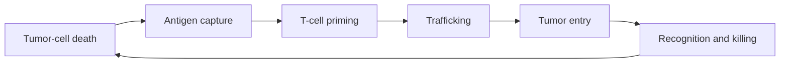

# Tumor immunology: locate the broken step

Cancer immunotherapy works when a recognizable target, a competent immune clone,
and physical access coincide. Tumors can defeat any of those conditions, and
treatment applies selection pressure to a heterogeneous population.

This module reuses the vaccine design chain under adversarial conditions. Antigen
must be generated and presented, clones must be primed and reach tissue, and
recognition must produce killing. Unlike a vaccine target, however, the tumor is
heterogeneous, evolving, and partly protected by normal tolerance mechanisms.

*Tumor resistance can occur at antigen generation, presentation, T-cell priming,
trafficking, entry, recognition, or killing. Locate the failed step before adding
therapy; extra activation cannot repair complete target or HLA loss.*

## Learning objectives

- localize resistance to antigen, presentation, priming, trafficking, or killing;
- distinguish primary, adaptive, and acquired resistance;
- compare CTLA-4 and PD-1/PD-L1 blockade by biological context;
- interpret clonality, spatial biomarkers, and survival endpoints;
- connect immune-related adverse events to the intended mechanism.

## A cycle with testable breakpoints

A high mutation count helps only if a mutation is clonal, expressed, processed,
bound by the patient's HLA, displayed, and recognized by an available TCR. Each
verb is a distinct assay and failure mode.

## Immunoediting as evolution

During elimination, susceptible cells are removed. During equilibrium, immune
pressure constrains growth while variants compete. Escape occurs when variants
with antigen loss, presentation defects, interferon-pathway changes, suppressive
ecology, or inaccessible geography expand.

This is the expansion-and-contraction model from immune memory applied to tumor
subclones. Treatment changes the net growth rate of each population rather than
changing every cell equally.

If clone A begins at 99% and has fitness 0.7 under therapy while resistant clone
B begins at 1% with fitness 1.1, their ratio changes each generation by
$1.1/0.7=1.57$. After ten generations, B's odds have increased roughly
$1.57^{10}\approx91$-fold. A rare pre-existing clone can therefore look like a
new resistance mechanism unless pretreatment sampling is deep enough.

## Checkpoints act in different contexts

CTLA-4 regulates costimulatory competition and priming, including regulatory
circuits. PD-1 restrains chronically stimulated cells in tissues. Blocking either
does not invent a useful clone or restore missing HLA. It changes thresholds in
the activation-balance model introduced in innate immunity and revisited in
tolerance.

T-cell exhaustion is a structured differentiation program, not ordinary
fatigue. Progenitor-like exhausted cells can retain proliferative potential;
terminal states may be less rescuable. A bulk "exhaustion score" can obscure
that distinction.

*H&E of colorectal adenocarcinoma with small dark lymphocytes among malignant
glands. H&E shows the density and location of tumor-infiltrating lymphocytes,
but not their CD4/CD8 phenotype, specificity, or function.*

## Spatial phenotype changes the combination

| Phenotype | Observation | First question | Plausible intervention logic |
|---|---|---|---|
| inflamed | T cells contact tumor cells | are they restrained or target-blind? | checkpoint release or target restoration |
| excluded | T cells stop at stroma/margin | vessel, fibroblast, chemokine, or matrix barrier? | normalize access plus immune activation |
| desert | few relevant T cells | absent antigen, priming, or recruitment? | vaccination, innate priming, or cell therapy |

Combination logic should name the bottleneck. Adding another activating drug to
an antigen-presentation-null tumor raises toxicity without repairing recognition.

## Biomarkers and trial reading

PD-L1 staining, mismatch-repair status, mutation burden, interferon signatures,
T-cell infiltration, and clonal neoantigens can enrich response in particular
settings. Every claim needs the assay, threshold, tumor type, therapy, sampling
time, and validation cohort.

Overall response rate, duration of response, progression-free survival, overall
survival, and quality of life are not interchangeable. Immunotherapy curves can
show delayed separation or a long-responder tail, so a single hazard ratio may
hide clinically important non-proportional effects.

## Mechanism-linked toxicity

Checkpoint blockade can lower tolerance thresholds in gut, skin, endocrine
organs, liver, lung, heart, and other tissues. Management is a control problem:
protect the organ, determine severity and infectious alternatives, and avoid
assuming that more toxicity always means more antitumor benefit.

## Tumor board exercise

A patient has a mixed response: lung lesions shrink, one liver lesion grows.
Build a biopsy plan that can distinguish antigen loss, beta-2-microglobulin or
HLA loss, interferon defects, clonal replacement, T-cell exclusion, and myeloid
suppression. For each proposed combination, state the repaired step, required
biomarker, and added toxicity. A defensible answer may recommend local treatment
for one resistant site rather than systemic escalation.

## Recap

- Resistance must be localized before a combination is chosen.
- Clonality and space can matter more than a bulk average.
- Checkpoint blockade changes thresholds; it cannot replace absent recognition.
- Toxicity and efficacy arise from the same regulatory biology.
- Tumor escape can be read as failure of a familiar immune step rather than as
  one undifferentiated state called immunosuppression.
