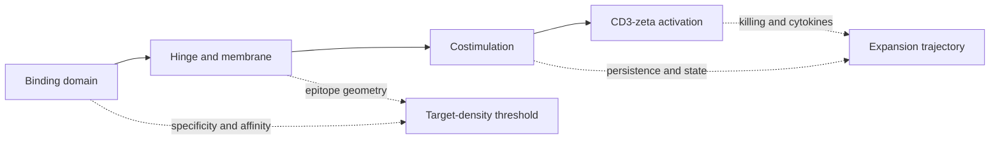

# Cell therapy: designing a living drug

A cell product senses, moves, expands, changes state, and may persist after the
infusion bag is empty. Its effective dose is a trajectory shaped by product
composition, antigen burden, conditioning, tissue access, and host immunity.

Checkpoint therapy adjusts the thresholds of endogenous clones. Cell therapy
goes further by selecting or engineering the receptor, signaling program, and
starting population. The old constraints still apply: target presentation,
trafficking, expansion, inhibitory context, escape, tolerance, and memory.

*CAR activity depends on target density. Low density may permit escape, while
target expression on healthy tissue creates on-target/off-tumor toxicity; CAR
affinity and signaling shift this window.*

## Learning objectives

- connect each CAR module to a controllable behavior;
- treat manufacturing and conditioning as mechanism variables;
- distinguish activation toxicity, target toxicity, and prolonged depletion;
- evaluate autoimmune "reset" with longitudinal evidence;
- choose between cytotoxic, regulatory, autologous, and allogeneic strategies.

## Receptor architecture is product behavior

A CAR combines binding domain, hinge/spacer, transmembrane region, activation
domain, and costimulation. Geometry determines whether the epitope can be
reached; affinity and receptor density affect low-density recognition; signaling
changes expansion, persistence, exhaustion, and cytokine output. Stronger is not
automatically safer or more durable.

## Target choice writes the toxicity forecast

CD19 enables deep B-lineage depletion, useful in B-cell malignancy and potentially
in autoantibody-organizing disease, but predicts B-cell aplasia and infection
risk. BCMA reaches antibody-secreting lineages more directly but still affects
protective humoral immunity. A tissue-address antigen for CAR-Tregs need not cause
disease; it must localize stable suppression without dangerous expression elsewhere.

## Manufacturing is part of the drug

*Autologous CAR-T workflow: collect T cells, add the CAR gene, expand and test the
product, then reinfuse it. Manufacturing time, cell quality, sterility, and
potency are part of the treatment, not just logistics.*

Autologous products reduce alloreactivity but begin with variable patient cells
and require vein-to-vein time. Allogeneic products support inventory and lot
standardization but face graft-versus-host risk, host rejection, and additional
editing. Release testing should cover identity, viability, potency, sterility,
vector/editing attributes, and unwanted populations, not cell count alone.

**Concrete release decision.** Two lots each contain $2\times10^8$ viable cells.
Lot A is 80% CAR-positive with 5% naive/stem-like cells; lot B is 45% CAR-positive
with 35% naive/stem-like cells. Neither is automatically superior. The product
specification must state whether immediate cytotoxic dose or proliferative
fitness predicts the intended use, and the potency assay must test that claim.

## Living-drug kinetics and toxicity

$$\frac{dC}{dt}=\big[r(A,t)-d(t)\big]C.$$

This is the same growth-minus-loss equation used for natural clonal responses.
$C$ is the CAR-cell population, $A$ is antigen burden or density, $r(A,t)$ is the
effective expansion rate, and $d(t)$ is the loss rate. High antigen burden can drive a larger peak $C$, improving clearance while
increasing cytokine-release risk. Neurotoxicity overlaps with, but is not simply
the same as, systemic cytokine release. On-target/off-tissue injury follows
healthy target expression; prolonged lineage depletion creates a later infection
and vaccine-response problem.

Controls include fractionated dosing, lower-affinity receptors, transient
expression, drug-gated switches, suicide systems, AND/OR/NOT logic, and rapid
toxicity treatment. Each control has latency and failure modes.

## What would prove autoimmune reset?

Deep remission after CD19-directed therapy is a signal, not by itself proof of
restored tolerance. A convincing reset study needs remission off background
therapy, durable organ outcomes, B-cell and plasma-cell reconstitution, repertoire
turnover, autoantibodies, vaccine responses, tissue measurements where feasible,
infection surveillance, and a comparator.

| Observation | What it supports | What it does not prove |
|---|---|---|
| B-cell aplasia | target engagement | durable tolerance |
| falling autoantibody | removal of an effector source | elimination of tissue memory |
| drug-free remission | clinically meaningful control | mechanism of control |
| diverse repopulating BCRs | repertoire renewal | absence of autoreactive clones |

## Product-design exercise

Design a phase 1/2 product for severe refractory systemic lupus erythematosus.
Specify eligibility, target, cell source, conditioning, dose-escalation rule,
primary safety endpoint, steroid-free disease endpoint, infection prophylaxis,
immune-reconstitution panel, comparator strategy, and a 24-month stopping rule.
Keep the sample and assays feasible: one blood panel at repeated time points plus
one optional tissue substudy is more credible than an unlimited omics wish list.

## Recap

- The infused count is only the starting condition of a living drug.
- Target density and healthy-tissue expression define a therapeutic window.
- Manufacturing covariates can change potency and toxicity.
- Clinical remission, depletion, and restored tolerance are distinct claims.
- Engineering changes selected terms in the immune circuit; it does not repeal
  anatomy, evolution, or host regulation.
