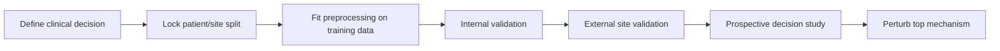

# Computational immunology: from cells to decisions

High-dimensional assays do not automatically create systems understanding. A
useful workflow preserves the patient, sample, time, tissue, receptor, and batch
links needed to test a decision outside the discovery dataset.

Every earlier module made claims about hidden states: specificity, presentation,
cell state, location, clonality, memory, or regulation. This module asks what each
assay actually observes and whether combined measurements can distinguish those
states without losing the patient-level experimental design.

*A model should move from discovery to patient-level testing, external validation,
and a prospective or perturbation study. Thousands of cells improve measurement
precision, but they do not replace independent patients.*

## Learning objectives

- match repertoire, single-cell, spatial, and immunopeptidomic assays to questions;
- recognize compositionality, pseudoreplication, batch effects, and leakage;
- select splits and metrics that reflect deployment;
- distinguish a predictive signature from a causal mechanism;
- design a minimal multimodal study whose added assay changes a decision.

## What each assay actually observes

| Assay | Preserves | Loses or distorts | Good question |
|---|---|---|---|
| bulk TCR/BCR sequencing | deep clonotype counts | cell state and often chain pairing | did a clone expand? |
| single-cell RNA + V(D)J | state and paired receptor | many cells, proteins, spatial context | which state carries the clone? |
| immunopeptidomics | displayed peptides | low-abundance and sampling coverage | what is presented? |
| spatial profiling | neighborhoods and boundaries | molecular depth, area, or resolution | can effector and target meet? |

Cell labels, inferred interactions, and clonotypes are outputs with uncertainty,
not ground truth simply because software assigns a name.

## The patient is usually the replicate

Ten thousand cells from three patients are not ten thousand independent tests.
Cells share host genetics, treatment, processing, and tissue history. Aggregate
to patient-level summaries, use hierarchical models, or otherwise preserve the
nested design. For new-patient prediction, all cells and time points from one
patient must stay in one fold; for cross-hospital use, hold out hospitals.

## Worked metric example

Suppose 10% of 1,000 candidate peptide-TCR pairs are true binders. A model with
80% sensitivity finds 80 true positives. At 90% specificity, it also calls 90 of
900 negatives positive. Precision is therefore

$$\frac{80}{80+90}=47\%.$$

The numerator is true-positive calls and the denominator is all positive calls.
This is the same base-rate lesson seen with autoantibody and allergy tests: test
performance alone does not determine how many positive results are useful. An apparently strong specificity still sends more false than true pairs to the
lab. Report precision-recall curves, expected screen yield, and calibrated
probabilities; AUROC alone hides the base-rate problem.

## Compositional and batch traps

Cell fractions sum to one. If one lineage doubles, every other fraction can fall
without losing a cell. Pair proportions with absolute counts or use an explicit
compositional model. Never regress out a batch perfectly confounded with outcome:
the algorithm cannot know which signal is biology.

Sequence models need family-, antigen-, donor-, or HLA-held-out tests depending
on the claim. Random pair splits can place nearly identical receptors on both
sides and measure memorization rather than generalization.

## Multimodal value must be incremental

Ask whether spatial data improve a decision beyond pathology and clinical
variables, whether the improvement transports, and whether it justifies another
biopsy. Compare a prespecified base model with the multimodal model using
calibration and decision utility, not only a p-value for improvement.

A "digital immune twin" would need longitudinal state updating, intervention
effects, uncertainty, and prospective comparison with standard decisions. A
baseline classifier with a personalized dashboard is not a twin.

## Prediction audit

Design a checkpoint-response model with 120 patients across three sites. Reserve
one site for external testing, use baseline-only features, predefine one primary
metric, and budget one discovery biopsy plus routine blood. State the treatment
decision the score changes. Then choose one spatial feature for protein-level
localization, perturbation, rescue, and an outcome readout.

## Recap

- Match the split to the promised deployment setting.
- Base rates and calibration determine experimental usefulness.
- Patients, not profiled cells, usually define replication.
- Added modalities earn their cost by changing a validated decision.
- A mechanism requires perturbation and rescue, not coexpression alone.
- A dataset is coherent only when recognition, context, compartment, time, and
  control remain linked rather than becoming detached feature columns.

The next module narrows from populations back to molecules. It asks how
AlphaFold-style structures and protein-design models can support immune mechanisms
without collapsing predicted geometry into binding or function.
