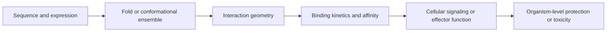

# Structural immunology: a predicted complex is the start of the argument

A model predicts that a viral mutation sits at an antibody-antigen interface.
The image is persuasive: the side chain appears to break a contact, and interface
confidence is high. Does the mutation cause immune escape?

Not yet. It may reduce antibody binding, but it may instead alter protein folding,
surface expression, glycosylation, conformational switching, or nothing measurable.
Even a real binding change may not alter neutralization in the relevant tissue.

This module connects the **Protein Folding and Design** course to immunology. It
uses structure prediction as one measurement in the course-wide chain from
recognition to context, compartment, time, and control.

## Learning objectives

- distinguish monomer-fold confidence from interface and functional confidence;
- map antibody, peptide-MHC, TCR, and engineered-receptor questions onto structural tasks;
- explain why sequence, structure, binding, signaling, and protection are different claim levels;
- design mutation-and-rescue experiments that test a predicted immune interface;
- identify cases where structure prediction is unlikely to answer the limiting question.

## What transfers from the protein-folding course

| Folding/design concept | Immunology use | Important limit |
|---|---|---|
| sequence conservation and variant scoring | prioritize constrained epitopes or escape mutations | conservation does not prove immune accessibility |
| predicted monomer structure | locate domains, loops, surfaces, and buried residues | the isolated fold may differ in a complex or membrane |
| complex prediction | propose antibody-antigen, TCR-peptide-MHC, or receptor-ligand geometry | a plausible pose does not establish binding or signaling |
| pLDDT-like local confidence | flag uncertain loops and domains | high local confidence is not interface confidence |
| inverse folding or binder design | propose stable candidate sequences | folding back correctly does not guarantee specificity or function |
| iterative lead optimization | couple model proposals to assays | the wet lab remains the source of functional ground truth |

The bridge is useful because immune recognition is molecular, but immunological
outcomes are not determined by structure alone.

## Four structural questions, four different assays

### Antibody-antigen: is the epitope contacted and accessible?

A complex model can propose contact residues and whether an antibody approaches a
surface compatible with the intact antigen. It can guide alanine scanning, escape
libraries, competition experiments, or design of a stabilized immunogen.

But neutralization also depends on antigen conformation, epitope exposure over
time, antibody valency, Fc behavior, target density, and whether the contacted
surface controls entry or another essential step. Module 3's warning still holds:
tight or geometrically plausible binding can be biologically decorative.

### Peptide-MHC: will this protein become a displayed target?

The source protein's fold can affect proteolysis, but presentation requires a
chain of events: expression, turnover, cleavage, transport, MHC loading, complex
stability, and cell-surface abundance. A whole-protein structure predictor does
not reproduce that cellular pipeline.

A peptide-MHC model can help inspect anchor residues and exposed TCR-facing side
chains after a candidate peptide has been proposed. It cannot by itself show that
the peptide is naturally processed or abundant enough for recognition. Confirm
those claims with immunopeptidomics, targeted mass spectrometry, or functional
T-cell assays using cells that process the full-length antigen.

### TCR-peptide-MHC: does a pose explain specificity or cross-reactivity?

A predicted ternary complex can suggest which peptide and MHC residues contact a
TCR. The useful experiment is not to admire the pose. Mutate predicted contacts,
measure binding and cellular activation separately, and include mutations outside
the interface as controls. A compensatory mutation or orthogonal structure can
strengthen the geometric claim.

Cross-reactivity is especially difficult. TCRs can use alternative docking modes,
peptides can change conformation, and similar surfaces can arise from dissimilar
sequences. Screening and functional testing remain necessary.

### Engineered receptors: does geometry create a therapeutic window?

For CARs, bispecifics, or designed binders, structure can help choose epitope,
spacer length, affinity range, and steric accessibility. The prediction must then
meet the antigen-density window from module 12. Test disease cells and primary
healthy cells across a density matrix; a clean modeled interface does not reveal
on-target/off-tissue toxicity.

## Confidence must match the claim

Confidence at one arrow does not automatically cross the next. For example:

- high confidence in each monomer does not guarantee the relative complex pose;
- a stable predicted interface does not provide measured association or dissociation rates;
- binding does not prove receptor signaling, neutralization, or cell killing;
- an ex vivo functional effect may not transport to the relevant tissue or patient.

Use confidence metrics locally. Inspect uncertainty at the actual epitope or
interface, compare alternative models and templates, and ask whether the model was
evaluated on related complexes. A single global score can hide the uncertain loop
that carries the entire mechanistic claim.

## Worked escape investigation

Suppose mutation `E484K` in a hypothetical viral antigen is predicted to disrupt
an antibody salt bridge.

1. **Sequence and production:** verify comparable antigen expression and integrity.
2. **Fold:** test whether wild type and mutant retain the relevant conformation.
3. **Binding:** measure affinity and kinetics for the antibody, not only an endpoint signal.
4. **Specificity control:** test unrelated antibodies to separate global misfolding from epitope-specific escape.
5. **Function:** compare neutralization using matched viral or pseudoviral particles.
6. **Rescue:** alter the antibody contact residue in a way predicted to restore complementarity.
7. **Breadth:** test sera or an antibody panel, because escape from one clone is not population escape.

The structure earns its place by choosing mutations and discriminating mechanisms.
The causal claim comes from the pattern across controls, perturbation, and rescue.

## When structure is not the bottleneck

Do not lead with AlphaFold-style prediction when the main uncertainty is:

- whether the antigen and immune cell occupy the same tissue;
- whether a peptide is naturally processed and presented;
- whether an immune population expands, persists, or reaches the target;
- whether a biomarker predicts outcome in new patients;
- whether treatment benefit outweighs toxicity or access burden.

These are compartment, time, population, and decision questions. Structure may
support a molecular link without answering the limiting biological question.

## Transfer exercise

Choose one problem from vaccination, tumor escape, autoantibody disease, or cell
therapy. Produce a one-page structure-to-function plan with:

1. the exact structural object: monomer, antibody-antigen complex, peptide-MHC,
   TCR-peptide-MHC, or engineered receptor complex;
2. the confidence needed at the claimed interface;
3. one predicted contact mutation and one non-interface control;
4. separate assays for folding/expression, binding, and cell function;
5. a rescue or orthogonal validation;
6. the downstream immunological claim the experiment still cannot establish.

Students coming from **Protein Folding and Design** should explicitly reuse one
quality metric or design method from that course and explain why it is insufficient
without the immune assay chain.

## Recap

- Structure prediction proposes molecular geometry; it does not certify mechanism.
- Monomer confidence, interface confidence, binding, signaling, and clinical effect
  are distinct levels of evidence.
- Immune-complex predictions become useful through controlled mutations, orthogonal
  assays, functional tests, and rescue.
- Presentation, trafficking, population dynamics, and tissue context often remain
  outside the structural model.
- The best cross-course workflow is prediction followed by an assay ladder, not
  prediction followed by a stronger caption.

The next coding lab makes that workflow concrete by auditing local confidence at
a toy antibody-antigen interface and turning supported contacts into mutation
priorities.
