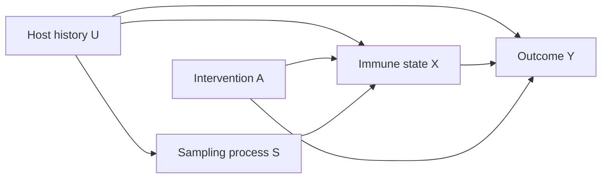

# Deeper theory: causal estimands and transport

Before collecting data, define the estimand. For a randomized intervention $A$,
the average treatment effect is

$$ATE=\mathbb{E}[Y(1)-Y(0)].$$

$Y(1)$ is the outcome the same study unit would have under intervention and
$Y(0)$ is its outcome under control; only one can be observed for a unit. The
expectation $\mathbb{E}$ averages that contrast over the target population.
That quantity differs from effect among treated patients, per-protocol effect,
or effect in a biomarker-positive subgroup. Naming the estimand prevents a
mechanistic substudy from quietly replacing the clinical question.

## A compact causal diagram

An association between measured state $X$ and outcome $Y$ may reflect host
history $U$ or selective sampling $S$. Randomizing $A$ identifies an intervention
effect, but mediation through $X$ requires stronger assumptions and time-aware
measurement.

## Transportability

An effect can change with age, prior exposure, HLA, microbiota, disease stage,
site practice, or assay implementation. Report who was studied and test effect
modification prospectively. External validity is not achieved by adding a more
diverse test set after model development if the intervention pathway itself
differs.

## Design discipline

Choose one primary endpoint, justify its time, predefine exclusions and missing
data handling, and identify the result that would change the program. Add omics
only when they discriminate competing mechanisms or improve a decision.
