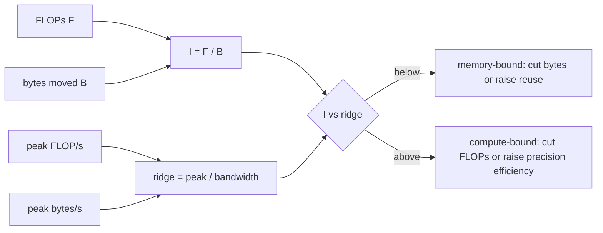

# The roofline model

The roofline model, introduced by Williams, Waterman, and Patterson in 2009,
answers one question: given a machine with a peak compute rate and a peak memory
bandwidth, which of the two limits a particular computation? It is a
back-of-the-envelope tool that survives because the envelope is usually right
about the *class* of the bottleneck even when it is wrong about the number.

## Two floors

Every computation moves $B$ bytes and performs $F$ floating-point operations. On
a machine with bandwidth $\beta$ bytes/s and peak throughput $\phi$ FLOP/s,
those give two independent lower bounds on elapsed time:

$$
t_\text{memory} = \frac{B}{\beta}, \qquad t_\text{compute} = \frac{F}{\phi}
$$

Real runtime is at least $\max(t_\text{memory}, t_\text{compute})$. Both are
floors because neither the memory system nor the arithmetic units can exceed
their own peak, and the work cannot be skipped. Nothing in the model claims the
two phases overlap perfectly, so the true time is usually above both.

## Arithmetic intensity and the ridge point

Divide the two quantities instead of comparing the times, and the machine drops
out of the workload description. **Arithmetic intensity** is work per byte:

$$
I = \frac{F}{B}
$$

The machine contributes one number, the **ridge point**, which is the intensity
at which its two peaks are balanced:

$$
I_\text{ridge} = \frac{\phi}{\beta}
$$

For the constants in this exercise:

$$
I_\text{ridge} = \frac{989 \times 10^{12}}{3350 \times 10^{9}}
\approx 295.22\ \text{FLOP/byte}
$$

The comparison $I$ versus $I_\text{ridge}$ decides the regime, and it is exactly
equivalent to comparing the two time floors:

$$
\frac{t_\text{memory}}{t_\text{compute}}
= \frac{B/\beta}{F/\phi}
= \frac{\phi}{\beta} \cdot \frac{B}{F}
= \frac{I_\text{ridge}}{I}
$$

So the ratio of the floors is the ratio of the intensities, inverted. That
identity is worth internalizing: a workload at one hundredth of the ridge point
is memory-bound by a factor of one hundred, and no kernel rewrite changes that.

The name comes from the plot: achievable FLOP/s against arithmetic intensity, on
log-log axes, is a diagonal line of slope $\beta$ that flattens into a
horizontal ceiling at $\phi$. The corner where they meet is the ridge.

## Why decode is memory-bound

A decoder-only transformer generating one token pushes a single hidden vector
through every layer. The matmul work is conventionally estimated as

$$
F \approx 2P
$$

for $P$ parameters — one multiply and one add per weight. A 70B model therefore
does about 140 GFLOP of matmul work per generated token.

The bytes are the other half. To multiply by a weight, the weight must be read.
In BF16, one pass over the model is

$$
70 \times 10^9 \times 2 = 140 \times 10^9\ \text{bytes}
$$

so at batch 1 the intensity is

$$
I = \frac{140 \times 10^9}{140 \times 10^9} = 1\ \text{FLOP/byte}
$$

That is roughly 295 times below the ridge point. The same conclusion appears in
the time floors: 41.79 ms from bandwidth against 0.142 ms from compute. Batch-1
decode is not slightly memory-bound; it is memory-bound by more than two orders
of magnitude, and an accelerator running it uses well under one percent of its
arithmetic capability.

Note where the 2 bytes per weight enters. Halving the weight dtype halves $B$
and leaves $F$ alone, which doubles $I$ and halves the memory floor. That is the
entire mechanism behind weight-only quantization, and it works precisely because
this regime is so far below the ridge that nothing else is close to binding.

## Why prefill and batching are the same trick

Prefill processes many prompt positions at once. Instead of a matrix-vector
product per layer, it is a matrix-matrix product: the same weight, once loaded,
is applied to every position. Batched decode does the same thing with tokens from
different requests rather than different positions of one request.

The arithmetic is the reason both work. Weight bytes are fixed per step; FLOPs
scale with the number of sequences $b$:

$$
I = \frac{2 P b}{P \cdot \text{bytes per weight}} = \frac{2b}{\text{bytes per weight}}
$$

With BF16 weights that is simply $I = b$. Arithmetic intensity equals batch size,
and the crossover sits at the ridge point: below batch 295 the step is
bandwidth-limited, above it the step is compute-limited.

| Batch | Intensity (FLOP/byte) | Regime | Per-token latency floor |
|---:|---:|---|---:|
| 1 | 1 | memory | 41.791 ms |
| 4 | 4 | memory | 10.448 ms |
| 16 | 16 | memory | 2.612 ms |
| 64 | 64 | memory | 0.653 ms |
| 256 | 256 | memory | 0.163 ms |
| 1024 | 1024 | compute | 0.142 ms |

The per-token floor falls by a factor of 256 from batch 1 to batch 256 and then
stops improving, because once the step is compute-bound the weight read is no
longer what you are paying for. Every serving system batches for this reason
before it does anything cleverer.

Reading benchmarks with this table in hand is a useful defence. A vendor chart
showing excellent tokens per second on long-prompt prefill is reporting the
right-hand end of the table. An interactive single-user chat session lives at the
top-left. Both can be honest; they are not the same measurement.

## KV cache capacity, and why it breaks the clean story

The KV cache is a second memory term that does not scale like the weights. For
one request:

$$
\text{KV bytes} = L \times T \times H_\text{kv} \times D \times 2 \times b_\text{val}
$$

with $L$ layers, $T$ context length, $H_\text{kv}$ key/value heads, head
dimension $D$, a factor of 2 for keys and values, and $b_\text{val}$ bytes per
stored value. Grouped-query attention reduces $H_\text{kv}$; KV-cache
quantization reduces $b_\text{val}$; paged attention reduces fragmentation rather
than size. Different levers, one pressure point.

For the exercise's model at 8192 tokens, GQA with 8 KV heads costs 2.50 GiB per
request and full multi-head attention with 64 KV heads costs 20.00 GiB — a
factor of 8 from one architectural choice.

Now the honest caveat about the batch table above, because it is a real
limitation rather than a footnote. Weight bytes are shared across the batch, but
**KV bytes are not**: every sequence reads its own cache every step. Adding a
sequence adds about 140 GFLOP of matmul work plus roughly 21 GFLOP of attention
work over its cache, and adds 2.68 GB of cache traffic. The marginal intensity of
an added sequence is therefore around

$$
\frac{(140 + 21) \times 10^9}{2.68 \times 10^9} \approx 60\ \text{FLOP/byte}
$$

which is still below the 295 FLOP/byte ridge. With 8192-token contexts on this
machine, the workload never actually crosses into the compute-bound region no
matter how large the batch: past batch 52 or so, cache traffic exceeds the weight
read and becomes the dominant memory term.

That does not make the table wrong; it makes it a statement about the weight-read
term specifically, which is what modules 3 and 4 attack. It does mean the clean
"intensity equals batch size" result holds only while the weight read dominates,
which in practice means short contexts, aggressive prefix sharing, or a cache
small enough to ignore.

## Why these are lower bounds, not predictions

Part 2 of the exercise measures achieved bandwidth and achieved FLOP/s directly,
and both land below the vendor's peak. That gap is the reason the model is
phrased as an inequality.

Sources of the gap, roughly in the order they usually matter:

- **Access patterns.** Peak bandwidth assumes large, aligned, sequential
  transfers. Strided or scattered access wastes part of every fetched cache line
  or DRAM burst.
- **Occupancy and tail effects.** A kernel that cannot keep every execution unit
  supplied, or whose last wave of work is partial, leaves capacity idle.
- **Cache and locality.** A working set that fits in cache measures far above
  DRAM bandwidth; one that thrashes measures far below. This is why the
  measurement uses a tensor large enough that cache cannot help it.
- **Launch and synchronization overhead.** Fixed per-kernel cost, which matters
  most for exactly the small, memory-bound operations that decode is full of.
- **Clocks and power.** Sustained peak is a thermal and power question, not only
  an architectural one, and advertised peaks often assume boost clocks.
- **On CPU, the memory system itself.** A desktop CPU has no high-bandwidth
  memory. Tens of GB/s is a normal measurement, an order of magnitude below an
  accelerator.

None of that invalidates the model. A floor you cannot reach is still a floor,
and its value is diagnostic: if measured time is near the floor, the remaining
wins are in reducing bytes or work, not in tuning. If measured time is far above
the floor, there is implementation headroom to recover first.

## What the exercise leaves out

The estimate ignores several real terms:

- reading and writing the KV cache during attention (quantified above, but not
  in the graded table);
- embedding lookups, the output projection, and sampling;
- normalization, rotary embedding, and other non-matmul kernels;
- CPU scheduling and request bookkeeping;
- tensor-parallel or pipeline-parallel communication;
- memory fragmentation and allocator behaviour;
- adapter application and any orchestration around the model.

The simplification is still the right starting point. A clean lower bound is the
first defence against magical thinking, and you should know whether the single
largest term already explains the observed behaviour before adding smaller ones.

## Connection to the next modules

Once you have seen a 140 GB weight-read term sitting 295x below the ridge point,
weight-only quantization stops being an abstract compression trick. It is a
direct attack on the dominant term in the dominant regime. Module 3 surveys the
formats that do this — INT8, INT4, NF4, FP8, FP4, and KV-cache quantization —
and module 4 has you implement groupwise INT4 against a real weight matrix and
measure what the compression costs in output error.
