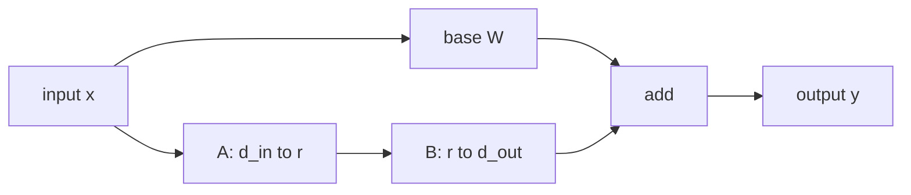

# The low-rank update

For a dense projection:

$$
W \in \mathbb{R}^{d_\text{out} \times d_\text{in}}
$$

LoRA introduces two smaller trainable matrices:

$$
A \in \mathbb{R}^{r \times d_\text{in}}
$$

$$
B \in \mathbb{R}^{d_\text{out} \times r}
$$

Their product has the same shape as the base matrix:

$$
BA \in \mathbb{R}^{d_\text{out} \times d_\text{in}}
$$

but its rank is at most $r$. If $r$ is much smaller than either matrix dimension, the update can move the model in a useful subspace while storing far fewer values.

## Parameter count

A dense update has:

$$
d_\text{out}d_\text{in}
$$

parameters. A LoRA update has:

$$
rd_\text{in} + d_\text{out}r = r(d_\text{in} + d_\text{out})
$$

parameters. The ratio is:

$$
\frac{r(d_\text{in} + d_\text{out})}{d_\text{out}d_\text{in}}
$$

For a square matrix with $d_\text{in}=d_\text{out}=d$, this simplifies to:

$$
\frac{2r}{d}
$$

That is the core memory story. Rank 16 on a width-4096 projection is about $32/4096 \approx 0.78\%$ of the dense matrix. Rank 64 is about 3.1 percent. Those numbers are small enough that many adapters can fit beside one base model.

## The scale

The LoRA paper uses:

$$
\Delta W = \frac{\alpha}{r}BA
$$

The factor $\alpha/r$ controls the initial and trained magnitude of the update. You can think of $r$ as widening the adapter and $\alpha$ as setting how loudly that adapter is mixed back into the original matrix. Many libraries expose this as `lora_alpha` and `r`.

In this lab:

$$
r = 2,\quad \alpha = 4,\quad \frac{\alpha}{r}=2
$$

so every entry of $BA$ is doubled before it is added to $W$.

## Shape discipline

The order $BA$ is not arbitrary. If an input vector is shaped like:

$$
x \in \mathbb{R}^{d_\text{in}}
$$

then the adapter path can be written as:

$$
B(Ax)
$$

First $A$ maps the input down to $r$ coordinates. Then $B$ maps those $r$ coordinates back up to $d_\text{out}$. The merged matrix $W + BA$ must therefore have the same shape as $W$ so it can replace the original projection without changing the model graph.

## QLoRA and 2026 practice

QLoRA made adapter training practical on much smaller hardware by keeping the base model quantized while training low-rank adapters. The base weights can live in a 4-bit format such as NF4, while adapter weights and optimizer state use higher precision where needed. That distinction matters:

- LoRA reduces the number of trainable parameters.
- Quantization reduces the bytes per stored base parameter.
- Paged optimizers and memory-aware training reduce peak training memory.

In 2026, adapter workflows are still common, but deployment choices vary. A research notebook may keep separate adapters for experimentation. A multi-tenant serving platform may load many adapters against one base model. A high-volume product endpoint may merge a chosen adapter into a base checkpoint, quantize the result, and serve it as a normal model.

## Practical caveats

LoRA is simple, but the system details are not always simple:

- Merging into quantized weights may require dequantize, add, then requantize, which can introduce small numerical changes.
- Multiple adapters are not always safely "averaged" or stacked unless the method was designed for that composition.
- Adapter rank is a capacity knob, not a quality guarantee. Higher rank can help, but data quality and target modules often matter more.
- Serving many adapters can shift the bottleneck from weight memory to adapter loading, routing, and batching.

Keep the mental model crisp: LoRA is a structured delta. The rest of the engineering is about when to materialize that delta and where to store it.
