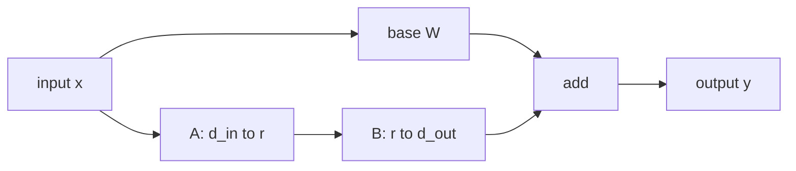

# The low-rank update

For a dense projection:

$$
W \in \mathbb{R}^{d_\text{out} \times d_\text{in}}
$$

LoRA introduces two smaller trainable matrices:

$$
A \in \mathbb{R}^{r \times d_\text{in}}
$$

$$
B \in \mathbb{R}^{d_\text{out} \times r}
$$

Their product has the same shape as the base matrix:

$$
BA \in \mathbb{R}^{d_\text{out} \times d_\text{in}}
$$

but its rank is at most $r$. If $r$ is much smaller than either matrix dimension, the update can move the model in a useful subspace while storing far fewer values.

## Parameter count

A dense update has:

$$
d_\text{out}d_\text{in}
$$

parameters. A LoRA update has:

$$
rd_\text{in} + d_\text{out}r = r(d_\text{in} + d_\text{out})
$$

parameters. The ratio is:

$$
\frac{r(d_\text{in} + d_\text{out})}{d_\text{out}d_\text{in}}
$$

For a square matrix with $d_\text{in}=d_\text{out}=d$, this simplifies to:

$$
\frac{2r}{d}
$$

That is the core memory story. Rank 16 on a width-4096 projection is about $32/4096 \approx 0.78\%$ of the dense matrix. Rank 64 is about 3.1 percent. Those numbers are small enough that many adapters can fit beside one base model.

## The scale

The LoRA paper uses:

$$
\Delta W = \frac{\alpha}{r}BA
$$

The factor $\alpha/r$ controls the initial and trained magnitude of the update. You can think of $r$ as widening the adapter and $\alpha$ as setting how loudly that adapter is mixed back into the original matrix. Many libraries expose this as `lora_alpha` and `r`.

In this lab:

$$
r = 8,\quad \alpha = 16,\quad \frac{\alpha}{r}=2
$$

so every entry of $BA$ is doubled before it is added to $W$.

## Why $B$ starts at zero

The initialization is not an implementation detail. LoRA sets $A$ to the same
distribution `nn.Linear` uses for its own weight and sets $B$ to exactly zero, so
that at step 0:

$$
\Delta W = \frac{\alpha}{r}BA = 0
$$

The adapted layer is then *bit-identical* to the frozen base layer, not merely
close to it. Fine-tuning therefore starts from the pretrained function, and the
first gradient step improves a model that already works.

The asymmetry is deliberate. If both factors were zero, the gradient with respect
to each would also be zero and the adapter could never leave the origin. If both
were random, every forward pass would carry an untrained perturbation before
training had learned anything, and the early steps would be spent undoing it.
Zeroing exactly one factor gives a no-op at initialization while keeping the
gradient path alive: $\partial L/\partial B$ depends on $Ax$, which is nonzero.

## What is actually frozen

"Freeze the base" means `base.weight.requires_grad_(False)`, and the consequence
worth checking is that the frozen weight's `.grad` stays `None` after a backward
pass. That is what stops an optimizer from allocating state for it. The weights
themselves are still resident in memory during training — a forward pass needs
them — so LoRA removes gradient and optimizer state, not the base model.

With Adam, each trainable parameter carries its value plus three more tensors of
the same size: the gradient, the first moment, and the second moment. Full
fine-tuning pays that four-fold cost on every parameter. LoRA pays it only on
$r(d_\text{in}+d_\text{out})$ adapter entries, and pays a single copy for the
frozen base:

$$
\text{full} = 4\,d_\text{out}d_\text{in}, \qquad
\text{LoRA} = d_\text{out}d_\text{in} + 4\,r(d_\text{in}+d_\text{out})
$$

Read those two expressions carefully before quoting a speedup. The trainable
state shrinks by a factor of roughly $d/2r$, but the total training footprint
cannot fall below the resident base weights, so the honest whole-system ratio is
close to $4\times$ and never much more. Both numbers are true; only the second
one describes what fits on a GPU.

## Rank is a ceiling, and the spectrum sets it

A rank-$r$ adapter can express exactly the set of matrices of rank at most $r$.
So for any target delta $\Delta$ you might want to learn, there is a best
achievable error that no training procedure can beat. The Eckart-Young theorem
identifies it: the optimal rank-$r$ approximation in Frobenius norm is the
truncated SVD, so with singular values $s_1 \ge s_2 \ge \dots$,

$$
\varepsilon(r) = \frac{\lVert \Delta - \Delta_r \rVert_F}{\lVert \Delta \rVert_F}
= \sqrt{\frac{\sum_{i>r} s_i^2}{\sum_i s_i^2}}
$$

This reframes the usual question. "Is rank 8 enough?" has no general answer,
because $\varepsilon(8)$ depends entirely on how fast the target's singular values
decay. A delta whose spectrum falls off quickly is nearly rank-8 already and a
small adapter captures most of it. At the other extreme, a delta whose $n$
singular values are all equal has exactly
$\varepsilon(r) = \sqrt{1 - r/n}$ with $n = \min(d_\text{in},d_\text{out})$, so rank
buys almost nothing until it approaches full rank. Isotropic noise is close to
that case: its spectrum is spread rather than perfectly flat, but it decays far
too slowly for any affordable rank to help.

Real fine-tuning deltas usually sit between those extremes: a structured,
fast-decaying component plus a diffuse remainder. That is exactly why rank sweeps
show steep improvement at low rank and then a plateau. The plateau is the diffuse
part, and raising the rank past it spends parameters on noise.

The empirical claim in the LoRA paper is that adaptation deltas have low
"intrinsic rank" — the first case above — which is why small $r$ works at all. It
is an observation about pretrained models, not a theorem.

## Shape discipline

The order $BA$ is not arbitrary. If an input vector is shaped like:

$$
x \in \mathbb{R}^{d_\text{in}}
$$

then the adapter path can be written as:

$$
B(Ax)
$$

First $A$ maps the input down to $r$ coordinates. Then $B$ maps those $r$ coordinates back up to $d_\text{out}$. The merged matrix $W + \frac{\alpha}{r}BA$ must therefore have the same shape as $W$ so it can replace the original projection without changing the model graph.

Torch stores activations as rows, so a batch $X \in \mathbb{R}^{n \times d_\text{in}}$ runs through the transposed form:

$$
Y = XW^{\top} + \frac{\alpha}{r}\left(XA^{\top}\right)B^{\top}
$$

The transposes are where most LoRA implementation bugs live. `nn.Linear` holds its weight as $(d_\text{out}, d_\text{in})$ and applies $XW^{\top}$, so $A$ as $(r, d_\text{in})$ and $B$ as $(d_\text{out}, r)$ keeps the adapter in the same convention.

## Merging is an algebraic identity, not an approximation

Because matrix multiplication distributes over addition, the merged path and the adapter path compute the same function:

$$
X\!\left(W + \tfrac{\alpha}{r}BA\right)^{\!\top} = XW^{\top} + \tfrac{\alpha}{r}\left(XA^{\top}\right)B^{\top}
$$

In exact arithmetic these are equal. In float32 they differ by rounding, because the two sides accumulate the same products in a different order — on a 1024-wide projection that discrepancy lands around $10^{-6}$, several orders of magnitude below any signal you care about.

That identity is what makes deployment-time merging free. Serving the merged weight costs one matmul of the original shape, with no extra kernel launches, no adapter tensors resident, and no change to the model graph. The cost is flexibility: a merged checkpoint is one model, and swapping tasks means loading a different one.

The two costs are worth stating as a trade rather than a ranking. Keeping the adapter separate costs two extra small matmuls per layer and lets a single base model serve many tenants. Merging removes those matmuls and gives up the sharing.

## QLoRA and 2026 practice

QLoRA made adapter training practical on much smaller hardware by keeping the base model quantized while training low-rank adapters. The base weights can live in a 4-bit format such as NF4, while adapter weights and optimizer state use higher precision where needed. That distinction matters:

- LoRA reduces the number of trainable parameters.
- Quantization reduces the bytes per stored base parameter.
- Paged optimizers and memory-aware training reduce peak training memory.

In 2026, adapter workflows are still common, but deployment choices vary. A research notebook may keep separate adapters for experimentation. A multi-tenant serving platform may load many adapters against one base model. A high-volume product endpoint may merge a chosen adapter into a base checkpoint, quantize the result, and serve it as a normal model.

## Practical caveats

LoRA is simple, but the system details are not always simple:

- Merging into quantized weights may require dequantize, add, then requantize, which can introduce small numerical changes.
- Multiple adapters are not always safely "averaged" or stacked unless the method was designed for that composition.
- Adapter rank is a capacity knob, not a quality guarantee. Higher rank can help, but data quality and target modules often matter more.
- Serving many adapters can shift the bottleneck from weight memory to adapter loading, routing, and batching.

Keep the mental model crisp: LoRA is a structured delta. The rest of the engineering is about when to materialize that delta and where to store it.
