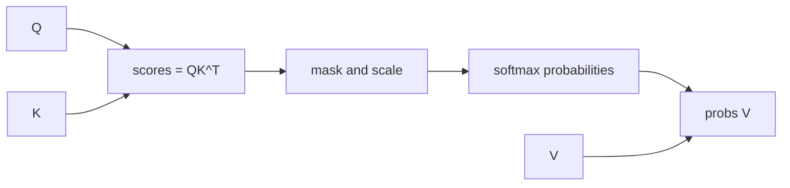

# Attention kernels and fusion

The transformer equations are compact. The naive implementation is not.

Scaled dot-product attention is usually written as:

$$
\operatorname{softmax}(QK^\top / \sqrt{d})V
$$

That one line hides a large systems problem. A direct implementation materializes the full score matrix $QK^\top$, applies masks and softmax, materializes the attention probability matrix, and then multiplies by $V$. For a sequence of length $L$, the score and probability matrices are both $L \times L$ per head. At long context, those intermediates dominate memory traffic even when the arithmetic itself is manageable.

This module explains why attention kernels became a central part of LLM optimization, why fusion matters, and why "same math, different memory movement" can be the difference between an elegant model and a usable serving system.

## The bottleneck is often movement, not math

Modern GPUs are extremely good at dense matrix multiply. They are less forgiving when a program repeatedly writes huge intermediate tensors to high-bandwidth memory and then reads them back for the next operation. Naive attention does exactly that:

The $L^2$ score matrix is not only large; it is also temporary. Once the weighted sum has been computed, the model does not need to keep attention probabilities around for inference. A better kernel can compute the exact same output while avoiding most of that round-trip through global memory.

FlashAttention-style kernels do this by tiling attention. They load blocks of queries, keys, and values, compute partial scores, maintain online softmax statistics, and accumulate the output while keeping the important temporary state on chip. The final output is exact up to floating-point rounding, but the memory behavior is dramatically different.

## A concrete memory picture

Suppose one attention head processes $L=8192$ tokens. The attention probability matrix has:

$$
8192^2 = 67108864
$$

entries. In BF16, that is about 134 MB for one head's probabilities alone. Multiply by many heads and layers, and it is clear why materializing attention matrices is painful.

The actual model also has Q, K, V, output activations, MLP activations, normalization buffers, and framework workspaces. The point of this estimate is simpler: if an intermediate is $O(L^2)$ and temporary, you should be suspicious of writing it to memory.

## What tiling changes

Tiling splits the computation into blocks small enough to fit in faster memory. For each query block, the kernel streams over key/value blocks. It never needs the full row of scores at once. Instead it keeps:

- a running maximum $m$ for numerical stability,
- a running denominator $l$ for the softmax normalizer,
- a running output accumulator $o$.

The next coding lab implements this recurrence for one query row. Real kernels apply the same idea across many rows, heads, and blocks with careful scheduling.

## The claim is a theorem, not a benchmark

It is easy to read "FlashAttention is faster" as an engineering result. It is stronger than that. Let $N$ be the sequence length, $d$ the head dimension, and $M$ the size of on-chip SRAM, with $d \le M \le Nd$. Then:

- standard attention performs $\Theta(Nd + N^2)$ HBM accesses;
- tiled attention performs $\Theta(N^2d^2M^{-1})$ HBM accesses;
- and **no exact attention algorithm can do asymptotically better** across all values of $M$ in that range.

The counting argument for the middle line is short enough to follow here. The kernel picks block sizes so that a Q block, a K block, a V block, and the output accumulator all fit on chip at once, which means $B_c = \lceil M/4d \rceil$ key/value rows at a time. The number of outer iterations over key/value blocks is therefore

$$
T_c = \left\lceil \frac{N}{B_c} \right\rceil = \Theta\!\left(\frac{Nd}{M}\right)
$$

and each outer iteration must sweep the full $Q$ and $O$ tensors, which are $\Theta(Nd)$ elements each. Multiply:

$$
\Theta(Nd) \times \Theta\!\left(\frac{Nd}{M}\right) = \Theta\!\left(\frac{N^2d^2}{M}\right)
$$

Now look at what that expression says. Both algorithms are quadratic in $N$ — tiling does not change the asymptotic order in sequence length, and any summary claiming it makes attention linear is wrong. What tiling changes is the constant, which is $d^2/M$. At $d = 64$ and $M \approx 100$ KB that constant is about $1/25$, and measured HBM traffic drops roughly ninefold in practice.

The constant is also the design guidance. $d^2/M$ says a *smaller head dimension* and a *larger SRAM* both help, quadratically and linearly. It explains why head dimension 64 kernels outrun head dimension 128 kernels by more than the FLOP count suggests, and why each GPU generation's larger on-chip memory buys attention performance beyond its raw bandwidth increase.

## Fusion as a general pattern

Kernel fusion means doing adjacent operations in one kernel so intermediate tensors do not bounce through global memory. Attention is the dramatic example, but the same pattern appears all over transformer inference:

| Fusion target | Why it helps |
|---|---|
| bias plus activation | Avoids writing pre-activation values |
| residual plus RMSNorm | Reduces bandwidth around normalization |
| rotary embedding inside attention | Avoids separate transformed Q/K tensors |
| dequantize plus matmul | Converts low-bit weights only where needed |
| mask plus softmax | Avoids storing masked score tensors |
| gated MLP patterns | Shares reads and improves tensor-core utilization |

Fusion is not magic. It trades generality for a kernel that understands a specific shape, layout, dtype, and operation sequence. The fastest path in 2026 is often the path that matches an existing optimized kernel rather than the path that looks prettiest in Python.

## 2026 reality

The attention-kernel landscape keeps moving, and the three generations are worth distinguishing because they fix three genuinely different bottlenecks.

| Version | The bottleneck it attacks | Core mechanism |
|---|---|---|
| FlashAttention | HBM traffic | tiling plus online softmax, recompute in backward |
| FlashAttention-2 | idle SMs and non-matmul FLOPs | parallelize over sequence, split Q across warps, defer rescaling |
| FlashAttention-3 | serialized data movement and softmax | producer/consumer warp specialization, async TMA copies, GEMM–softmax interleaving, FP8 |

The pattern is that each version stops being memory-bound in the previous sense and becomes bound by something else. FlashAttention-1 solved traffic and left the GPU underutilized on long sequences with small batches. FlashAttention-2 fixed occupancy and left the exponential unit and the memory pipeline serialized against the tensor cores. FlashAttention-3 overlaps them. This is what optimization work usually looks like up close: not one fix, but a sequence in which each success promotes a new limiting resource.

Serving stacks such as vLLM, TensorRT-LLM, SGLang, and vendor backends combine attention kernels with paged KV cache, prefix reuse, quantization, and continuous batching.

For an optimization engineer, the practical workflow is:

1. Measure prefill and decode separately.
2. Identify the actual kernel path being used.
3. Check that tensor shapes, head dimensions, dtype, masks, and layout hit the intended fast path.
4. Look for hidden transposes, casts, or graph breaks around the kernel.
5. Re-measure after changing batch size, sequence length, or quantization format.

The warning is important: "uses FlashAttention" is not a full performance claim. A model can fall off the fast path because of an unsupported head dimension, an unusual mask, a layout conversion, an incompatible dtype, or framework dispatch behavior.

## Recap

Attention kernels are about data movement as much as arithmetic. The equation $\operatorname{softmax}(QK^\top)V$ is the same, but the implementation can either materialize massive temporary matrices or stream tiles with online statistics. The next lab implements that streaming recurrence over real multi-head tensors and checks it against `torch.nn.functional.scaled_dot_product_attention`, so you can confirm for yourself that the memory-bounded algorithm computes the same function as the textbook one.
