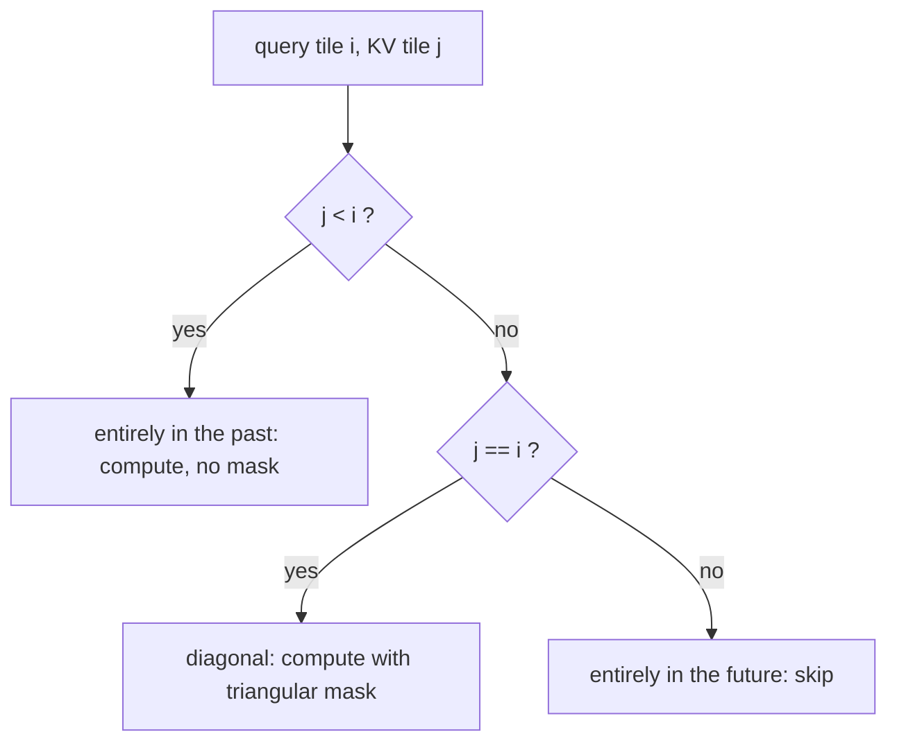

# Stable streaming

The ordinary softmax formula is:

$$
\operatorname{softmax}(x)_i =
\frac{e^{x_i}}{\sum_j e^{x_j}}
$$

The stable form subtracts the maximum:

$$
\operatorname{softmax}(x)_i =
\frac{e^{x_i-m}}{\sum_j e^{x_j-m}}
$$

where:

$$
m = \max_j x_j
$$

Both numerator and denominator are multiplied by $e^{-m}$, so the ratio is
unchanged. What changes is the arithmetic: every exponent is now at most zero,
so nothing overflows, and the largest term is exactly $1$.

## Naive attention and the matrix you do not want

For one head, attention over a sequence of length $L$ is:

$$
S = \frac{QK^\top}{\sqrt{d}}, \qquad
P = \operatorname{softmax}(S), \qquad
O = PV
$$

Written that way, $S$ and $P$ are both $L \times L$ per head, per batch element.
At the lab's shape — batch 2, heads 4, $L = 256$ — that is 524,288 float32
entries, or 2 MiB. Unremarkable. At $L = 65536$ the same expression asks for
128 GiB of scores, and no amount of arithmetic throughput saves you, because the
problem is that the tensor does not fit.

The observation that rescues it is that $S$ and $P$ are *temporary*. Inference
never needs the probability matrix after the weighted sum has been formed. If
the output can be built incrementally, the full matrix never has to exist.

## The rescaling identity

Everything rests on one line. For a set of indices $A$ and any reference value
$\mu$, define the partial denominator and the partial unnormalized output:

$$
\ell_A(\mu) = \sum_{i \in A} e^{x_i - \mu}, \qquad
O_A(\mu) = \sum_{i \in A} e^{x_i - \mu}\, v_i
$$

Now change the reference from $\mu$ to $\mu'$. Every term picks up the *same*
constant factor:

$$
e^{x_i - \mu'} = e^{x_i - \mu}\, e^{\mu - \mu'}
$$

and a constant factors out of a sum, so:

$$
\ell_A(\mu') = e^{\mu - \mu'}\, \ell_A(\mu), \qquad
O_A(\mu') = e^{\mu - \mu'}\, O_A(\mu)
$$

That is the whole derivation. The reason $e^{m_\text{old} - m_\text{new}}$ is
the right correction factor is not a special property of softmax; it is that
shifting the reference multiplies every exponential by a shared constant. The
correction applies identically to the denominator and to the accumulator because
both are sums of the same exponentials, differing only in whether each term is
weighted by $v_i$.

## The tile recurrence

Suppose the keys have been split into tiles and the tiles $S$ seen so far are
summarized by three numbers per query row:

$$
m = \max_{i \in S} x_i, \qquad
l = \ell_S(m), \qquad
O = O_S(m)
$$

A new tile $T$ arrives. Let:

$$
m' = \max\left(m,\ \max_{j \in T} x_j\right)
$$

Split the combined sum, rescale the old part with the identity above, and write
the new part directly in the new reference frame:

$$
\ell_{S \cup T}(m') = e^{m - m'} l + \sum_{j \in T} e^{x_j - m'}
$$

$$
O_{S \cup T}(m') = e^{m - m'} O + \sum_{j \in T} e^{x_j - m'} v_j
$$

Then set $m \leftarrow m'$ and repeat. After the last tile, $m$ is the true row
maximum, $l$ is the true softmax denominator, and the answer is:

$$
o = \frac{O}{l}
$$

Some presentations compute a tile-local maximum $m_T$, form $\ell_T(m_T)$ and
$O_T(m_T)$, and then rescale *both* partial sums into $m'$. That is the same
recurrence — it just applies the identity twice instead of once. Writing the
new tile straight into the $m'$ frame, as above and as the lab code does, saves
a pass and is what kernels actually do.

## Why this is exact, not approximate

Nothing here is a truncation, a sampling scheme, or a low-rank approximation.
In exact arithmetic the recurrence produces the same numbers as the batch
formula, for any tile size and any tile order, because each step is an algebraic
identity applied to a partition of the sum.

The floating-point behaviour is also well controlled:

- $m' \ge x_j$ for every score seen, so every exponent is at most zero and no
  exponential overflows.
- $m' \ge m$, so the correction factor $e^{m-m'} \le 1$ and rescaling never
  amplifies.
- The initial state $m = -\infty$, $l = 0$, $O = 0$ behaves correctly: the first
  correction factor is $e^{-\infty} = 0$, which zeroes an already-zero state.
  This is only safe if $m'$ is finite, which is why a fully masked tile must be
  skipped rather than merged.

What remains is ordinary rounding. Naive attention sums $L$ terms in one order;
the tiled version sums them in a different order with intermediate rescalings.
In the lab that shows up as a maximum absolute difference of a few times
$10^{-7}$ in float32 — the same order as the difference between the naive
version and `scaled_dot_product_attention`, which is the point. The tiled
implementation is not "more approximate" than the reference; the three
implementations disagree with each other by roughly the amount that any two
float32 reduction orders disagree.

## Causal masking and the tiles you can skip

With a causal mask, query $i$ may only attend to keys $j \le i$. Masked
positions get a score of $-\infty$, so $e^{-\infty} = 0$ and they contribute
nothing to either $l$ or $O$.

Once the loop is tiled in both dimensions, each (query tile, KV tile) pair falls
into one of three cases:

The third case is where causal attention gets its work back, and it is a real
optimization rather than a bookkeeping detail. With $T$ tiles along each axis
there are $T^2$ pairs, of which $T(T-1)/2$ are fully masked, so the fraction
skipped is:

$$
\frac{T(T-1)/2}{T^2} = \frac{T-1}{2T}
$$

At the lab's $T = 4$ that is $6/16 = 0.375$, which is exactly what the program
prints. As $T$ grows it approaches $1/2$. A kernel that dutifully computes every
tile and then multiplies half of them by zero does twice the necessary work —
and that factor of two is why production attention kernels take the mask type as
a parameter rather than accepting a generic mask tensor.

## Memory accounting

The naive path needs the full score matrix:

$$
\text{bytes}_\text{full} = B \cdot H \cdot L^2 \cdot \text{itemsize}
$$

The tiled path needs one block of scores live at a time:

$$
\text{bytes}_\text{tile} = B \cdot H \cdot L \cdot T_{kv} \cdot \text{itemsize}
$$

The ratio is $L / T_{kv}$, which is unimpressive at short context and decisive
at long context. Holding $B = 2$, $H = 4$, $T_{kv} = 64$, float32:

| $L$ | Full scores | One tile | Reduction |
|---:|---:|---:|---:|
| 1024 | 32 MiB | 2 MiB | 16x |
| 4096 | 512 MiB | 8 MiB | 64x |
| 16384 | 8 GiB | 32 MiB | 256x |
| 65536 | 128 GiB | 128 MiB | 1024x |

The running state adds $B \cdot H \cdot L \cdot (d + 2)$ elements for the
accumulator, denominator, and maximum, which is linear in $L$ and small next to
Q, K, and V themselves. Quadratic becomes linear. That is the entire memory
argument, and it is why exact long-context attention is possible at all.

## Why the Python version is slower

The lab's tiled implementation is a Python loop over tiles, and it is measurably
slower than the naive path on CPU. This is not a flaw in the tiling; it is the
gap between an algorithm and a kernel.

Naive attention issues two large matrix multiplies that a threaded BLAS
saturates. The tiled version issues the same total arithmetic as many smaller
matmuls, adds a Python-level loop, and allocates fresh tensors for the
correction factors on every iteration. It trades vectorization for interpreter
overhead and wins nothing back, because in PyTorch each tile's intermediate
still round-trips through main memory — the one thing tiling is supposed to
prevent.

The speed win requires a *fused* kernel, where the tile loop lives inside a
single GPU kernel and the running statistics stay in registers and shared memory
for the whole loop. That is what FlashAttention is, and in this lab it is what
`scaled_dot_product_attention` dispatches to. The stderr timings show all three:
the naive path, your tiled loop, and the fused kernel.

So read the result correctly. You are proving the recurrence is exact and
memory-bounded. The kernel engineering that turns it into a speedup is a
separate discipline, and conflating the two is how "we implemented
FlashAttention" turns into a benchmark that gets slower.

## Numerical caveats

- Initialize the running maximum to $-\infty$, not to zero or to the first
  score. Zero is wrong whenever all scores are negative.
- Never normalize inside the loop. Storing $O/l$ at each step and rescaling the
  normalized value is the most common way to lose the correction.
- Skip fully masked tiles rather than merging them. Merging a tile whose maximum
  is $-\infty$ produces $\infty - \infty$ in the correction exponent and yields
  NaN.
- Use the identical scale expression in both implementations. Comparing
  `scores * (1/sqrt(d))` against `scores / sqrt(d)` introduces a difference that
  has nothing to do with the algorithm under test.

## Transition

The next reading returns to serving systems. Once attention can be computed tile
by tile, the next major question is where the old keys and values live while
thousands of requests decode concurrently.
