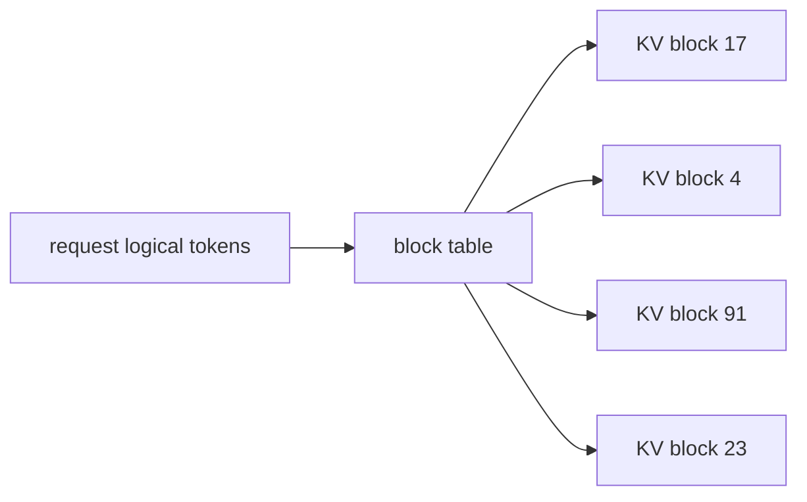

# KV-cache serving systems

During autoregressive decoding, every generated token attends to the tokens that came before it. Recomputing all previous keys and values at every step would be wasteful, so inference engines store them in a KV cache.

The cache is both the reason LLM serving works and one of the main reasons it is hard:

- useful because it avoids recomputing old keys and values,
- expensive because it grows with context length, layers, KV heads, and concurrency,
- awkward because requests have different prompt lengths and finish at different times.

This module is about the data structures and policies around that cache. Once attention kernels are efficient, the next serving bottleneck is often not the matrix multiply itself but the system that keeps the right K/V blocks resident, compact, reusable, and schedulable.

## The basic cache

For each layer, the model stores keys and values for previous tokens. On the next decode step, the new query attends over all cached keys and reads the corresponding values. The memory for one request is:

$$
\text{bytes} =
L_\text{layers}
\times H_\text{kv}
\times D_\text{head}
\times 2
\times T
\times B_\text{dtype}
$$

The factor of 2 is for K and V. $T$ is the number of cached tokens. With batch size $N$, multiply by $N$ unless prefixes or cache blocks are shared.

This linear growth is easy to underestimate. A model with many layers and a long context window can use more memory for KV cache than for quantized weights, especially under concurrent traffic.

Take the crossing points seriously, because they invert an intuition the earlier modules may have built. Weight quantization is the headline optimization of this course, and on that chart it moves one horizontal line down by a factor of four and does nothing else. It does not touch a single one of the sloped lines. At batch 32, a 70B model quantized to INT4 is outweighed by its own cache after about 3,300 tokens of context — which is a short conversation.

Beyond that crossing point, further weight compression is close to irrelevant and every remaining lever is a cache lever: fewer KV heads, fewer bytes per entry, fewer resident tokens, or fewer concurrent requests. Knowing which side of the crossing your workload lives on is worth more than any individual technique in this module.

## Why contiguous allocation fails

Imagine a server that gives every request one contiguous KV region sized for its maximum possible length. It sounds simple, but real traffic is not simple:

- one user sends a 200-token prompt,
- another sends 20,000 retrieved tokens,
- one request stops after 12 generated tokens,
- another streams for 1,000 tokens,
- some are cancelled,
- some share a system prompt,
- some use parallel sampling or tool schemas.

Static contiguous reservations waste memory and fragment the remaining space. Worse, they force the scheduler to be conservative because admitting a request requires enough contiguous space for its worst case, not just enough blocks for its current tokens.

*Figure 3 from Kwon et al., PagedAttention (CC BY 4.0). Three distinct wastes, and it is worth separating them because they have different fixes. **Reserved** slots will eventually be used, but they are unavailable to anyone else in the meantime. **Internal fragmentation** — the 2038 and 507 slots on the right — is space allocated for a maximum sequence length that the request never reached, and it is pure loss. **External fragmentation** is the gap in the middle: free memory that no request can use because it is not contiguous. Measured across earlier serving systems, only 20.4 to 38 percent of KV memory held real tokens.*

## PagedAttention

PagedAttention, popularized by vLLM, borrows the idea of paging from operating systems. Instead of requiring one contiguous physical allocation per request, the KV cache is split into fixed-size blocks. A request sees a logical sequence of blocks, while the physical blocks may live wherever the allocator has space.

*Figure 6 from Kwon et al., PagedAttention (CC BY 4.0). Logical block 0 lives in physical block 7 and logical block 1 in physical block 1; the request neither knows nor cares. The "# filled" column is what makes growth cheap — a new token appends into the current block and increments a counter, and only a full block triggers an allocation.*

This improves memory utilization because the server can allocate blocks as a sequence grows and free blocks as a sequence finishes. It also makes prefix sharing natural: two requests can point to the same immutable prefix blocks and diverge only after their prompts differ.

The waste that remains is bounded and computable. With block size $B$ tokens, a sequence of length $T$ occupies $\lceil T/B \rceil$ blocks and wastes whatever is left in the last one. If $T \bmod B$ is roughly uniform, the expected waste is

$$
\mathbb{E}[\text{wasted slots}] = \frac{B-1}{2} \ \text{tokens per sequence}
$$

At vLLM's default $B = 16$ that is 7.5 tokens, regardless of how long the sequence is or how long it might have become. Against a 1000-token sequence it is 0.75 percent. Compare that with reserving 2048 slots for a request that stops at 1000: 51 percent. Paging converts a waste proportional to the *maximum* length into a constant, and this is the entire argument in one line.

Block size is then a real tuning knob with a two-sided cost:

| Smaller blocks | Larger blocks |
|---|---|
| less internal waste, $(B-1)/2$ | more internal waste |
| longer block tables, more indirection | shorter tables, less bookkeeping |
| fewer contiguous positions per gather | more positions the kernel can process in parallel |

The tradeoff is that attention kernels and scheduler logic must understand block tables. That is an engineering cost, but it bought enough throughput and utilization that paged KV cache became a standard idea in LLM serving.

## Prefix reuse

Many production requests share prefixes:

- a system prompt,
- retrieved context boilerplate,
- tool or function schemas,
- policy text,
- a document template,
- an instruction scaffold for a specific workflow.

Prefix caching stores KV blocks for those repeated prefixes. If a later request has the same prefix under the same model state, the server can reuse the cached blocks and skip some prefill work. This is exact reuse when the tokens, model weights, positional treatment, and relevant cache metadata match.

The invalidation rules matter. A small prompt difference, tokenizer change, adapter change, or cache-salting policy can make reuse unsafe. Some serving stacks expose controls to prevent accidentally sharing cache entries across tenants or security boundaries.

## Virtualized cache alternatives

PagedAttention changes the attention implementation to gather from paged blocks. Another line of work asks whether the system can keep the KV cache virtually contiguous while relying on virtual memory mechanisms underneath to avoid physical fragmentation. vAttention is a representative example: preserve a contiguous virtual address view for kernels while managing physical memory dynamically.

The theme is the same even when the mechanism differs:

1. Requests need a logical sequence of K/V states.
2. Physical GPU memory is scarce and fragmented.
3. The serving engine needs dynamic allocation without destroying kernel performance.

## KV-cache compression

Cache compression asks whether all old keys and values need full precision or full length. Approaches include:

- low-bit KV quantization,
- retaining only important tokens,
- product-quantization-style compression,
- sliding windows with sink tokens,
- learned or training-free cache compression,
- layer-specific or head-specific retention policies.

Compression can be exact only in special lossless cases. Usually it is approximate, so evaluation must include long-context tasks where cache quality matters: retrieval, code, math, multi-document QA, and scientific workflows. A method that looks fine on short chat may fail when a single far-back token is decisive.

## Recap

For long-context LLM serving, the KV cache is often the system. Kernels decide how fast attention can read it; allocators decide how many requests fit; schedulers decide which requests get tokens next. The next coding lab builds all three against real tensors: a paged KV cache, a continuous-batching scheduler that admits and retires requests mid-flight, and real attention decode steps that read from the cache. The payoff is a correctness test — proving that a request batched alongside others produces the same output it would have produced alone, which is exactly the property that cache-indexing bugs silently break.
