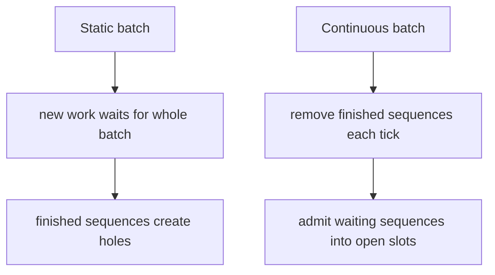

# Why continuous batching helps

Decode is iterative. At each step, every active sequence usually needs one next-token computation. If all active sequences finished at the same time, static batching would be fine. They do not.

Consider two requests:

| Request | Output tokens |
|---|---:|
| short | 1 |
| long | 100 |

A static batch that waits for both requests to finish leaves the short request's slot idle for 99 iterations. Continuous batching lets a new waiting request enter as soon as the short request leaves.

## Static versus continuous

The throughput gain depends on traffic. Continuous batching helps most when:

- requests arrive over time,
- output lengths vary,
- the server has a queue,
- decode iterations are frequent,
- memory capacity allows new requests to enter.

It helps less when one request dominates the server, when all requests have identical lengths, or when prefill is the only bottleneck.

## Scheduler state

A minimal scheduler needs:

| State | Purpose |
|---|---|
| waiting queue | requests that have arrived but are not active |
| active set | requests currently generating tokens |
| remaining tokens | per-request progress |
| completion map | final finish times |
| clock tick | discrete decode iteration |

This lab can sort or scan requests by arrival time because the workload is tiny. Larger systems use queues, heaps, priority policies, and memory-aware admission control.

## Prefill and decode

The lab models only decode. Real requests first go through prefill, where the prompt is processed and initial KV cache is created. Prefill can be expensive for long prompts, and it can interfere with decode latency if scheduled carelessly.

Modern serving stacks often support chunked prefill: split a long prompt into chunks so decode work for existing users is not blocked for too long. That creates a mixed scheduling problem:

- prefill wants large efficient chunks,
- decode wants frequent low-latency iterations,
- KV-cache memory must be available for both.

The simple `MAX_ACTIVE` in this lab stands in for a much richer resource budget.

## Fairness and latency

Maximizing tokens per second is not the only goal. A scheduler also shapes:

- time to first token,
- inter-token latency,
- tail latency,
- starvation risk,
- fairness between short and long requests,
- priority handling for interactive versus batch jobs.

A greedy policy that always fills open slots can still behave badly if it admits huge prompts that consume all KV memory or if it repeatedly preempts the same long-running request.

## Completion time

The finish time convention in this lab is discrete:

$$
\text{finish} = \text{tick} + 1
$$

for a request that generates its last token during `tick`. This mirrors a common simulation pattern: work happens during the half-open interval:

$$
[\text{tick},\ \text{tick}+1)
$$

and results are available at the right edge of the interval.

## Exactness

Continuous batching does not change model outputs by itself. It changes which requests share a decode iteration. As long as attention masks, KV caches, random seeds, and sampling streams are handled correctly, the model computation for each request remains the same. The hard parts are resource accounting and latency policy, not mathematical approximation.
