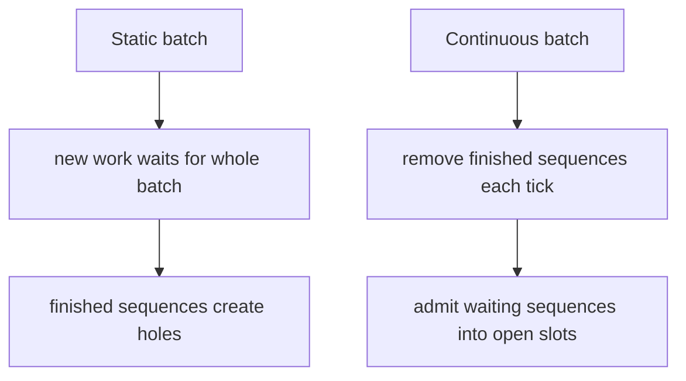
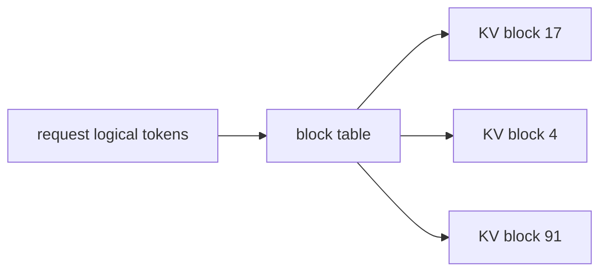

# Why continuous batching needs a paged cache

Decode is iterative. At each step, every active sequence needs one next-token
computation. If all active sequences finished at the same time, static batching
would be fine. They do not.

Consider two requests:

| Request | Output tokens |
|---|---:|
| short | 1 |
| long | 100 |

A static batch that waits for both requests to finish leaves the short request's
slot idle for 99 iterations. Continuous batching lets a new waiting request
enter as soon as the short request leaves.

That description is complete as a *policy*. It is incomplete as a *system*,
because the new request has to land somewhere in a KV cache that the departing
request just vacated. The rest of this note is about that landing.

## Static versus continuous

The throughput gain depends on traffic. Continuous batching helps most when
requests arrive over time, output lengths vary, the server has a queue, decode
iterations are frequent, and memory capacity allows new requests to enter. It
helps less when one request dominates the server, when all requests have
identical lengths, or when prefill is the only bottleneck.

## Why contiguous per-request allocation fails

The obvious layout is one contiguous region per request, sized for its maximum
possible length. Under real traffic that layout fails in two ways at once:

- *Internal waste.* A request reserved for 2048 tokens that finishes at 40
  leaves 2008 slots idle and unusable by anyone else.
- *External fragmentation.* After a few such reservations complete, the free
  space is a scatter of holes, none of them large enough for the next long
  prompt even though the *total* free space would be.

PagedAttention, popularized by vLLM, borrows paging from operating systems.
The cache is a pool of fixed-size physical blocks. A request sees a *logical*
sequence of positions; a *block table* maps those positions onto whichever
physical blocks the allocator currently has free.

Logical position $\text{pos}$ of a request with block size $B$ lives at:

$$
\text{physical block} = \text{table}\!\left[\left\lfloor \frac{\text{pos}}{B} \right\rfloor\right],
\qquad
\text{slot} = \text{pos} \bmod B
$$

Growing a sequence appends a free physical block. Completing a sequence returns
every one of its blocks to the free list, where they become available to a later
request that has no relationship to the previous owner.

## Internal versus external fragmentation

Paging eliminates external fragmentation: any free block can serve any request.
It does not eliminate *internal* fragmentation. The last block of a request of
length $L$ wastes

$$
B - (L \bmod B)
$$

slots when $L$ is not a multiple of $B$, and zero slots when it is. Averaged
over a traffic mix, that waste is a function of $B$:

| Block size $B$ | Internal waste | Block-table entries | Gather work |
|---|---|---|---|
| 1 | none | one per token | maximum |
| small (8–16) | a few tokens per request | moderate | moderate |
| large (64+) | most of a block, per request | few | minimum |

The lab's sweep holds the *pool* fixed at 256 slots and varies $B$. Equivalence
must hold at every size; the interesting output is how fragmentation and
block-table reads trade off. Block size 1 reports zero internal fragmentation
and over a thousand gather reads. Block size 64 reports two-thirds of allocated
slots unused and a handful of reads.

There is no universally correct $B$. Production stacks typically land in the
16-to-64 token range, which is also where this lab's numbers stop being
pathological in either direction.

## The correctness invariant

Continuous batching does not change model outputs *if* the cache is right. The
invariant is:

> For every request $r$ and every generated position $t$, the keys and values
> that $r$ attends over at step $t$ are exactly the keys and values $r$ itself
> wrote at positions $0, \ldots, t$, and nothing else.

Three ways to break it, all of which this lab's workload is sized to provoke:

1. *Stale length.* Gathering $L+1$ slots after writing $L$ tokens pulls in a
   neighbour's key or a previous owner's leftover. The output moves by $O(1)$.
2. *Use-after-free.* Completing $r$ without returning its blocks, then
   allocating those same blocks to $s$, means $s$ and a zombie $r$ share
   physical storage.
3. *Forgotten free.* Completing $r$ without returning its blocks, and never
   reallocating them, leaks the pool until the scheduler can no longer admit
   work. The lab raises if it runs past `MAX_STEPS` without finishing, which is
   how a leak presents.

The blocks are deliberately not zeroed on free. Zeroing would hide (1) and (2)
for any test that happened to look at a slot the new owner had not yet written.
A test that only passes because of a memset is not a test of the invariant.

The batched decode path pads to the longest *currently active* sequence, so the
softmax reduction order can differ from a single-request replay by a few
float32 ulps. `allclose` with a $10^{-5}$ absolute tolerance absorbs that.
Attending over a wrong key does not.

## Prefill, decode, and admission

The lab models decode plus a one-shot prompt write on admission. Real requests
first go through prefill, which can be expensive for long prompts and can
interfere with decode latency if scheduled carelessly. Modern stacks often
support chunked prefill: split a long prompt so decode work for existing users
is not blocked for too long.

Admission is not just `len(active) < MAX_ACTIVE`. The scheduler also has to
leave enough free blocks for every in-flight request to finish growing. The lab
does this with a reservation: blocks still owed to already-admitted requests
are subtracted from the free count before a new request is allowed in. Without
that, on-demand growth can fail mid-generation, which is a production incident.

## Fairness and latency

Maximizing tokens per second is not the only goal. A scheduler also shapes time
to first token, inter-token latency, tail latency, starvation risk, and fairness
between short and long requests. A greedy policy that always fills open slots
can still behave badly if it admits huge prompts that consume all KV memory, or
if it repeatedly preempts the same long-running request.

This lab's policy is FCFS with a hard concurrency cap and a block reservation.
That is enough to make the cache correctness problem real. It is not a complete
serving policy.

## Transition

The next module keeps the same decode loop and tries to spend each iteration on
more than one token, by drafting several candidates and verifying them in
parallel. Speculative decoding only works if the cache underneath it is already
correct — which is why the equivalence test in this lab comes first.
