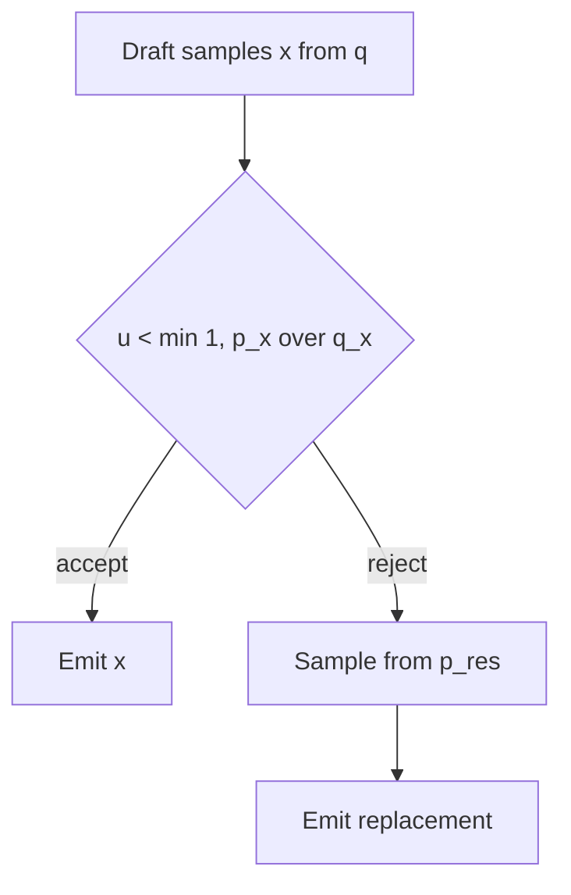

# Why speculative sampling is exact

Speculative decoding is unusual among inference optimizations. Quantization
trades accuracy for bytes. Pruning trades capacity for FLOPs. Speculative
decoding trades *nothing*: with the correct acceptance rule, the tokens it emits
are drawn from exactly the target model's distribution, for any draft model at
all, including a deliberately terrible one.

That is a strong claim, so it deserves a proof rather than a citation. This page
derives it, and derives the acceptance rate along with it. Both results are
checked by the code you write — the first as an exact identity over the
vocabulary, the second as a printed boolean.

Throughout, $p$ is the target's next-token distribution over a vocabulary
$\mathcal{V}$, $q$ is the draft's, $k$ is the draft length, and $a$ is the
marginal probability that a drafted token is accepted. Those are the reading's
symbols. The code calls $a$ `alpha`, following the papers.

## The rule

For a single position:



The rejection branch draws from the **residual distribution**

$$
p_{\text{res}}(t) = \frac{\max(0,\, p_t - q_t)}{Z},
\qquad
Z = \sum_{s \in \mathcal{V}} \max(0,\, p_s - q_s)
$$

Everything below turns on that branch. Replacing it with a draw from $p$ breaks
the theorem.

## The acceptance rate

Write $A$ for the event that the proposal is accepted. Conditioning on which
token the draft proposed:

$$
\Pr[A] = \sum_t \Pr[x = t]\,\Pr[A \mid x = t]
= \sum_t q_t \cdot \min\!\left(1, \frac{p_t}{q_t}\right)
$$

Distributing $q_t$ through the minimum — legitimate because $q_t \ge 0$ —
gives $q_t \min(1, p_t/q_t) = \min(q_t, p_t)$, so

$$
a = \Pr[A] = \sum_{t} \min(p_t, q_t)
$$

If $q_t = 0$ the token is never proposed and contributes nothing, which matches
$\min(p_t, 0) = 0$, so the identity holds even where the ratio is undefined.

Now relate that to total variation distance. For any two non-negative reals,

$$
|x - y| = x + y - 2\min(x, y)
$$

which you can check by cases: if $x \ge y$ the right side is $x + y - 2y = x -
y$, and if $x < y$ it is $x + y - 2x = y - x$. Summing over the vocabulary, and
using $\sum_t p_t = \sum_t q_t = 1$:

$$
2\,\mathrm{TV}(p, q) = \sum_t |p_t - q_t|
= \sum_t p_t + \sum_t q_t - 2\sum_t \min(p_t, q_t)
= 2 - 2a
$$

Therefore

$$
\boxed{\,a = 1 - \mathrm{TV}(p, q)\,}
$$

This is worth sitting with. Acceptance rate is not an empirical curiosity that
depends on training recipes and tokenizer luck. It *is* the statistical distance
between the two models' next-token distributions, one minus. Every engineering
lever that raises acceptance — distilling the draft from the target, sharing a
tokenizer, lowering temperature, constraining the grammar — works by pulling
$q$ closer to $p$ in total variation, and nothing else can work.

The same identity gives the normalizer of the residual for free. Using
$\max(0, x - y) = x - \min(x, y)$:

$$
Z = \sum_t \max(0,\, p_t - q_t)
= \sum_t p_t - \sum_t \min(p_t, q_t)
= 1 - a
$$

So the residual's normalizing constant is exactly the rejection probability.
That is not a coincidence, and the next section shows why.

## The correctness proof

**Claim.** The token emitted by one speculative step is distributed exactly as
$p$.

**Proof.** Fix a token $t$. There are two disjoint ways to emit it.

*Path 1: the draft proposed $t$ and the target accepted.* These are independent
given $t$, so

$$
\Pr[x = t,\ A] = q_t \cdot \min\!\left(1, \frac{p_t}{q_t}\right) = \min(p_t, q_t)
$$

*Path 2: the proposal was rejected, and the residual draw landed on $t$.* The
replacement is drawn independently of which token was rejected, so

$$
\Pr[\lnot A]\; p_{\text{res}}(t)
= (1 - a) \cdot \frac{\max(0,\, p_t - q_t)}{1 - a}
= \max(0,\, p_t - q_t)
$$

The factor $1 - a$ cancels the residual's normalizer exactly, which is the whole
trick. Adding the two paths and applying $\max(0, x - y) = x - \min(x, y)$ once
more:

$$
\Pr[\text{emit } t] = \min(p_t, q_t) + p_t - \min(p_t, q_t) = p_t
$$

$\blacksquare$

Two remarks on the edge cases. If $q = p$ then $a = 1$, the residual is $0/0$
and undefined — but the rejection branch has probability zero, so nothing is
ever sampled from it. If $q_t = 0$ for some token the target likes, that token
is simply unreachable through path 1 and arrives entirely through the residual;
the proof does not care. The draft can be arbitrarily bad without breaking
correctness. It can only be bad enough to be useless.

Notice what the proof did *not* use: any assumption about $q$. This is why a
2-hidden-dimension draft with 320 parameters produces exactly the same output
distribution as a well-matched one. Only the *speed* depends on the draft
quality.

## Why sampling the replacement from $p$ is wrong

The tempting bug is to say: the draft's guess was rejected, so let the target
just sample normally. That gives

$$
\text{wrong}(t) = \min(p_t, q_t) + (1 - a)\, p_t
$$

which sums to $a + (1 - a) = 1$. It is a perfectly valid probability
distribution, it passes every "do my probabilities sum to one" check, and it is
not $p$. The bias is

$$
\text{wrong}(t) - p_t = \min(p_t, q_t) - a\, p_t
$$

Read that by cases. Where the draft covers the target ($q_t \ge p_t$) the bias
is $(1 - a)\,p_t > 0$: the token is over-emitted. Where the draft misses
($q_t \approx 0$) the bias is $-a\,p_t < 0$: the token is under-emitted.
**The bug leaks the draft model's preferences into the output.**

There is a compact way to say how much. Let $m = \min(p, q)/a$ be the
distribution of *accepted* tokens — the normalized agreement region. Then
$\min(p_t, q_t) = a\, m_t$, so

$$
\text{wrong} = a\,m + (1 - a)\,p,
\qquad
\text{wrong} - p = a\,(m - p),
\qquad
\mathrm{TV}(\text{wrong}, p) = a \cdot \mathrm{TV}(m, p)
$$

The corruption is a product of two competing factors, and it vanishes at both
ends. If the draft is perfect, $a = 1$ and $m = p$, so nothing is ever rejected
and there is no wrong branch to take. If the draft is useless, $a \to 0$ and the
sampler almost always falls through to a plain draw from $p$, which is correct
by accident. The damage lives in between — which is precisely the acceptance
range where anyone would deploy speculative decoding.

The exercise reports both configurations. The strong draft's buggy sampler sits
at $\mathrm{TV} = 0.1785$ from the target ($a = 0.7113$ times
$\mathrm{TV}(m, p) = 0.2510$); the weak draft's sits at $0.1319$
($0.2283 \times 0.5776$). Note that these do not order the way $a$ alone would
suggest — the two factors move in opposite directions and the shape of $q$
decides which wins. What is not in doubt is the scale. Both are two orders of
magnitude above the `0.0047` of Monte Carlo noise in the correct sampler. This
bug does not degrade quality subtly; it serves a different distribution.

## Prefix acceptance and the committed-token formula

Speculative verification accepts a *prefix*. If the draft proposes

```text
the protein binds strongly
```

and the target rejects `binds`, then `strongly` is worthless. It was drafted
conditioned on a token that did not survive, so the target never scored it
against the right context. This is why the reading's estimator uses
$a + a^2 + \cdots + a^k$ rather than $ka$.

Let $S_i$ be the event that the first $i$ drafted tokens are all accepted. The
number of accepted draft tokens is $\sum_{i=1}^{k} \mathbf{1}[S_i]$, so by
linearity of expectation the expected committed count — accepted tokens plus the
one guaranteed residual-or-bonus token — is *exactly*

$$
E[\text{committed}] = 1 + \sum_{i=1}^{k} \Pr[S_i]
$$

That much needs no assumptions. The reading's formula then substitutes
$\Pr[S_i] = a^i$, and *that* is the assumption: it requires acceptance events to
be independent across positions and to have the same probability at every
position. Under it,

$$
1 + \sum_{i=1}^{k} a^i = \frac{1 - a^{k+1}}{1 - a}
$$

using $\sum_{i=1}^{k} a^i = a(1 - a^k)/(1 - a)$ and combining over the common
denominator: $(1 - a) + a - a^{k+1} = 1 - a^{k+1}$. As $k \to \infty$ with
$a < 1$ this saturates at $1/(1-a)$, which is the ceiling the reading described.

## Where the geometric model breaks

The substitution $\Pr[S_i] = a^i$ fails in real systems, and it fails in the
exercise, because **$a$ is a property of a context, not of a model pair**. The
program prints the spread directly: for the strong draft, $a$ ranges from
`0.3205` to `0.9639` across the 64 contexts, with a mean of `0.6165`. The
starting context has $a = 0.7113$.

Two things follow.

First, if the starting context is easier than typical, positions further into
the draft regress toward the mean and the geometric formula over-predicts. That
is the strong draft: measured committed tokens at $k = 8$ are `2.8703` against a
prediction of `3.3023`, a 13% overshoot.

Second, if the starting context is harder than typical, the formula
under-predicts. That is the weak draft: $a = 0.2283$ at the start against a mean
of `0.3649`, and the measurement comes in 4.8% *above* the prediction at
$k = 8$.

There is a second-order effect layered on top. The context at position $i+1$ is
the token accepted at position $i$, and conditioned on acceptance that token is
distributed as $\min(p, q)/a$ rather than as $q$ — it is biased toward tokens
both models like. Whether that makes the next position easier or harder depends
on the model pair, which is another way of saying the process is not
memoryless.

None of this makes the formula useless. It is off by a few percent at $k = 2$
and by low tens of percent at $k = 8$, which is exactly the accuracy you want
from a back-of-the-envelope estimator: enough to reject a bad configuration,
not enough to certify a deployment. What it does mean is that a serving system
should measure committed tokens per step directly rather than measuring $a$ and
extrapolating, and that "the average acceptance rate is 0.7" tells you much less
than the distribution of acceptance rates across your actual traffic.

## What this exercise still does not model

The proof above covers a single position, and the multi-token loop applies it
independently at each verified position, which is exactly what the real
algorithm does. What is missing is systems reality:

- **Cost.** Verification is treated as free here. The reading's $1 + k c_d$ cost
  model is the other half of the story, and neither half is a benchmark.
- **Verification kernels.** Scoring $k$ positions is not always one ordinary
  decode step. Attention shapes, cache reads, and logits extraction differ.
- **Batching and memory.** Draft weights and a second KV cache compete with
  batch size. A latency win at batch 1 can be a throughput loss at saturation.
- **Tree drafting.** Proposing a tree rather than a chain changes $\Pr[S_i]$
  entirely; the geometric model does not apply at all.
- **Real conditionals.** The bigram target here has a 64-token vocabulary and
  one token of context. A transformer's acceptance rate varies with position in
  the sequence, prompt domain, and sampling parameters far more than the spread
  you measured.

The correctness result, though, is not an approximation. It holds for any $p$,
any $q$, and any vocabulary size, and it is the reason speculative decoding is
allowed anywhere near a production serving stack.

## Relation to biological screening

The proposal-plus-verification instinct transfers to protein pipelines — embed
cheaply, filter, then fold or dock the survivors with an expensive model — and
the next module develops that. But the transfer is incomplete in exactly the
place this module made precise. Speculative decoding is lossless because the
expensive model gets to *correct* every rejection with a draw from its own
distribution. A cheap screen that discards candidates never gives the expensive
model that chance: a false negative is gone.

So the honest analogy is not "speculative decoding for proteins." It is: if your
cheap stage only *reorders* work that the expensive stage will eventually see,
you can be lossless; if it *removes* work, you are trading recall for compute
and you owe someone a false-negative measurement.
