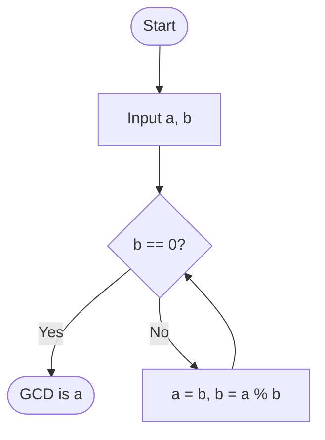

# Greatest Common Divisor (GCD)

Let $a$ and $b$ be two integers, not both zero. The **greatest common divisor** of $a$ and $b$, denoted as $\gcd(a, b)$, is the largest positive integer $d$ such that:
1. $d \mid a$
2. $d \mid b$

For example, the divisors of $12$ are $\pm 1, \pm 2, \pm 3, \pm 4, \pm 6, \pm 12$. The divisors of $18$ are $\pm 1, \pm 2, \pm 3, \pm 6, \pm 9, \pm 18$. The common divisors are $\pm 1, \pm 2, \pm 3, \pm 6$. The greatest of these is $6$, so $\gcd(12, 18) = 6$.

While listing divisors works for small numbers, it is completely impractical for large integers (like those used in modern cryptography). We need a better way.

## The Key Lemma

The entire Euclidean Algorithm hinges on one brilliant observation based on the Division Algorithm.

**Lemma:** If $a = bq + r$, then $\gcd(a, b) = \gcd(b, r)$.

**Proof:**
Let $d = \gcd(a, b)$ and $c = \gcd(b, r)$. We will show that $d \le c$ and $c \le d$, which implies $d = c$.

**Part 1: Show $d \le c$**
Since $d = \gcd(a, b)$, we know $d \mid a$ and $d \mid b$.
From the equation $a = bq + r$, we can rewrite the remainder as $r = a - bq$.
Since $d$ divides both $a$ and $b$, by the linear combination theorem, $d$ must also divide $1 \cdot a + (-q) \cdot b$, which is $r$.
Thus, $d \mid b$ and $d \mid r$. This makes $d$ a common divisor of $b$ and $r$.
Since $c$ is the *greatest* common divisor of $b$ and $r$, it must be that $d \le c$.

**Part 2: Show $c \le d$**
Since $c = \gcd(b, r)$, we know $c \mid b$ and $c \mid r$.
By the linear combination theorem, $c$ must divide $q \cdot b + 1 \cdot r$, which is $a$.
Thus, $c \mid a$ and $c \mid b$. This makes $c$ a common divisor of $a$ and $b$.
Since $d$ is the *greatest* common divisor of $a$ and $b$, it must be that $c \le d$.

Since $d \le c$ and $c \le d$, we conclude that $d = c$, or $\gcd(a, b) = \gcd(b, r)$. $\blacksquare$

## The Algorithm

The Euclidean algorithm repeatedly applies this lemma and the Division Algorithm to reduce the size of the numbers until the remainder becomes zero.

Given two non-negative integers $a$ and $b$ with $a \ge b > 0$:

1. Apply the Division Algorithm: $a = b \cdot q_1 + r_1$, with $0 \le r_1 < b$.
2. By our Lemma, $\gcd(a, b) = \gcd(b, r_1)$.
3. If $r_1 = 0$, then $\gcd(b, 0) = b$, and we are done.
4. If $r_1 \neq 0$, repeat the process with $b$ and $r_1$: $b = r_1 \cdot q_2 + r_2$.
5. Continue until a remainder of $0$ is reached. The last non-zero remainder is the GCD.

$$
\begin{aligned}
a &= b \cdot q_1 + r_1 \\
b &= r_1 \cdot q_2 + r_2 \\
r_1 &= r_2 \cdot q_3 + r_3 \\
&\vdots \\
r_{n-2} &= r_{n-1} \cdot q_n + r_n \\
r_{n-1} &= r_n \cdot q_{n+1} + 0
\end{aligned}
$$

The last non-zero remainder, $r_n$, is the GCD of $a$ and $b$.

## Bezout's Identity

An important consequence of the Euclidean Algorithm is that the GCD can always be expressed as a **linear combination** of the original numbers.

**Theorem (Bezout's Identity):** For any integers $a$ and $b$ (not both zero), there exist integers $x$ and $y$ such that:

$$
ax + by = \gcd(a, b)
$$

**Proof:**
Consider the set of all *positive* integer linear combinations of $a$ and $b$:
$$
S = \{ ax + by : x, y \in \mathbb{Z} \} \cap \mathbb{Z}^+
$$
Since $a$ and $b$ are not both zero, $S$ is non-empty (for example, $a \cdot a + b \cdot b = a^2 + b^2 > 0$ lies in $S$). By the **well-ordering principle**, $S$ has a least element; call it $d = ax_0 + by_0$.

We claim $d = \gcd(a, b)$. First, $d \mid a$: by the Division Algorithm write $a = dq + r$ with $0 \le r < d$. Then
$$
r = a - dq = a - q(ax_0 + by_0) = a(1 - qx_0) + b(-qy_0),
$$
so $r$ is itself an integer linear combination of $a$ and $b$. If $r > 0$ it would belong to $S$, contradicting the minimality of $d$ since $r < d$. Hence $r = 0$ and $d \mid a$. The identical argument shows $d \mid b$, so $d$ is a common divisor of $a$ and $b$.

Finally, let $c$ be *any* common divisor of $a$ and $b$. By the linear combination theorem, $c$ divides $ax_0 + by_0 = d$, so $c \le d$. Thus $d$ is the greatest common divisor, and $d = ax_0 + by_0$ expresses it as a linear combination. $\blacksquare$

In practice, the coefficients $x$ and $y$ can be found constructively by "working backwards" through the steps of the Euclidean Algorithm, a process known as the **Extended Euclidean Algorithm**.

### Proof of Termination

Why must the algorithm stop? Notice the sequence of remainders:

$$
b > r_1 > r_2 > r_3 > \dots \ge 0
$$

The remainders form a strictly decreasing sequence of non-negative integers. Since there are only finitely many non-negative integers strictly less than $b$, the sequence must eventually hit $0$. The algorithm is guaranteed to terminate.

### Example Trace

Let's compute $\gcd(252, 105)$:

$$
\begin{aligned}
252 &= 105 \cdot 2 + 42 \quad &(r_1 = 42) \\
105 &= 42 \cdot 2 + 21 \quad &(r_2 = 21) \\
42 &= 21 \cdot 2 + 0 \quad &(r_3 = 0)
\end{aligned}
$$

Since the remainder is $0$, the last non-zero remainder ($21$) is our GCD.
So, $\gcd(252, 105) = 21$.
