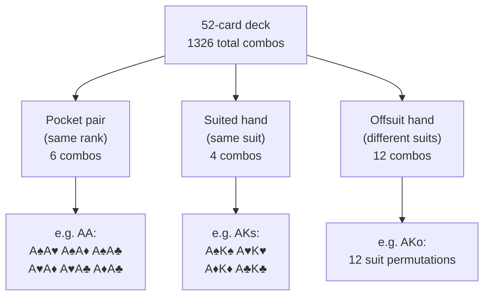

# Probability Foundations

Good poker decisions are not guesses — they are probability estimates dressed up in real time. Before we can talk about pot odds, equity, or expected value, we need a firm grip on the mathematics of a 52-card deck. This module builds that foundation from the ground up.

---

## The 52-Card Deck

A standard deck has 52 cards: 13 ranks (2 through Ace) across 4 suits (clubs ♣, diamonds ♦, hearts ♥, spades ♠). Every hand of hold'em starts by drawing 2 hole cards from those 52.

---

## Combinatorics: Counting Without Listing

The number of ways to choose $k$ items from $n$ without regard to order is the **binomial coefficient**:

$$\binom{n}{k} = \frac{n!}{k!\,(n-k)!}$$

For our hole cards, $n = 52$ and $k = 2$:

$$\binom{52}{2} = \frac{52 \times 51}{2} = 1{,}326 \text{ total starting-hand combos}$$

Every probability calculation in hold'em ultimately divides some subset of combos by 1,326 (or by whatever remains after accounting for known cards).

---

## Hand Combo Counting

Once you know $\binom{n}{k}$, counting how many ways to make each hand type is straightforward.

### Pocket Pairs

A specific pair (e.g., pocket Aces) requires 2 cards of the same rank. There are 4 suits available, so:

$$\binom{4}{2} = 6 \text{ combinations per pair}$$

For example, AA has exactly 6 combos: A♠A♥, A♠A♦, A♠A♣, A♥A♦, A♥A♣, A♦A♣.

### Suited Hands

A specific suited hand (e.g., AKs) requires both cards to share a suit. There are 4 suits, so:

$$4 \text{ combinations per suited hand}$$

AKs: A♠K♠, A♥K♥, A♦K♦, A♣K♣.

### Offsuit Hands

A specific offsuit hand (e.g., AKo) requires the two cards to have **different** suits. The first card has 4 suit choices, the second has 3 remaining:

$$4 \times 3 = 12 \text{ combinations per offsuit hand}$$

### Worked Example: AK

AK total = AKs + AKo = 4 + 12 = **16 combinations**.

This is why AK blocks aces: holding A♥K♥ removes two specific cards from the deck, collapsing the remaining AA combos from 6 to just 3.

---

## Outs: Counting Your Winners

An **out** is any unseen card that will improve your hand to (likely) the best hand. Counting outs is the first step toward estimating your equity.

| Draw Type | Outs | Reasoning |
|---|---|---|
| Flush draw | 9 | 13 cards per suit − 4 already seen = 9 remaining |
| Open-ended straight draw (OESD) | 8 | 4 cards of each of 2 ranks complete the straight |
| Gut-shot (inside) straight draw | 4 | Only one rank fills the gap |
| Overcards (two) | 6 | 3 remaining of each overcard rank |
| Pair → two pair or trips | 5 | 3 cards pair your kicker + 2 cards pair your top card |

These are rough averages assuming a clean board (your outs are not "tainted" by giving the opponent a better hand). In real play you'll discount outs that might improve an opponent more.

---

## The Rule of 2 and 4

Once you have an out count, you need your approximate **equity** — the percentage of the time you'll win at showdown. The exact calculation requires counting all remaining deck combinations, but a fast mental shortcut works remarkably well:

> **Rule of 4:** with two cards to come (flop → turn → river), multiply your outs by 4 to get your approximate equity percentage.
>
> **Rule of 2:** with one card to come (turn → river), multiply your outs by 2.

$$\text{Equity} \approx \text{outs} \times 4\% \quad (\text{two cards to come})$$

$$\text{Equity} \approx \text{outs} \times 2\% \quad (\text{one card to come})$$

### Worked Example: Flush Draw on the Flop

You hold A♥K♥. The flop comes Q♥7♥2♣. You have 9 flush outs.

- **Two cards to come:** $9 \times 4 = 36\%$ equity (exact: ~35%)
- **One card to come (turn):** $9 \times 2 = 18\%$ equity (exact: ~19.6%)

The rule is an approximation — it slightly overestimates when outs are high (>10) and is almost perfect for 4–9 outs. For a deeper derivation of exactly why it works, see `theory.md`.

---

## Combo Removal and Blockers

When you hold specific cards, you **block** combos that your opponent might have. This is a powerful advanced concept that builds directly on combo counting.

**Example:** You hold A♠ on a board of K♥7♦2♣. How many AA combos can your opponent hold?

With A♠ in your hand, only 3 Aces remain (A♥, A♦, A♣). The remaining AA combos:

$$\binom{3}{2} = 3 \text{ combos of AA remaining}$$

Down from 6 to 3 — you've cut the probability of running into Aces exactly in half. This "blocker effect" underpins advanced range construction and is explored further in Module 07 (Range Theory).

---

## Putting Numbers on Starting Hands

With combo counting in hand, we can compute the probability of being dealt any hand type:

| Hand | Combos | Probability (out of 1,326) |
|---|---|---|
| Any specific pair (e.g. AA) | 6 | 0.45% |
| Any pair (13 ranks × 6) | 78 | 5.88% |
| Any specific suited hand | 4 | 0.30% |
| Any specific offsuit hand | 12 | 0.90% |
| AK (suited + offsuit) | 16 | 1.21% |

These numbers explain why pocket Aces only come around once every ~221 hands ($1/0.00452$), and why you'll see AK roughly once every 83 hands.

---

## Recap

- The deck yields **1,326** total two-card starting combos: $\binom{52}{2}$.
- Pocket pairs have **6** combos; suited hands **4**; offsuit hands **12**.
- **Outs** are unseen cards that complete your drawing hand. Common counts: flush draw = 9, OESD = 8, gut-shot = 4, two overcards = 6.
- The **Rule of 4** (two cards to come) and **Rule of 2** (one card to come) convert out counts to approximate equity percentages instantly.
- Holding a card **blocks** your opponent's combos — a critical concept for range analysis.

Next up: [Module 02 — Combinatorics Quiz](../02-combinatorics-quiz/) where you'll drill these calculations with fresh randomised numbers.
