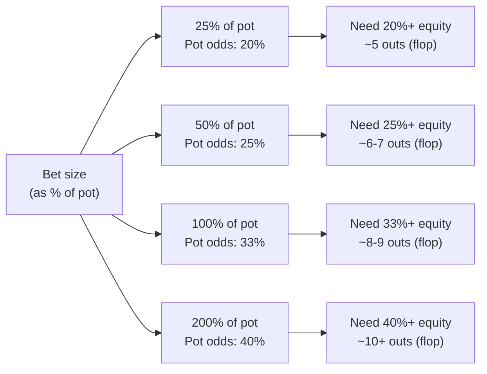

# Pot Odds and Equity

You now know how to count outs and estimate equity. But knowing you have 35% equity on a flush draw means nothing in isolation — it only matters *relative to the price you're being offered*. That price is your **pot odds**, and comparing equity to pot odds is the fundamental calling decision in poker.

---

## What Are Pot Odds?

**Pot odds** express how much of the final pot you have to contribute in order to see the next card (or showdown). The standard formula computes them as a percentage:

$$\text{Pot Odds} = \frac{\text{call amount}}{\text{pot after calling}} \times 100\%$$

where "pot after calling" = current pot + opponent's bet + your call.

### Worked Example

The pot is $\$100$. Your opponent bets $\$50$. To continue, you must call $\$50$. The pot after calling will be $\$100 + \$50 + \$50 = \$200$.

$$\text{Pot Odds} = \frac{50}{200} = 25\%$$

You're putting in 25% of the final pot. That means you need to win at least 25% of the time for the call to be break-even.

---

## Break-Even Equity

**Break-even equity** is the minimum equity needed for a call to be exactly $\$0$ EV (neither winning nor losing in the long run). It equals your pot odds expressed as a percentage:

$$\text{Break-Even Equity} = \text{Pot Odds \%}$$

This is not a coincidence. See `theory.md` for the derivation — it falls directly out of the EV equation.

| Scenario | Pot | Bet | Call | Total pot | Pot Odds | Break-Even Equity |
|---|---|---|---|---|---|---|
| Small bet | $100 | $25 | $25 | $150 | 16.7% | 16.7% |
| Half-pot bet | $100 | $50 | $50 | $200 | 25% | 25% |
| Pot-sized bet | $100 | $100 | $100 | $300 | 33.3% | 33.3% |
| Overbet (2×) | $100 | $200 | $200 | $500 | 40% | 40% |

The bigger the bet relative to the pot, the worse the pot odds, and the more equity you need to call profitably.

---

## Equity: From Outs to a Percentage

From Module 01, you can estimate equity with the Rule of 2 and 4. You now connect that estimate to the calling decision:

$$\text{Call if: Equity} \geq \text{Pot Odds \%}$$

This is **the calling equation**. It's the single most important formula in poker mathematics.

### Full Worked Example

**Situation:** You hold 9♥8♥ on a flop of 7♦6♣2♠. The pot is $\$80$. Your opponent bets $\$40$.

**Step 1 — Count outs.** You have an open-ended straight draw. Any 5 or any T completes your straight: 4 fives + 4 tens = **8 outs**.

**Step 2 — Estimate equity.** Two cards to come, so Rule of 4: $8 \times 4 = 32\%$.

**Step 3 — Calculate pot odds.** Total pot after calling: $80 + 40 + 40 = \$160$. Your call is $\$40$.

$$\text{Pot Odds} = \frac{40}{160} = 25\%$$

**Step 4 — Compare.** Equity (32%) > Pot Odds (25%). **Call.**

If your equity were only 20% — say you were on a gut-shot (4 outs, ~16% by Rule of 4) — the call would be unprofitable at those pot odds.

---

## Equity as a Percentage of the Pot

Another way to frame the same comparison is in dollar terms:

$$\text{EV(call)} = \text{Equity} \times \text{Total Pot} - \text{Call Amount}$$

In the example: $0.32 \times 160 - 40 = 51.20 - 40 = +\$11.20$ EV per call.

For a gut-shot (16%): $0.16 \times 160 - 40 = 25.60 - 40 = -\$14.40$ EV. Fold.

---

## Implied Odds: Adjusting for Future Streets

Pot odds are a static snapshot. **Implied odds** account for the additional chips you can win (or lose) on future streets if you hit your draw.

> **Implied odds** = pot odds adjusted upward by the amount you expect to win on later streets if you complete your draw.

If the pot is $\$100$, your opponent bets $\$50$ (pot odds = 25%), but you believe you'll win an additional $\$200$ when you hit your flush on the turn or river, your implied total pot is $\$300$:

$$\text{Implied Pot Odds} = \frac{50}{300} \approx 16.7\%$$

Now a 9-out flush draw (35% equity) is a very profitable call even against a bet that appeared marginal on pure pot odds.

Implied odds are **estimated**, not guaranteed. They require:
1. A hidden, disguised draw (opponent can't see it coming)
2. An opponent who will pay off when you hit
3. A strong enough made hand that your opponent can't fold by the river

**Reverse implied odds** work the other way: some hands are technically profitable to call on pot odds but will consistently lose large pots when they hit second-best (e.g. a smaller flush vs. the nut flush).

---

## Common Pot-Odds Reference

---

## Putting It Together: A Decision Framework

When facing a bet, run through these four steps:

1. **Count outs** — how many cards improve your hand to likely best?
2. **Estimate equity** — Rule of 4 (two cards to come) or Rule of 2 (one card).
3. **Calculate pot odds** — call ÷ (pot + bet + call) × 100%.
4. **Compare** — if equity ≥ pot odds, call. If equity < pot odds, fold (unless implied odds justify it).

This framework converts a feel-based decision into a mathematical one. It won't be perfectly precise every time, but it will be correct far more often than gut feeling.

---

## Recap

- **Pot odds** = your call ÷ total pot after calling, expressed as a percentage.
- **Break-even equity** equals your pot odds — the two numbers are always linked by the EV equation.
- **The calling equation:** call if equity ≥ pot odds. Fold otherwise.
- **Implied odds** adjust pot odds upward when you expect to extract additional value by hitting your draw.
- Larger bets offer worse pot odds and demand more equity to continue profitably.

Next up: [Module 04 — Pot Odds Quiz](../04-pot-odds-quiz/) to sharpen your pot-odds arithmetic on randomised numbers, then [Module 05 — Expected Value](../05-expected-value/) generalises the calling equation into a complete EV framework covering bluffs, value bets, and multi-decision spots.
