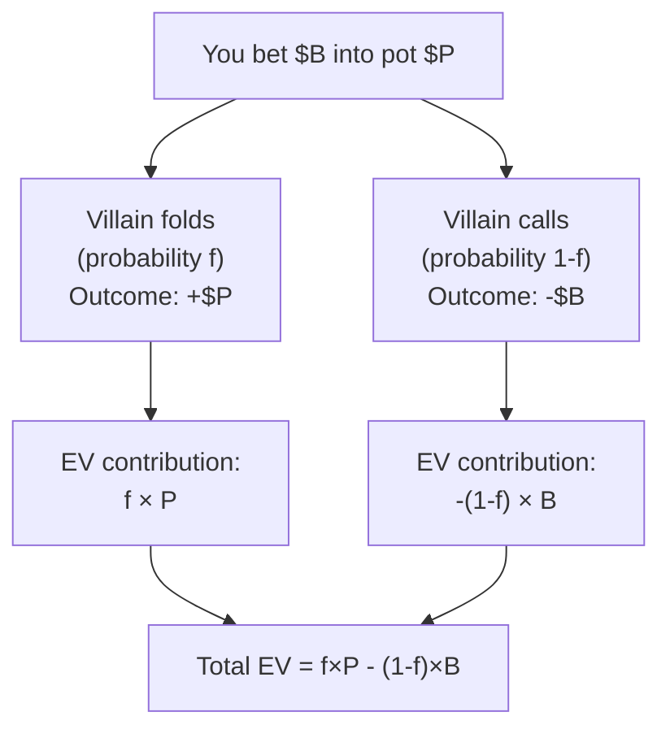

# Expected Value

Every poker decision has a monetary consequence that can be measured before it happens — not with certainty, but *on average*, across thousands of repetitions. That average consequence is the **expected value (EV)**. When you consistently make +EV decisions and avoid −EV ones, you will win money in the long run, regardless of short-term variance.

This module derives the EV formula from first principles and applies it to calling, bluffing, and value betting.

---

## The EV Formula

If a decision has $n$ possible outcomes, each with probability $P_i$ and monetary result $V_i$ (positive = win, negative = loss), then:

$$\text{EV} = \sum_{i=1}^{n} P_i \cdot V_i$$

The outcomes must be mutually exclusive and exhaustive ($\sum P_i = 1$). In poker, most betting decisions collapse to two outcomes: win or lose.

---

## EV of a Call

When you call a bet, two things can happen: you win the pot (with probability $q$, your equity) or you lose your call (with probability $1-q$).

Let:
- $q$ = your equity (probability of winning at showdown)
- $P$ = pot before you call (including the opponent's bet)
- $C$ = call amount

$$\text{EV(call)} = q \cdot P - (1-q) \cdot C$$

Equivalently (expanding):

$$\text{EV(call)} = q(P + C) - C$$

This is the equation we derived in Module 03. Setting it to zero gives break-even equity = $C/(P+C)$ = pot odds. Calling is +EV whenever $q$ exceeds pot odds.

### Worked Example

Pot = $200, Villain bets $100, you hold a flush draw (9 outs, ~35% equity):

- $q = 0.35$, $P = 300$, $C = 100$
- $\text{EV} = 0.35 \times 300 - 0.65 \times 100 = 105 - 65 = +\$40$

You win $+\$40$ in EV on average every time you make this call.

---

## EV of a Bluff

When you bluff, your opponent either folds (you win the pot immediately) or calls/raises (you lose your bet, assuming you have little showdown value):

Let:
- $f$ = probability villain folds (fold equity)
- $P$ = pot before your bluff
- $B$ = your bluff bet size

$$\text{EV(bluff)} = f \cdot P - (1-f) \cdot B$$

The bluff is +EV when $f \cdot P > (1-f) \cdot B$, i.e. when:

$$f > \frac{B}{P + B}$$

This is the **break-even fold frequency** — the minimum fraction of the time villain must fold for your bluff to be profitable.

### Worked Example

Pot = $150, you bluff $75. Break-even fold frequency:

$$f^* = \frac{75}{150 + 75} = \frac{75}{225} = 33\%$$

If your opponent folds more than 33% of the time, the bluff is +EV. If they fold less, it's −EV. Notice: the break-even fold frequency only depends on your bet size relative to the pot, not on your hand strength.

### Bluff EV with a Range

If you have 10% showdown equity when called (i.e. you occasionally win at showdown even when not bluffing):

$$\text{EV(bluff)} = f \cdot P + (1-f) \cdot [0.10 \cdot (P + B) - 0.90 \cdot B]$$

The second term adds the (usually small) extra value from sometimes winning at showdown.

---

## EV of a Value Bet

When you value bet, you hope to be called by worse hands. Let:

- $c$ = call frequency (probability villain calls)
- $q$ = your equity when called (usually high — you're value betting)
- $P$ = pot before your value bet
- $B$ = your value bet size

We measure the *marginal* value the bet adds beyond the pot you would win anyway. When villain folds, the bet adds nothing extra (you keep the pot you already had). When villain calls, you win their $B$ with probability $q$ and lose your $B$ with probability $1-q$:

$$\text{EV(value bet)} = c \cdot [q \cdot B - (1-q) \cdot B] = c \cdot (2q - 1) \cdot B$$

At 100% equity ($q=1$, the pure nuts):

$$\text{EV(value bet, nuts)} = c \cdot B$$

Every unit of call frequency earns you one bet's worth of value from the bet itself (and you keep the pot regardless). The bet stops adding value once $q < \tfrac{1}{2}$: a hand that loses more than half the time *when called* is not a value bet — betting it just donates chips to villain's stronger calling range.

### Worked Example

Pot = $200, you bet $100 for value. You estimate villain calls 60% of the time, and your equity when called is 90% (you occasionally lose to a redraw):

$$\text{EV(value bet)} = 0.60 \times (2 \times 0.90 - 1) \times 100 = 0.60 \times 0.80 \times 100 = +\$48$$

The bet extracts about \$48 beyond the pot you already expected to win. The thinner your edge when called (the closer $q$ is to 50%), the smaller this margin — which is why thin value bets need a high call frequency to be worth making, and why a hand you are not at least 50% to win with when called should usually be checked rather than bet.

---

## EV Formula Reference Table

| Decision | EV Formula | Key Variable |
|---|---|---|
| Call | $q \cdot P - (1-q) \cdot C$ | Equity $q$ vs. pot odds $C/(P+C)$ |
| Bluff | $f \cdot P - (1-f) \cdot B$ | Fold equity $f$ vs. $B/(P+B)$ |
| Value bet | $c \cdot (2q - 1) \cdot B$ | Call frequency $c$ and equity $q$ (value beyond the pot) |
| Check/Fold | $0$ (by definition) | Baseline |

---

## Decision Trees: Visualising EV

A decision tree makes the EV calculation concrete. Here is the bluff scenario:

For a call decision, replace "you bet" with "you call" and the branches become "you win at showdown" (equity $q$, outcome $+P$) and "you lose" (probability $1-q$, outcome $-C$).

---

## The Fundamental Insight

Every poker decision reduces to the same question: **does this action have positive expected value?**

- Calling: $q > C/(P+C)$?
- Bluffing: $f > B/(P+B)$?
- Value betting: is $c \cdot (2q - 1) \cdot B > 0$ — i.e. is your equity when called above 50%?

The math is simple arithmetic. The difficulty lies in estimating $q$ (opponent's range vs. your hand), $f$ (opponent's folding frequency), and $c$ (opponent's calling frequency) accurately. The entire rest of this course — ranges, GTO, bet sizing, board texture — is about building the skills to estimate these quantities reliably.

---

## Recap

- **EV formula:** $\text{EV} = \sum P_i V_i$ — the probability-weighted average of all outcomes.
- **EV of a call:** $q \cdot P - (1-q) \cdot C$. Positive when equity exceeds pot odds.
- **EV of a bluff:** $f \cdot P - (1-f) \cdot B$. Positive when fold frequency exceeds $B/(P+B)$.
- **EV of a value bet (beyond the pot you already own):** $c \cdot (2q - 1) \cdot B$. Positive when your equity when called exceeds 50%.
- Every poker concept in this course is a consequence of maximising expected value.

Next up: [Module 06 — EV Quiz](../06-ev-quiz/) to drill the calling, bluffing, and value-betting formulas on randomised numbers, then [Module 07 — Range Theory](../07-range-theory/) lifts the analysis from single hands to full ranges.
