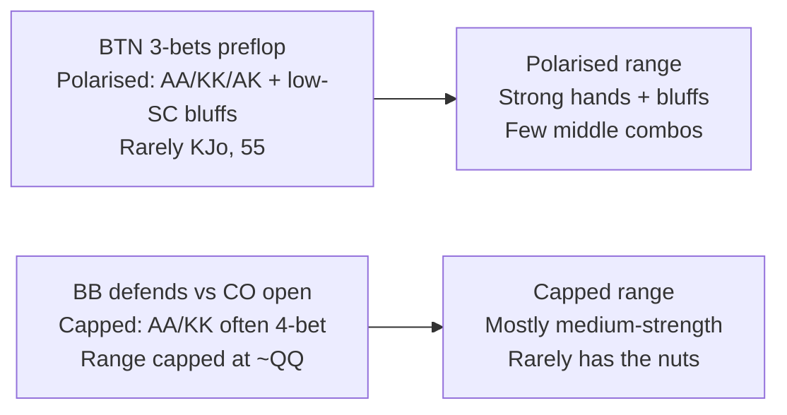
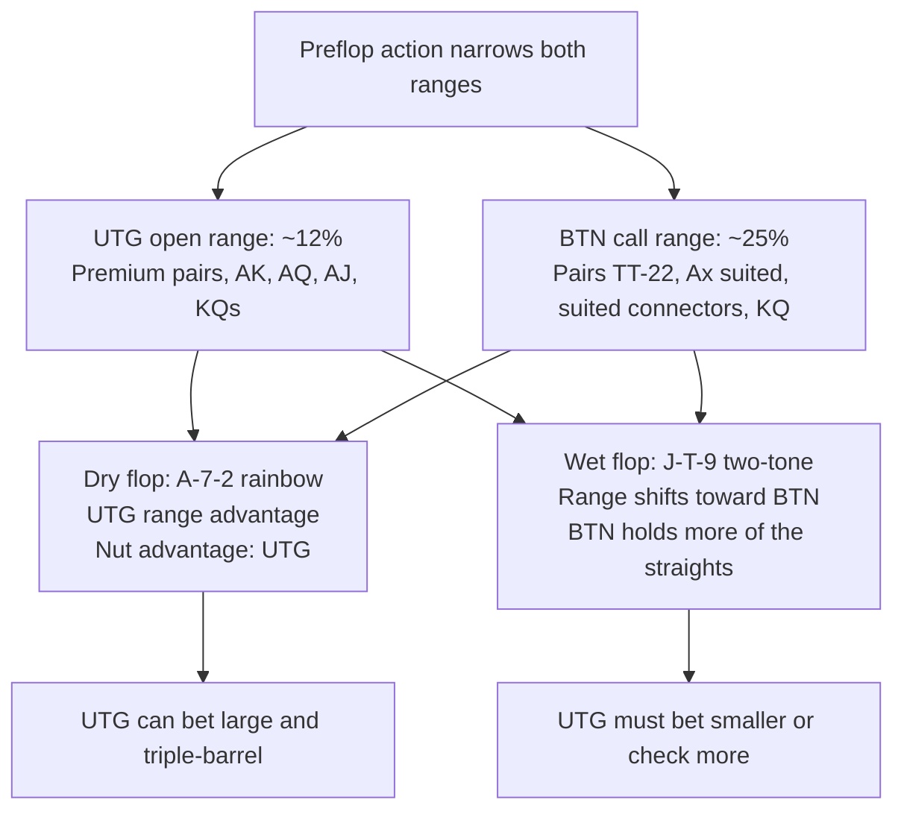

# Range Theory: Thinking in Ranges

Every poker decision in this course has been framed around a single hand: *I have A♠K♥, what should I do?*
That framing is a crutch. Skilled players never think "villain has X." They think "**villain's range here is…**" — a probability distribution over all hands consistent with the actions they've observed.

This module makes the shift from hand-level to range-level thinking. By the end you will be able to:

- Describe any player's holding as a **range** (a set of hand combos) rather than a single hand
- Read and use a simplified **poker hand matrix** (the 13×13 range grid)
- Construct realistic preflop opening ranges by position
- Identify which player holds **range advantage** and **nut advantage** on a given board
- Explain the concept of a **polarised** vs. **capped** range
- Quantify how a **blocker** reduces the combo count of opponent hands
- Predict how a flop changes the **relative strength** of two ranges

---

## 1. What Is a Range?

A **range** is the complete set of hands a player could hold at any point, weighted by probability, given everything we know about their actions in the hand so far.

Before any cards are dealt, any player could hold any of the 1326 two-card combinations from a 52-card deck:

$$\binom{52}{2} = \frac{52 \times 51}{2} = 1326 \text{ combos}$$

As soon as a player acts — opens, 3-bets, calls, folds — they reveal information that narrows their range. If a very tight UTG player open-raises, they have eliminated roughly 88% of those 1326 combos. If they then call a 3-bet (rather than 4-betting or folding), they eliminate more still. By the river, two or three streets of action have refined both players' ranges to a relatively narrow subset of the original 1326.

> **Key insight:** You never "know" villain's exact hand. You maintain a *distribution* over their possible hands. Making good decisions means responding optimally to that distribution — not guessing a single hand.

---

## 2. The Poker Hand Matrix

Ranges are often visualised as a **13×13 grid** indexed by rank (A, K, Q, J, T, 9, 8, 7, 6, 5, 4, 3, 2 from top-left to bottom-right):

- **Diagonal cells** (top-left to bottom-right): pocket pairs (AA, KK, QQ, …, 22)
- **Upper-right triangle**: suited hands (AKs, AQs, KQs, …)
- **Lower-left triangle**: offsuit hands (AKo, AQo, KQo, …)

A simplified 5×5 corner of the matrix (A through T) looks like:

|   | **A** | **K** | **Q** | **J** | **T** |
|---|:---:|:---:|:---:|:---:|:---:|
| **A** | AA | AKs | AQs | AJs | ATs |
| **K** | AKo | KK | KQs | KJs | KTs |
| **Q** | AQo | KQo | QQ | QJs | QTs |
| **J** | AJo | KJo | QJo | JJ | JTs |
| **T** | ATo | KTo | QTo | JTo | TT |

A player's **range** is simply the subset of these 169 hand-types they could hold, along with the number of **combos** each hand-type contributes:

| Hand type | Combos | Why |
|---|---|---|
| Pocket pair (e.g. AA) | 6 | $\binom{4}{2} = 6$ |
| Suited hand (e.g. AKs) | 4 | 4 suits |
| Offsuit hand (e.g. AKo) | 12 | $4 \times 3 = 12$ |

> **Quick check:** Total combos from all 169 hand types = $6 \times 13 + 4 \times 78 + 12 \times 78 = 78 + 312 + 936 = 1326$. ✓

---

## 3. Preflop Range Construction

Different positions at the table open very different ranges. Position is valuable (acting last gives you more information and initiative), so later positions open wider:

| Position | Typical open% | Approximate combos | Characteristics |
|---|---|---|---|
| UTG (under the gun) | ~12% | ~159 | Only premium hands: AA–TT, AK, AQ, KQs, suited broadways |
| MP (middle position) | ~18% | ~239 | Adds JJ–99, AJs, KQo, some suited connectors |
| CO (cutoff) | ~27% | ~358 | Adds lower pairs 88–66, AT, KJ, more SCs |
| BTN (button) | ~40% | ~530 | Adds small pairs, many suited hands, loose Ax |
| SB (small blind) | ~45% | ~597 | Wide but out of position post-flop |
| BB (big blind) | Defends ~60%+ vs BTN | ~800+ combos defended | Range is wide but reactive |

A rough UTG opening range might look like this in the hand matrix (✓ = included):

```
     A    K    Q    J    T    9    8    7    6    5    4    3    2
A  [ AA] [AKs] [AQs] [AJs] [ATs]  --   --   --   --  [A5s] [A4s] [A3s]
K  [AKo] [KK] [KQs] [KJs] [KTs]  --   --   --   --   --   --   --   --
Q  [AQo] [KQo] [QQ] [QJs]  --   --   --   --   --   --   --   --   --
J  [AJo]  --   --  [JJ]   --   --   --   --   --   --   --   --   --
T   --    --   --   --  [TT]   --   --   --   --   --   --   --   --
9   --    --   --   --   --  [99]   --   --   --   --   --   --   --
...
```

*A5s–A3s are included as "ace-blocker bluffs" — they unblock many of villain's calling combos while holding an ace that removes AA/AX combos from villain's range.*

### Three categories within a range

When analysing a range you will encounter three categories of hands:

1. **Value hands** — the strongest holdings you would bet/raise for value (AA, KK, top pair top kicker). You want to be called.
2. **Speculative / marginal hands** — hands with post-flop potential: suited connectors, small pairs. These realise their equity best in position with deep stacks.
3. **Folds** — hands too weak to play profitably. The exact boundary depends on position, stack depth, and opponent tendencies.

---

## 4. Range Advantage and Nut Advantage

When two players reach the flop, their ranges interact with the board differently. **Range advantage** is the aggregate metric: who has a higher average hand strength across their entire range? **Nut advantage** is the directional metric: who holds more of the *best* possible hands (the nuts and near-nuts) on this board?

These two concepts often move together, but not always:

- A player can have **range advantage without nut advantage** if they have many medium-strength hands but few of the very best.
- A player can have **nut advantage without range advantage** if they hold more premium combos but their overall range is weaker.

Nut advantage matters most for the ability to credibly put in large bets — you need the nuts to justify betting big and calling off your stack.

### Example: A♠ 7♦ 2♣ (A72 rainbow)

After UTG opens and BTN calls:

- UTG's range contains: AA, KK, QQ, AK, AQ, AJ, AT — **many Ax hands** and over-pairs
- BTN's range contains: TT–22 (except AA–QQ), suited connectors (76s, 65s), broadway suits (KQs, QJs)

On A72r:
- UTG **flopped top pair or better** with a large fraction of their range (AA, AK, AQ, AJ, AT all connect)
- BTN's **entire suited-connector and small-pair section missed completely**

UTG holds **both range advantage and nut advantage** here. This gives them the initiative to bet large — villain cannot easily punish them because villain lacks the Ax combos to make strong calling hands.

### Example: J♠ T♦ 9♥ (JT9 two-tone)

On a connected board like JT9:
- BTN's calling range (which includes 87s, QJs, KQs, 76s, 65s) connects heavily — straights, open-ended straight draws, pair + draw combos
- UTG's value hands (AA, KK, QQ, AK) are now often *ahead* but vulnerable to many turn cards

BTN has **more of the straights and strong draws**. While UTG may still have overall range equity, BTN's speculative hands have finally materialised into the combos that matter most on this board. The range interaction has shifted.

---

## 5. Polarised vs. Capped Ranges

**Polarised** means a range contains both very strong hands and very weak (bluff) hands, with few middle-strength holdings.

**Capped** (or **linear**) means a range is bounded at the top — it contains few or no nutted hands.

This distinction matters because a **polarised bettor** can credibly represent the nuts; a **capped caller** cannot.



In practice:
- The **3-bettor's range** is typically polarised: they hold the top of their range (premiums) plus some bluffs, and they 4-bet-fold or flat with the middle.
- The **flat-caller's range** is often capped: they would have 3-bet AA/KK, so post-flop they rarely hold the very best hands.

This asymmetry means the 3-bettor can often bet all three streets on many board textures because they credibly hold more of the nutted combos.

---

## 6. Blockers

A **blocker** is a card in your hand that reduces the number of combos of a specific hand that villain can hold. Because you're using one of the four copies of a card, villain has fewer of the combinations that include that card.

### Pocket pair blockers

With no information, AA has $\binom{4}{2} = 6$ combos in villain's range. If you hold one ace (say A♠), the remaining three aces form only $\binom{3}{2} = 3$ combos of AA:

$$\text{Combos(AA with A♠ in hero's hand)} = \binom{3}{2} = 3$$

Holding an ace **halves** the number of AA combos in villain's range.

### Suited hand blockers

AKs has 4 combos (one per suit). If you hold A♠, the A♠K♠ combo is impossible — villain cannot have the spade-suit AKs. Three suited AK combos remain.

### Why blockers matter strategically

1. **Deciding to bluff:** If you hold the A♠ on a board that contains A♥ Q♦ 7♣, your A♠ blocks many of villain's strongest value hands (AQ, AK, AA) — making your bluff less likely to run into a hero call with a top-pair monster.

2. **Deciding to call a bluff:** If you're considering calling a river shove, ask "does villain's hand make more sense if they hold the blockers to my best holdings?" If you hold K♠J♠ on a board where the flush came in, villain cannot have the nut flush (A♠X♠), which makes their range slightly weaker — a small incentive to call.

3. **Combo counting for bet sizing:** When you know you hold blockers to villain's value range, the relative frequency of value vs. bluff in their betting range shifts, affecting the EV of your calls.

### A worked example

Board: A♥ Q♦ 7♣ (rainbow). You bet the river. Villain is considering calling.

Your bluffing hand: K♠J♠ (no ace, no queen)
- You don't block villain's calling range (AX, QX)
- Villain is more likely to call → bluffing is less attractive

Your bluffing hand: A♠5♠ (an ace in your hand)
- You **block** AA (3 combos instead of 6), AQ (4 combos instead of 12), AK (4 fewer combos)
- Villain's strong calling hands are fewer → bluffing with A♠5♠ is more profitable

This is why good players prefer to bluff with hands that include blockers to villain's calling range.

---

## 7. Range Interaction with the Board

Every flop reorganises the relative strength of both players' ranges. The key factors:

### Connectivity
- **Dry boards** (A72r, K52r): favour the preflop aggressor, whose range contains more Ax/Kx top-pair combos. Speculative hands in the caller's range mostly missed.
- **Wet boards** (JT9ss, 876ss): favour the caller's speculative hands (suited connectors, small pairs). The aggressor's over-pairs are still strong but vulnerable.

### Pairing
- A paired board (AA7, KK3) reduces the number of "trips" combos available — good for the player who holds more pocket pairs in their range.
- A low pair (226) mostly doesn't change the aggressor's range advantage; both players rarely held a 2.

### High-card boards
- A board like AKQ massively favours the UTG opener, who 3-bets and has AK, AQ, KQ, AA in abundance.
- BTN's flatting range of suited connectors is nearly a blank on AKQ.



---

## Recap

| Concept | Key takeaway |
|---|---|
| Range | A probability-weighted set of all hands consistent with a player's actions |
| Hand matrix | 13×13 grid; pairs on diagonal, suited upper-right, offsuit lower-left |
| Combo count | Pair=6, suited=4, offsuit=12 |
| Range advantage | Whose range has higher average strength on this board |
| Nut advantage | Who holds more of the best possible combos |
| Polarised | Strong hands + bluffs, few middle combos; typical of 3-bettors |
| Capped | Bounded at the top; typical of pre-flop callers |
| Blocker | Holding a card reduces combos of that hand in villain's range |
| Board texture | Dry boards favour aggressors; wet boards favour callers' speculative hands |

Every concept from this point forward — GTO, MDF, bet sizing, multi-street planning — is ultimately an exercise in **correctly estimating what ranges look like at each decision point** and responding optimally to those distributions.

**Next:** [Module 08 — Range Theory Quiz](../08-range-theory-quiz/) drills combo counting, blockers, and range-advantage assessment on randomised scenarios; then [Module 09 — Game Theory Optimal Play](../09-game-theory-optimal/) builds on ranges to explain why Nash equilibrium strategies exist and what "balanced" play means.
