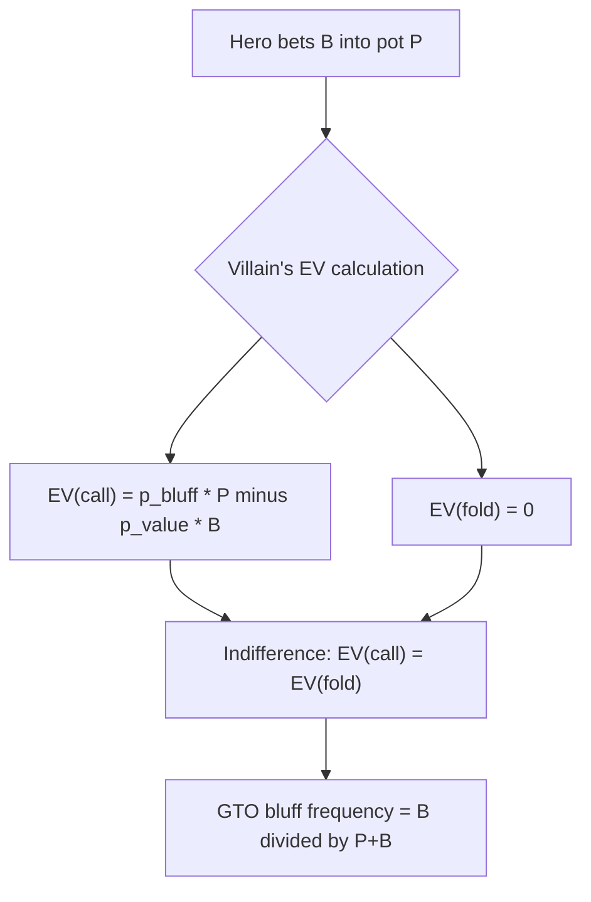

# Game Theory Optimal Play

You've built the tools to think in ranges (Module 07). Now the natural question surfaces: **if both players are constructing optimal ranges, what do those ranges look like?**

The answer comes from game theory. In this module you'll learn:

- The definition of **Nash equilibrium** and why it applies to poker
- Why poker is a **zero-sum game** and what that implies for strategy
- What a **GTO (Game Theory Optimal) strategy** guarantees — and what it doesn't
- Why GTO requires **mixed strategies** (randomisation) rather than always choosing the same action
- The **indifference principle**: how bluff frequency and call frequency are set so that neither player can profit by deviating
- The trade-off between **GTO play** (unexploitable floor) and **exploitative play** (higher ceiling, higher risk)
- Why **rock-paper-scissors** is a perfect analogy for GTO's mixed strategies

This is the theoretical backbone of all modern solver-based poker analysis. You don't need a solver to use these ideas — understanding the logic tells you *why* ranges should be balanced and *how* to reason about your own frequencies.

---

## 1. Two-Player Zero-Sum Games

Poker at showdown is a **zero-sum** game: every chip one player wins comes from another player's stack. The total wealth is conserved (ignoring rake for the conceptual argument). More formally:

$$\text{EV}(\text{player A}) + \text{EV}(\text{player B}) = 0$$

in any single-pot, two-player confrontation. This is the mathematical structure that allows us to apply game theory cleanly.

Zero-sum structure has a powerful implication: **there is no cooperation strategy**. In a zero-sum game, what is best for you is worst for your opponent, and vice versa. You cannot both gain by coordinating — you have directly opposing interests.

*Note: real poker is multi-player and involves antes/blinds that make some situations not purely zero-sum. But at any individual heads-up decision point — calling or folding on the river — the zero-sum structure holds.*

---

## 2. Nash Equilibrium

A **Nash equilibrium** is a strategy profile — one strategy per player — where **no player can increase their EV by unilaterally changing their strategy**, given that all other players keep their strategies fixed.

More informally: a Nash equilibrium is a mutual best-response. If both players are playing Nash equilibrium strategies, neither player regrets their strategy after seeing what the other player did.

> **John Nash (1950):** In any finite two-player zero-sum game, a Nash equilibrium in mixed strategies always exists.

In the context of poker: there exists a pair of strategies (one for each player) such that neither player can do better by switching to any other strategy, regardless of what the other player does.

That strategy profile is what we call **GTO** — Game Theory Optimal.

---

## 3. Rock-Paper-Scissors: The Purest Example

Before applying Nash equilibrium to poker, consider rock-paper-scissors. The payoff matrix (player A's gain):

|  | **Scissors** | **Rock** | **Paper** |
|---|---|---|---|
| **Scissors** | 0 | −1 | +1 |
| **Rock** | +1 | 0 | −1 |
| **Paper** | −1 | +1 | 0 |

If player A always plays Rock, player B plays Paper and wins every time. If player A always plays Paper, player B plays Scissors. **Any pure (deterministic) strategy is exploitable.**

The only unexploitable strategy is to **randomise uniformly**: play each action with probability $\frac{1}{3}$.

$$\text{EV}(\text{GTO player}) = \frac{1}{3}(0) + \frac{1}{3}(0) + \frac{1}{3}(0) = 0$$

Against this strategy, player B cannot do better than 0 EV regardless of which action they choose. The $\frac{1}{3}$-each strategy is the Nash equilibrium.

**The poker parallel:** just as always-bluffing or never-bluffing with a hand is exploitable, GTO poker requires mixing between actions — sometimes betting for value, sometimes bluffing, sometimes checking — with specific frequencies that make the opponent indifferent.

---

## 4. GTO in Poker: Balanced Ranges

A GTO poker strategy is one where **your betting range (at every decision node) is balanced** between value hands and bluffs at the exact ratio that makes your opponent indifferent between calling and folding.

### Why balance is necessary

Consider a river spot where you can bet or check. Suppose you **only ever bet when you have the nuts**:

- Villain can profitably fold every time you bet (you never bluff → they lose nothing by folding)
- Your nut-value bets get no calls → you lose EV

Now suppose you **always bluff** with your weak hands in addition to value betting:

- Villain can profitably call every time you bet (you bluff so much the call has positive EV)
- Your bluffs get called → you lose EV on bluffs

The only strategy that prevents villain from exploiting either deviation is to **mix** value bets and bluffs at the correct ratio. That ratio is determined by the **indifference principle**.

---

## 5. The Indifference Principle

The **indifference principle** states: at GTO, your bluff frequency is set so that your opponent is **indifferent** between calling and folding — both actions yield the same EV.

Let's derive the exact bluff frequency for a river spot.

**Setup:**
- Pot = $P$ before the river bet
- Hero bets $B$
- Villain must call $B$ or fold

**Villain's decision:**

$$\text{EV}(\text{fold}) = 0$$

$$\text{EV}(\text{call}) = p_{\text{bluff}} \cdot P - p_{\text{value}} \cdot B$$

where $p_{\text{bluff}}$ is the probability hero is bluffing given that hero bet, and $p_{\text{value}} = 1 - p_{\text{bluff}}$.

**Setting them equal (indifference condition):**

$$p_{\text{bluff}} \cdot P = (1 - p_{\text{bluff}}) \cdot B$$

$$p_{\text{bluff}} \cdot P = B - p_{\text{bluff}} \cdot B$$

$$p_{\text{bluff}} \cdot (P + B) = B$$

$$\boxed{p_{\text{bluff}} = \frac{B}{P + B}}$$

This is the fraction of hero's betting range that should be bluffs to make villain exactly indifferent.

**Example:** Pot = \$100, bet = \$50.

$$p_{\text{bluff}} = \frac{50}{100 + 50} = \frac{1}{3} \approx 33\%$$

One third of hero's $100 bets should be bluffs, two thirds should be value.

### The symmetric constraint: Minimum Defense Frequency

The same logic works in the other direction. From **hero's perspective**, at what call frequency should villain defend to make hero indifferent between bluffing and checking?

$$\text{EV}(\text{bluff}) = p_{\text{fold}} \cdot P - p_{\text{call}} \cdot B = 0$$

$$p_{\text{fold}} \cdot P = p_{\text{call}} \cdot B$$

$$(1 - p_{\text{call}}) \cdot P = p_{\text{call}} \cdot B$$

$$P = p_{\text{call}} \cdot (P + B)$$

$$\boxed{p_{\text{call}} = \frac{P}{P + B}}$$

This is the **Minimum Defense Frequency (MDF)** — the minimum fraction of villain's range that must call to prevent hero from profitably bluffing 100% of the time. Module 11 explores MDF in depth. Notice that bluff% + MDF = 1, which is a reassuring sanity check.

---

## 6. Mixed Strategies in Practice

GTO requires randomisation. In real play this might mean:

- With a specific hand on the river, you **bet for value 70% of the time and check back 30% of the time**
- With a specific bluff candidate, you **bet 40% of the time and give up 60% of the time**

How do you randomise in live play without a random number generator? Common techniques:

1. **Card-suit-based**: use the suit of a specific card as a randomisation device (hearts → bet, other suits → check). Works well when you want a rough 25%/75% split.
2. **Time-based**: mentally commit to a rule before looking at the river card ("if the river is a low card I bet, otherwise I check"), effectively using the card's arrival as randomness.
3. **Simplify to pure strategies**: against opponents who are far from GTO, pure exploitative strategies often outperform mixed GTO strategies. Mixing matters most against strong, observant opponents.

---

## 7. GTO vs. Exploitative Play

GTO and exploitative play are not the same thing — and choosing between them is a real strategic decision.

| | **GTO (Nash Equilibrium)** | **Exploitative** |
|---|---|---|
| **What it guarantees** | EV ≥ Nash equilibrium value — you cannot be exploited | No guarantee; you might be counter-exploited |
| **Against a GTO opponent** | Breaks even (or wins due to rake advantage if you're the less-raked player) | Same result as GTO (GTO is also the best response to GTO) |
| **Against a weak opponent** | Leaves EV on the table — doesn't maximise against mistakes | Captures maximum EV from opponents' deviations |
| **Risk** | Low — the "safe floor" strategy | High — being exploited if your reads are wrong |

### The rock-paper-scissors analogy revisited

Imagine you're playing RPS against someone who plays Rock 90% of the time:

- **GTO strategy**: play 1/3 each → EV ≈ 0 (you win 1/3 of the time when they play rock, lose 1/3 to paper, break even on scissors)
- **Exploitative strategy**: always play Paper → EV = +0.8 per game (90% wins, 10% losses)

The exploitative strategy vastly outperforms GTO. **But** if your opponent notices and switches to Scissors, you lose 100% of the time. GTO is not the best play against a predictable opponent — it is the *safest* play against an unknown or unpredictable one.

**In poker:**
- If villain **always folds to river bets**, the GTO-aware player should **deviate: bluff more** than GTO recommends. GTO would leave free EV on the table.
- If villain **always calls river bets**, deviate the other way: **bluff less, value bet thinner**.
- The risk: if villain detects your deviation and adjusts, you become exploitable.

The practical advice:
> Play closer to GTO when you have little information about villain. Deviate exploitatively when you have a reliable, specific read.

---

## 8. What GTO Is Not

Several misconceptions are worth addressing:

**"GTO means using a solver output."** No. Solvers compute GTO strategies numerically for specific tree sizes, but the *concept* of GTO (balanced frequencies, correct bluff ratios, indifference) can be reasoned about without a solver. Understanding the logic is more transferable than memorising solver outputs.

**"GTO always wins."** No. GTO guarantees you cannot be *exploited* — it does not guarantee profit. Against another GTO player, the game is breakeven (before rake). GTO is a floor, not a ceiling.

**"GTO means never bluffing."** No. GTO requires bluffing at a precise frequency determined by the bet size and pot. Bluffing is structurally required to make value bets credible.

**"GTO means always c-betting."** No. GTO requires checking some strong hands to keep your checking range strong (so villain can't always bet when you check). Balanced strategies check some monsters and bet some air.

---

## Recap

| Concept | Key takeaway |
|---|---|
| Zero-sum game | Poker at showdown: every chip one player wins is another's loss |
| Nash equilibrium | No player can improve EV by unilaterally changing strategy |
| GTO | The Nash equilibrium strategy for poker — unexploitable |
| Mixed strategy | Randomise between actions so no single action is always correct |
| Indifference principle | Bluff at $B/(P+B)$ so villain's EV(call) = EV(fold) = 0 |
| MDF | Villain calls $P/(P+B)$ so hero's EV(bluff) = EV(check) = 0 |
| GTO vs. exploitative | GTO = safe floor; exploitative = higher ceiling against predictable opponents |

The indifference principle — setting frequencies so the opponent cannot profitably deviate — is the engine behind every GTO concept. **Minimum Defense Frequency (Module 11)** applies the same logic to defence: what fraction of your range must you protect to make villain's bluffs break even?

**Next:** [Module 10 — GTO Quiz](../10-gto-quiz/) drills mixed-strategy frequencies, the indifference principle, and exploitative-versus-GTO trade-offs; then [Module 11 — Minimum Defense Frequency](../11-minimum-defense-frequency/) applies the indifference principle to the defender's perspective, giving you a formula for how often to call or raise against any bet size.
