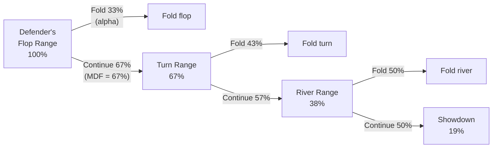

# Minimum Defense Frequency

In the previous module you learned that GTO strategy is built on the **indifference principle**: your frequencies must be tuned so that the opponent cannot exploit you regardless of their choice. Module 09 told you *that* such frequencies exist. This module derives the **exact formulas** that tell you what those frequencies are.

By the end of this module you will be able to:

- State the **Minimum Defense Frequency (MDF)** formula and explain where it comes from
- Calculate MDF for any bet size in under five seconds
- Define **alpha (α)** — the break-even fold frequency — and explain its relationship to MDF
- Construct a correctly balanced betting range by applying the **bluff:value ratio**
- Apply MDF across multiple streets to find the fraction of your range that reaches showdown

---

## 1. Deriving MDF

Let the pot before the bet be $P$ and the bet size be $B$. A pure bluff — a hand with zero equity — wins $P$ when you fold and loses $B$ when you call. Let $f$ denote the fraction of your range you fold. The expected value of the bluff is:

$$\text{EV}_{\text{bluff}} = f \cdot P - (1 - f) \cdot B$$

For a bluff to be immediately profitable, $\text{EV}_{\text{bluff}} \geq 0$:

$$f \cdot P - (1 - f) \cdot B \geq 0$$

$$fP \geq B - fB$$

$$f(P + B) \geq B$$

$$f \geq \frac{B}{P + B}$$

If you fold more than $\alpha = B/(P+B)$ of your range, a zero-equity bluff profits automatically — you are being exploited. Therefore you must fold **at most** $\alpha$ and continue (call or raise) with at least:

$$\boxed{\text{MDF} = 1 - \alpha = \frac{P}{P + B}}$$

This is the **Minimum Defense Frequency**. It is the minimum fraction of your range you must continue with to deny automatic profit to any bluff, regardless of its equity.

---

## 2. MDF by Bet Size

The table below shows MDF and $\alpha$ for the most common bet sizes. Memorising the 50% pot and pot-sized rows is enough to anchor the rest.

| Bet size (% of pot) | $\alpha$ (max fold) | MDF (min continue) |
|---|---|---|
| 25% | 20% | 80% |
| 33% | 25% | 75% |
| 50% | 33% | 67% |
| 75% | 43% | 57% |
| 100% (pot-sized) | 50% | 50% |
| 150% | 60% | 40% |

**Key pattern:** as bet size grows, MDF falls. Larger bets demand a *narrower but stronger* defending range; smaller bets demand a *wider* one. Neither is automatically better — the right size depends on the bettor's range, which we will address in module 13.

---

## 3. Alpha — the Dual View

Alpha ($\alpha = B / (P + B)$) has two equivalent interpretations depending on which side of the bet you are on:

**From the defender's perspective:** $\alpha$ is the maximum fraction of your range you can fold without being exploited. Fold more than $\alpha$ and bluffs become free money for the bettor.

**From the bettor's perspective:** $\alpha$ is the break-even *fold* frequency — how often villain must fold for a pure bluff to break even — and, equivalently, the **bluff-to-value ratio** in your betting range: you include $\alpha$ of a bluff combo for every value combo (bluffs $=$ value $\times\,\alpha$). Do **not** confuse this with the bluff *fraction* of the whole betting range, which is $B/(P+2B)$ — a smaller number, equal to the pot odds you lay the caller. (For a pot-sized bet, $\alpha = 50\%$ but the bluff fraction is only $33\%$, a 2:1 value-to-bluff ratio.)

Both players are solving the same indifference equation. Alpha and MDF sum to one:

$$\alpha + \text{MDF} = \frac{B}{P+B} + \frac{P}{P+B} = 1$$

This symmetry is not a coincidence — it is the signature of a Nash equilibrium. At the GTO frequencies, neither player can improve their EV by deviating.

---

## 4. Bluff:Value Ratio — Worked Example

The bettor's **bluff-to-value ratio** is $\alpha = B/(P+B)$ — that is, $\alpha$ bluff combos for every value combo. So given any number of value combos:

$$\text{bluffs} = \text{value} \times \alpha = \text{value} \times \frac{B}{P+B}$$

**Example:** You are betting the river with 12 value combos (flushes, straights, full houses). You choose a **75% pot bet**.

$$\alpha = \frac{0.75P}{P + 0.75P} = \frac{0.75}{1.75} \approx 0.43 \quad (43\%)$$

$$\text{bluffs} = \text{value} \times \alpha = 12 \times 0.43 \approx 5$$

You should include about **5 bluff combos**. Adding too many makes calling profitable for the defender; including too few makes folding profitable.

**Sanity check (bluff fraction of the betting range):** $5 / (5 + 12) = 5/17 \approx 29\%$ — which matches $B/(P+2B) = 0.75/2.5 = 30\%$, the pot odds the caller is laid. (Note this 30% is *not* $\alpha = 43\%$; $\alpha$ is the bluff-to-*value* ratio, not the bluff share of the whole range.)

A quick formula to keep in mind: **bluffs = value combos × $\alpha$ = value × B/(P+B)**. For a pot-sized bet, $\alpha = 1/2$, so bluffs = value/2 (a 2:1 value-to-bluff ratio). For a half-pot bet, $\alpha = 1/3$, so bluffs = value/3 (a 3:1 ratio).

| Bet size | $\alpha = B/(P+B)$ | Bluffs per 12 value combos | Value:bluff |
|---|---|---|---|
| 25% pot | 0.20 | 2 | 5:1 |
| 50% pot | 0.33 | 4 | 3:1 |
| 75% pot | 0.43 | 5 | 2.33:1 |
| 100% pot | 0.50 | 6 | 2:1 |

---

## 5. Multi-Street MDF

On each street the defender applies MDF independently to the portion of their range that survived the previous street. The total fraction that reaches showdown after calling every street is the **product** of each street's MDF:

$$\text{Showdown fraction} = \text{MDF}_{\text{flop}} \times \text{MDF}_{\text{turn}} \times \text{MDF}_{\text{river}}$$

**Worked example:**

| Street | Bet size | MDF |
|---|---|---|
| Flop | 50% pot | 0.67 |
| Turn | 75% pot | 0.57 |
| River | 100% pot | 0.50 |

$$\text{Showdown fraction} = 0.67 \times 0.57 \times 0.50 \approx 0.19 \quad (19\%)$$

Only about **1 in 5 hands** from the original flop range reaches showdown after calling down all three streets. The bettor's triple-barrel strategy succeeds as long as the defender folds on any one of the three streets — a much easier bar to clear than winning at showdown.

The compounding effect is why range advantage matters so much in deep-stack play. Small edges on early streets snowball into large showdown fractions by the river.

---

## 6. The Defense Decision Tree

Each arrow labelled "Continue" represents a street where the defender applies MDF. Each arrow labelled "Fold" is the corresponding alpha leak. The showdown leaf — 19% — is the product of all three MDF values.

---

## 7. Common Mistakes

**Mistake 1 — treating MDF as a calling frequency, not a continuing frequency.** MDF includes raises. If you raise 5% of your range and call 62%, you are continuing with 67% — exactly MDF for a half-pot bet. Raising as part of your defense is perfectly valid.

**Mistake 2 — applying MDF to the wrong pot size.** The pot $P$ in the formula is the pot *before* the bet, not after. A bet of \$50 into a \$100 pot gives $\alpha = 50/150 \approx 33\%$, not 50%.

**Mistake 3 — forgetting that MDF is a minimum, not a target.** You must continue with *at least* MDF. If your range has many strong hands, you may profitably continue more. MDF is the floor below which exploitation begins.

**Mistake 4 — applying multi-street MDF multiplicatively to the *bettor's* range.** The compounding product applies to the *defender's* continuing range. The bettor's range may grow (if the defender folds) or shrink (if the bettor is also facing raises), depending on the tree.

---

## Recap

- **MDF = P / (P + B)**: the minimum fraction of your range you must continue with to prevent a zero-equity bluff from being immediately profitable.
- **Alpha = B / (P + B)**: the maximum fold frequency, and simultaneously the bluff-to-value *ratio* (bluffs per value combo) in the bettor's range — but **not** the bluff fraction of the whole betting range, which is $B/(P+2B)$.
- $\alpha + \text{MDF} = 1$: they are mathematically dual — two faces of the same equilibrium condition.
- **Bluff combos = value combos × $\alpha$ = value × B/(P+B)**: for a 75% pot bet, about 5 bluffs for every 12 value combos (a 2.33:1 value-to-bluff ratio).
- **Multi-street**: the fraction of your range that calls down all streets is $\text{MDF}_1 \times \text{MDF}_2 \times \text{MDF}_3$; only ~19% of the flop range reaches showdown against three consecutive pot-to-pot-size bets.
- Larger bets lower MDF, increase alpha, and compress the defending range — but require more bluffs in the bettor's range to stay balanced.

**Next:** [Module 12 — MDF & Alpha Quiz](../12-mdf-quiz/) drills MDF, alpha, bluff:value ratios, and multi-street compounding on randomised numbers; then [Module 13 — Bet Sizing Theory](../13-bet-sizing-theory/) applies these frequencies to the question of *which size to choose*: when to use 33% pot versus 75% versus a full overbet, and how geometric sizing allows you to build toward an all-in across multiple streets.
